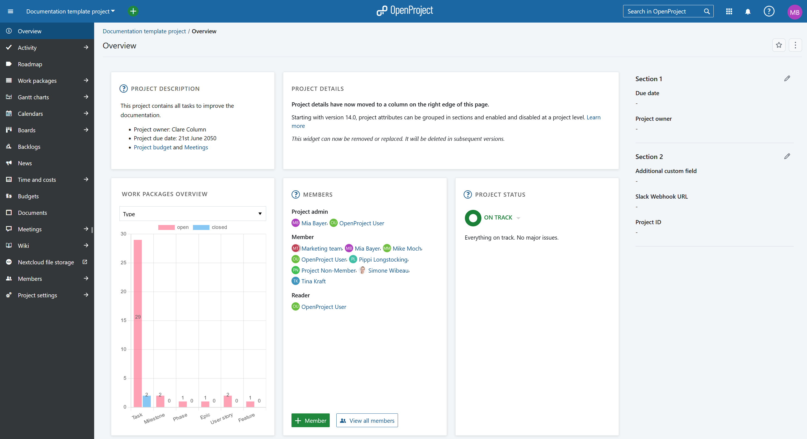
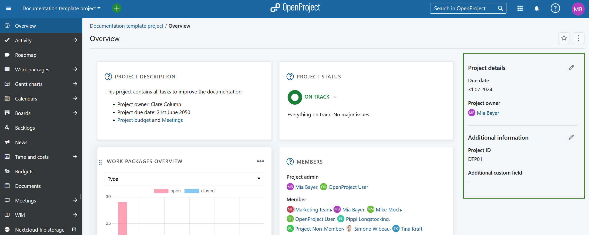
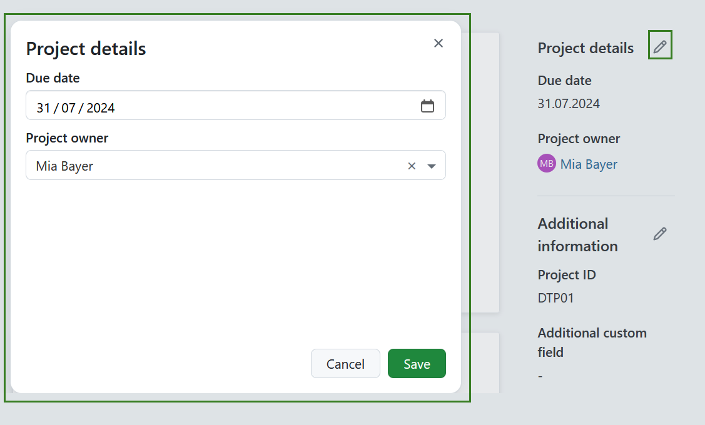
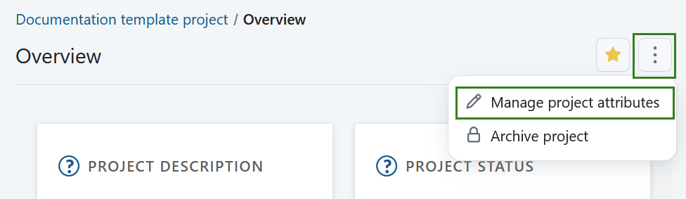
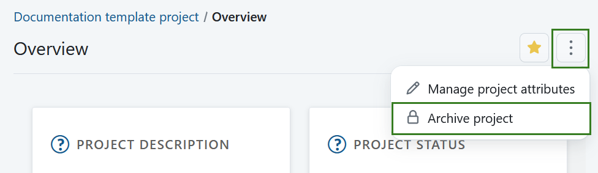
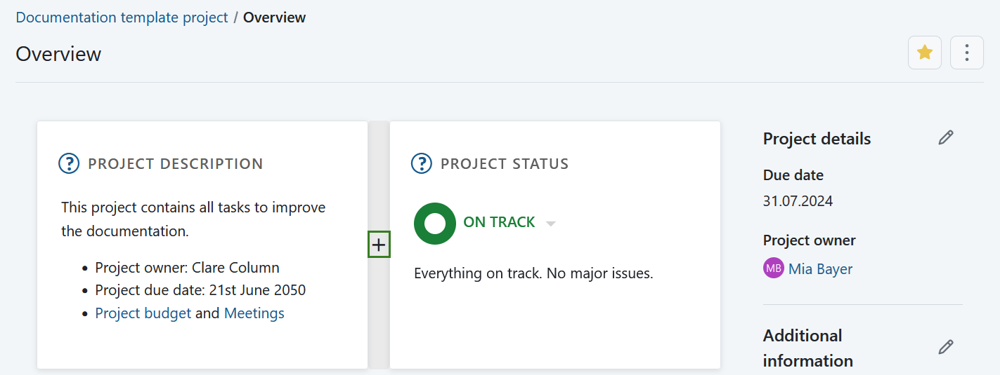
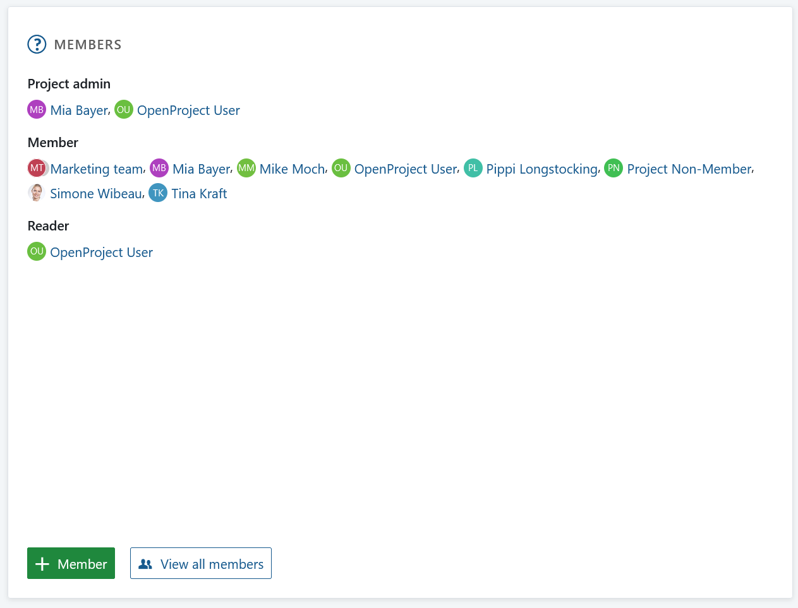
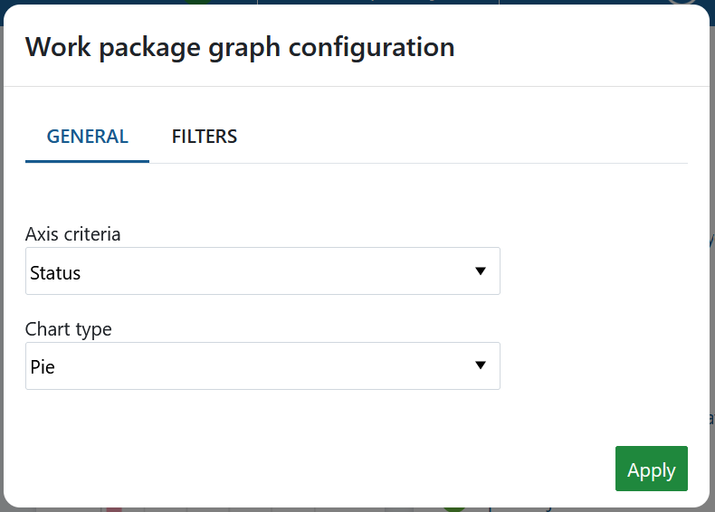
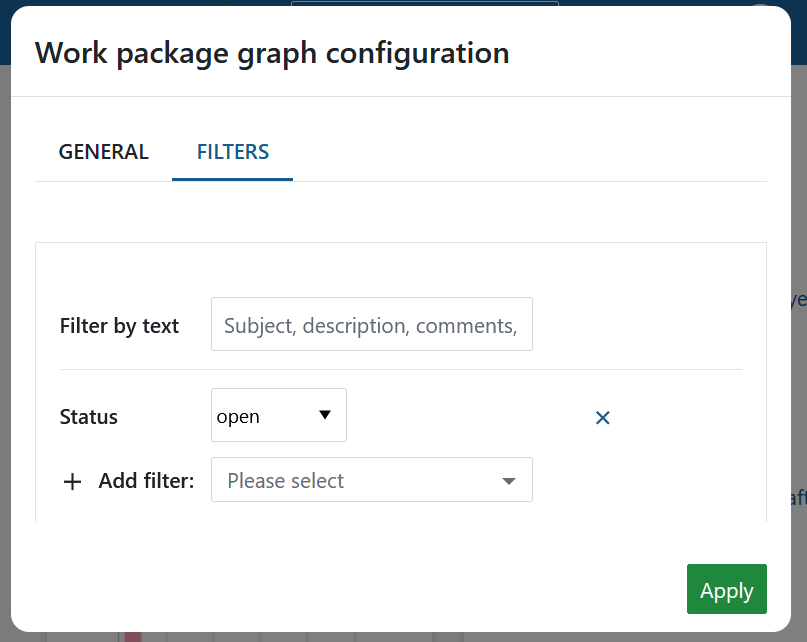

---
sidebar_navigation:
  title: Project overview
  priority: 900
description: Learn how to configure a project overview page
keywords: project overview page
---

# Project overview

The **Project overview** page is a dashboard with important information about your respective project(s). This page displays all relevant information for your team, such as members, news, project description, work package reports, or project status.

| Topic                                                        | Content                                                      |
| ------------------------------------------------------------ | ------------------------------------------------------------ |
| [What is the project overview?](#what-is-the-project-overview) | What can I do with the project overview page?                |
| [Project attributes](#project-attributes)                    | What are project attributes and how can I use them?          |
| [Mark project as a favorite](#mark-a-project-as-favorite)    | How can I mark a project as favorite?                        |
| [Archive a project](#archive-a-project)                      | How can I archive a project from the project overview page?  |
| [Widgets](#widgets)                                          | What are widgets, and how can I add them to my project overview page? |
| [Project status](#project-status)                            | Set your project status                                      |
| [Available project overview widgets](#available-project-overview-widgets) | What kind of widgets can I add to the project overview?      |
| [Re-size and re-order widgets](#re-size-and-re-order-widgets) | How can I re-order or re-size the widgets?                   |
| [Remove widgets](#remove-widget-from-project-overview-page)  | How can I remove widgets from the project overview page?     |

## What is the project overview?

The project overview is a single dashboard page where all important information of a selected project can be displayed. The idea is to provide a central repository of information for the whole project team. 

Project information is added to the dashboard as either [project attributes](#project-attributes) or [widgets](#widgets). 

Open the project overview by navigating to **Overview** in the project menu on the left.

## Project attributes

**Project attributes** are a set of project-level custom fields that let you display certain types of information relevant to your project.

You will see a list of all available project attributes in a pane on the right side of of your Project overview page. They may be grouped in sections.

> [!TIP]
> Your view of the project attributes may vary depending on on your  [roles and permissions in OpenProject](../../system-admin-guide/users-permissions/roles-permissions/). 
> The project attributes are visible for users with the **View project attributes** permission enabled. The editing icons are visible for users with the **Edit project attributes** permission.

To edit the value of any visible project attribute, click on the **Edit** (pencil) icon next to the name of the section containing that project attribute. A modal will be displayed with all the attributes in that section.

Edit the values for each project attribute and click on **Save** to confirm and save your changes.

>[!NOTE]
>If you are an instance admin and would like to create, modify or add project attributes, please read our [admin guide to project attributes](../../system-admin-guide/projects/project-attributes).

### Project attribute settings 

To adjust the the project attribute settings for a specific project click the **More** (three dots) icon and select *Manage project attributes*. This will lead you directly to the [project attribute settings](../projects/project-settings/project-attributes/).

>[!NOTE]
>This option is always available to instance and project administrators. It can also be activated for specific roles by enabling the *select_project_attributes* permission for that role via the [Roles and permissions page](../../system-admin-guide/users-permissions/roles-permissions/) in the administrator settings.

## Mark a project as favorite

You can mark the project as a *Favorite* by clicking the **Favorite** (star) icon in the upper right corner. The icon color will change to yellow and the project will be marked as favorite both on the overview page and in the projects list. Read more about [project lists](../projects/project-lists/). 

To remove a project from favorites click the **Favorite** icon again. 

## Archive a project 
You can archive a project directly from the project overview page. To do that click the **More** (three dots) icon and select *Archive project*.

>[!NOTE]
>This option is always available to instance and project administrators. It can also be activated for specific roles by enabling the *archive_project* permission for that role via the [Roles and permissions page](../../system-admin-guide/users-permissions/roles-permissions/) in the administrator settings.

You can also archive a project under [project settings](../projects/#archive-a-project) or in a [projects list](../projects/project-lists/). 

## Widgets

**Widgets** are small blocks of information that you can customize to display pertinent project information (such as project description, status, work package lists or graphs). You can add and remove multiple widgets, re-order them and resize them to your liking.

To add a new widget:

1. Choose the place where to add the new widget.

To add a widget to the project overview, hover around the existing widgets. The **+** icon will appear automatically. 

2. Click the **+** icon and choose which kind of widget you want to add.

## Project status

On the project overview page, you can set your project status and give a detailed description. The project status is a widget that you add to your project overview. Find the description [below](#project-status-widget).

## Available project overview widgets

You can add various widgets to your project overview.

### Calendar widget

The calendar widget displays your current work packages in a calendar. It shows work packages that are being worked on at the current date. The maximum number of displayable work packages is 100.

### Custom text widget

Within the custom text widget you can add any project information which you want to share with your team, e.g. links to important project resources or work packages, filters, specifications.

You can also add files to be displayed or attached to your project overview.

### Project members widget

You can add a widget which displays all project members and their corresponding role for this project on the project overview page. This includes both, groups and users (placeholders or registered).

You can [add members to your project](../../getting-started/invite-members/) via the green **+ Member** button in the bottom left corner.

The **View all members** button displays the list of project members that have been added to your project. Members can be individuals as well as entire groups.

### News widget

Display the latest project news in the news widget on the project overview page.

### Project description

The project description widget adds the project description to your project overview.

The description can be added or changed in the [project settings](../projects/project-settings).

### Project details widget

> [!IMPORTANT]
> Project details widget was replaced by [Project attributes](#project-attributes) in [OpenProject 14.0](../../release-notes/14-0-0/) and will be removed in the future.

The project details widget displays all custom fields for projects, e.g. project owner, project due date, project number, or any other custom field for this project.

The custom fields can be adapted in the [project settings](../projects/project-settings/). As a system administrator you can [create new custom fields for projects](../../system-admin-guide/custom-fields/custom-fields-projects/).

New custom fields for projects can be created in the [system administration](../../system-admin-guide/).

### Project status widget

Add your project status as a widget to display at a glance whether your project is on track, off track or at risk.

First, select your project status from the drop-down. You can choose between:

ON TRACK (green)

OFF TRACK (red)

AT RISK (yellow)

NOT SET (grey)

Add a **project status description** and further important information, such as project owner, milestones and other important links or status information.

### Spent time widget

The spent time widget lists the **spent time in this project for the last 7 days**.

Time entries link to the respective work package and can be edited or deleted. To have a detailed view on all spent time and costs, go to the [Cost reporting](../time-and-costs/reporting/) module.

### Subprojects

The subprojects widget lists all subproject of the respective project on the overview. You can directly open a subproject via this link.

The widget only links the first subproject hierarchy and not the children of a subproject.

To edit the project hierarchy, go to the [project settings](../projects/project-settings).

### Work package graph widgets (Enterprise add-on)

The work package graph widgets display information about the work packages within a project. They can be displayed in different graph views, such as a bar graph or a pie chart.

**Configure the work package graph**

You can filter the work packages to be displayed in the graph according to the [work packages table configuration](../work-packages/work-package-table-configuration/).

To configure the work package graph, click on the three dots in the top right corner and select **Configure view...**

Select the **Axis criteria** to be displayed on the axis of the graph, e.g. Accountable, Priority, Status, Type.

Next, select the **Chart type** how the work package information shall be displayed, e.g. as a bar graph, a line, a pie chart.

**Filter** the work packages for your chart.

Click on the Filter tab in order to configure the work packages to be displayed, e.g. only work packages with the priority "high".

Click the green **Apply** button to save your changes.

If you want to replicate the widgets shown in the example in the screen-shot above:

- For the "Assignees" graph please choose the widget "work packages overview" and change to "assignees".
- For the Work packages status graph please select "work package graph", click on the three dots in the upper right corner of the widget, choose "configure view", then choose "status" as axis criteria and "pie chart" as chart type.
- For the Work package progress graph please select "work package graph", click on the three dots in the upper right corner of the widget, choose "configure view", then choose "% Complete" as axis criteria and "line" as chart type.

### Work package overview widget

The work package over widget displays all work packages in a project differentiated by a certain criteria.

You can display the graph according to the following criteria:

* Type
* Status
* Priority
* Author
* Assignee

The widget lists all **open** and all **closed** work packages according to this criteria.

### Work package table widget

The work package table widget includes a work package table to the project overview. The work package table can be filtered, grouped, or sorted according to the [work package table configuration](../work-packages/work-package-table-configuration/), e.g. to display only work packages with the priority "High".

## Re-size and re-order widgets

To **re-order** a widget, click on the dots icon on the upper left hand corner and drag the widget with the mouse to the new position.

To **re-size** a widget, click on the grey icon in the lower right hand corner of the widget and drag the corner to the right or left. The widget will re-size accordingly.

## Remove widget from project overview page

To remove a widget from the project overview page, click on the three dots at the top right corner of the widget and select **Remove widget**.

