---
sidebar_navigation:
  title: Project overview
  priority: 900
description: Learn how to configure a project overview page
robots: index, follow
keywords: project overview page
---

# Project overview

The **Project overview** page is a dashboard with important project information. You can display relevant information for your team, such as members, news, project description, work package reports, or a project status. 

| Feature                                                      | Documentation for                                       |
| ------------------------------------------------------------ | ------------------------------------------------------- |
| [What is the project overview?](#what-is-the-project-overview?) | What can I do with the project overview page?           |
| [Add a widget to the project overview](#add-a-widget-to-the-project-overview) | How can I add a new widget to the project overview?     |
| [Available project overview widgets](#available-project-overview-widgets) | What kind of widgets can I add to the project overview? |
| [Re-size and re-order widgets](#re-size-and-re-order-widgets) | How can I re-order or re-size the widgets?              |
| [Remove widget](#remove-widget-from-project-overview-page)   | How can I remove widget from project overview page?     |

## What is the project overview?

The project overview is a single dashboard page where all important project information can be displayed. The idea is to have it centrally available for the whole project team.

You can add project information as widgets to the dashboard and not only order but also re-size the widgets according to your needs.

Furthermore, you can add text widgets, custom texts, links and other information to your overview page.

Open the project overview by navigating to **Overview** in the project menu on the left.

## Add a widget to the project overview

1. Choose the place where to add the new widget.

To add a widget to the project overview, click on the **+ button** on the top right of the page. Select the place where to add the widget, by clicking on a plus that appears on the top right corner of the page.

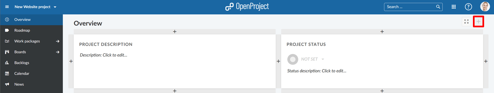

2. Choose which kind of widget you want to add.

Choose one of the possible widgets to add from the list.

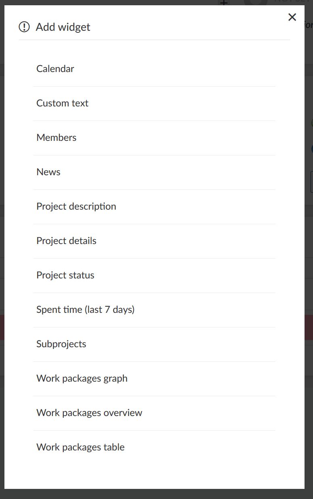

## Available project overview widgets

You can add various widgets to your project overview.

### Calendar widget

The calendar widget displays your current work packages in a calendar. It shows work packages that are being worked on at the current date.

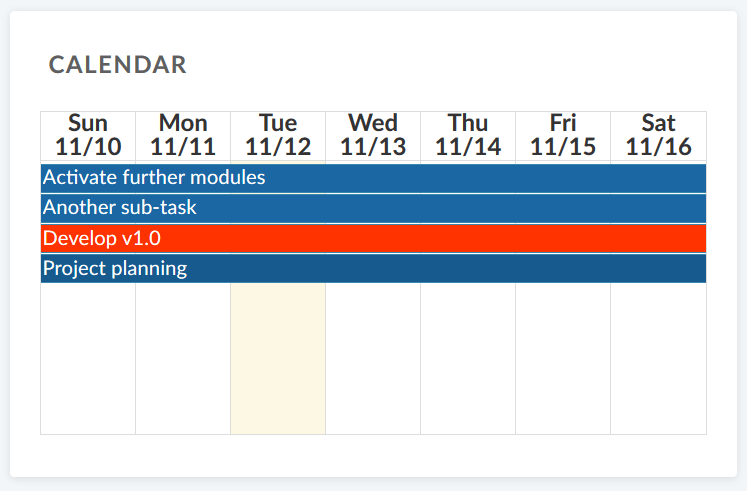

### Custom text widget

Within the custom text widget you can add any project information which you want to share with your team, e.g. links to important project resources or work packages, filters, specifications.

You can also add files to be displayed or attached to your project overview.

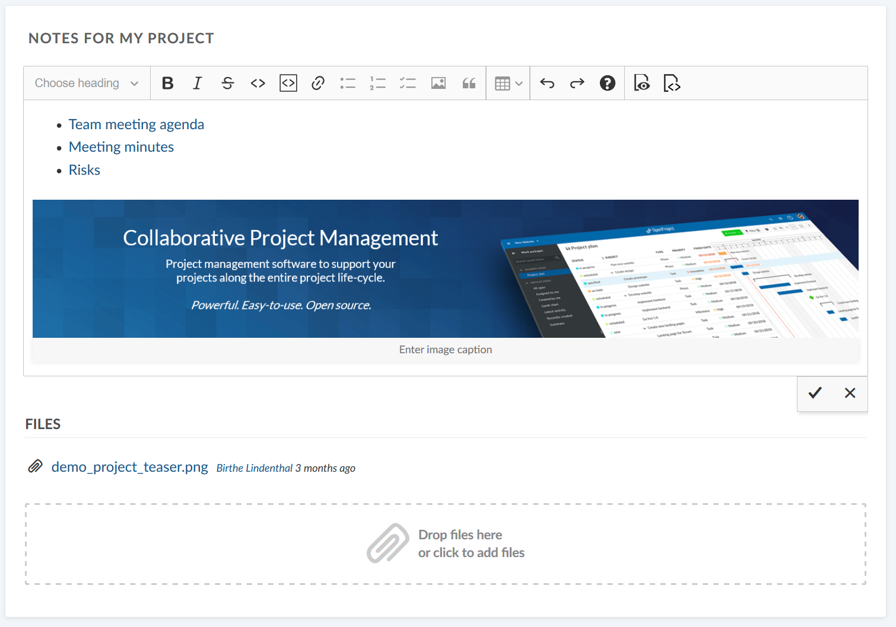

### Project members widget

You can add a widget which displays all project members and their corresponding role for this project at the project overview page.

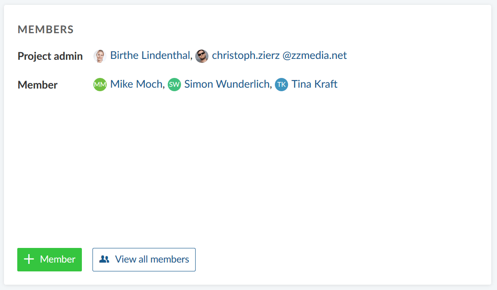

With the green button you can [add members to your project](/getting-started/invite-members/).

The View all members button brings you to the list of project members.

### News widget

Display the latest project news in the news widget on the project overview page.

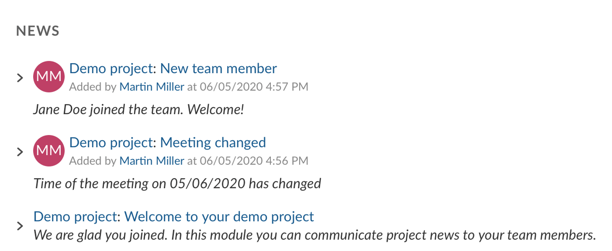

### Project description

The project description widgets adds the project description to your project overview. 

The description can be added or changed in the [project settings](../projects/project-settings).

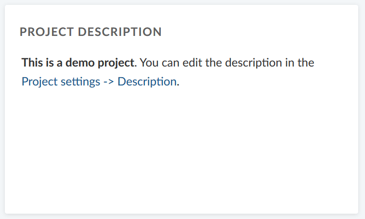

### Project details widget

The project details widget displays all custom fields for projects, e.g. project owner, project due date, project number, or any other custom field for this project.

The custom fields can be adapted in the [project settings](../projects/project-settings/). As a system administrator you can [create new custom fields for projects](../../system-admin-guide/custom-fields/custom-fields-projects/).

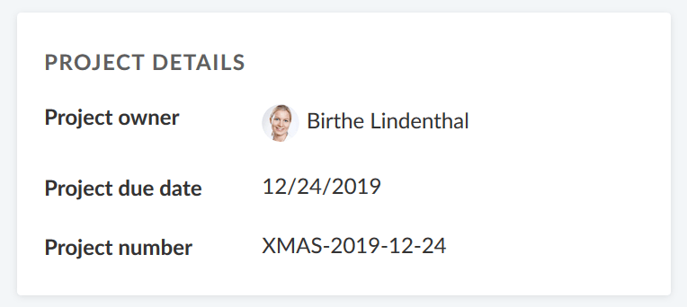

New custom fields for projects can be created in the [system administration](../../system-admin-guide/).

### Project status widget

Add your project status as a widget to display at a glance whether your project is on track, off track or at risk.

First, select your project status from the drop-down. You can choose between:

ON TRACK (green)

OFF TRACK (red)

AT RISK (yellow)

NOT SET (grey)

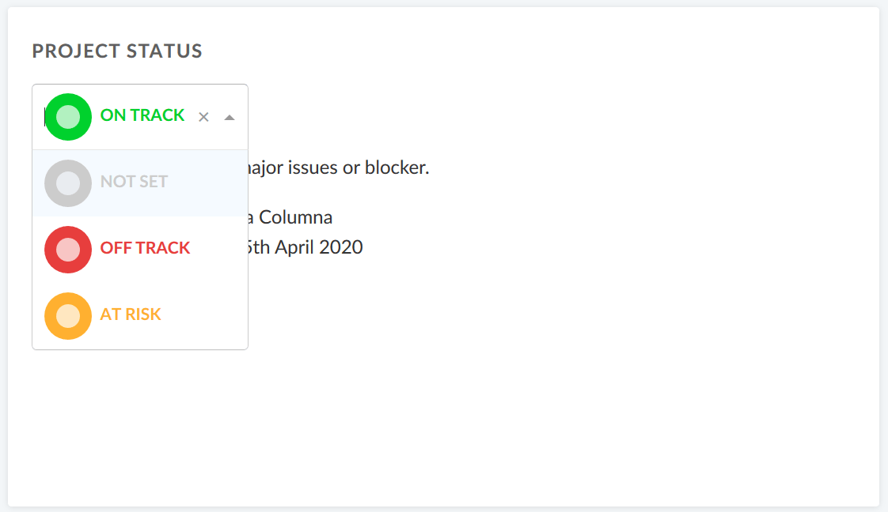

Add a **project status description** and further important information, such as project owner, milestones and other important links or status information.

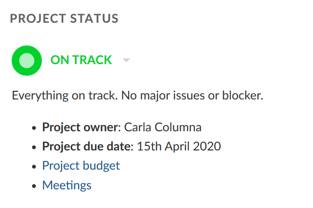

### Spent time widget

The spent time widget lists the **spent time in this project for the last 7 days**.

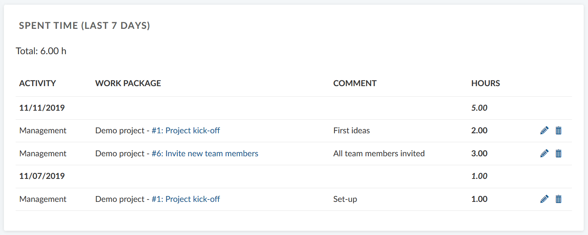

Time entries link to the respective work package and can be edited or deleted. To have a detailed view on all spent time and costs, go to the [Cost reporting](#TODO) module.

### Subprojects

The subprojects widget lists all subproject of the respective project on the overview. You can directly open a subproject via this link.

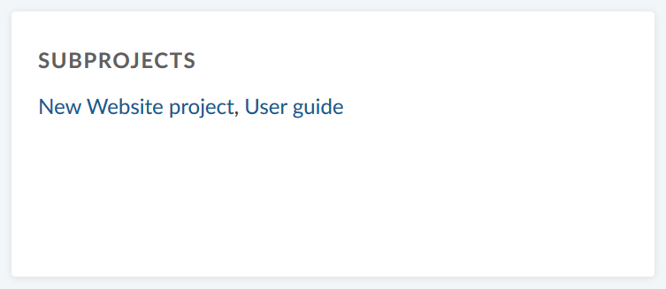

The widget only links the first subproject hierarchy and not the children of a subproject.

To edit the project hierarchy, go to the [project settings](../projects/).

### Work package graph widgets (Premium feature)

The work package graph widgets displays information about the work packages within a project. They can be displayed in different graph views, such as a bar graph or a pie chart.

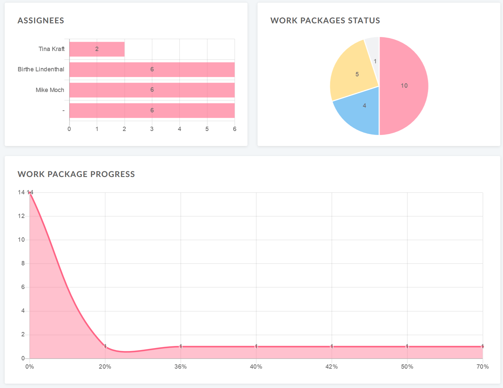

**Configure the work package graph**

You can filter the work packages to be displayed in the graph according to the [work packages table configuration](/user-guide/work-packages/work-package-table-configuration/).

To configure the work package graph, click on the three dots in the top right corner and select **Configure view...**

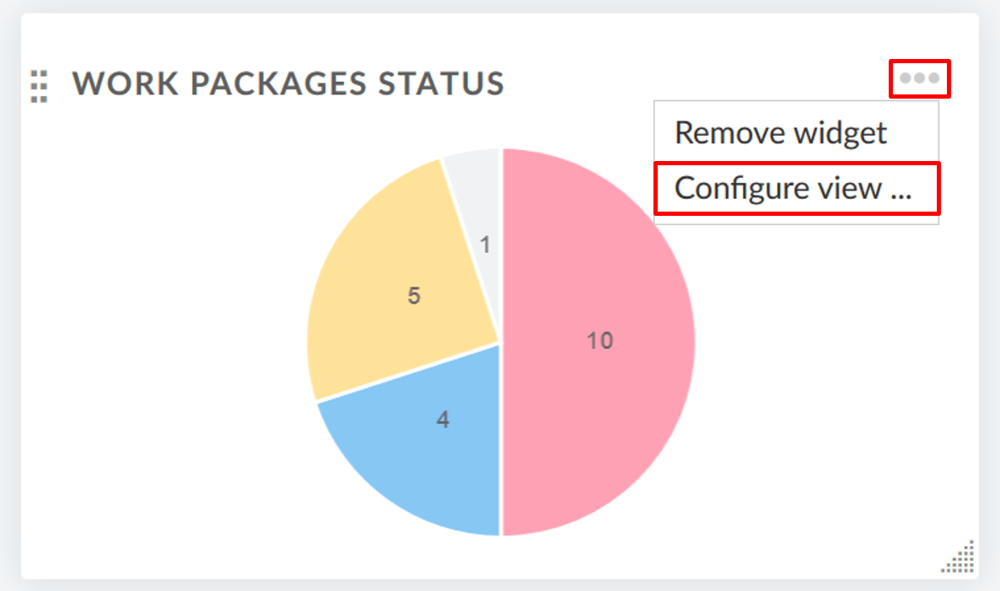

Select the **Axis criteria** which shall be displayed on the axis of the graph, e.g. Accountable, Priority, Status, Type.

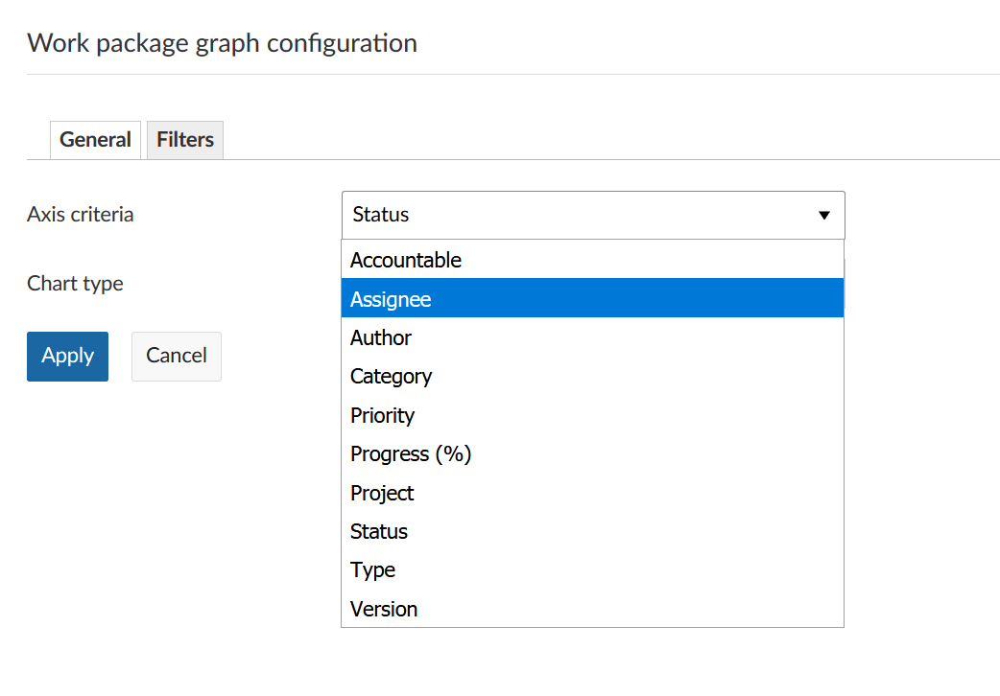

Next, select the **Chart type** how the work package information shall be displayed, e.g. as a bar graph, a line, a pie chart.

**Filter** the work packages for your chart.

Click on the Filter tab in order to configure the work packages which shall be displayed, e.g. only work packages with high priority.

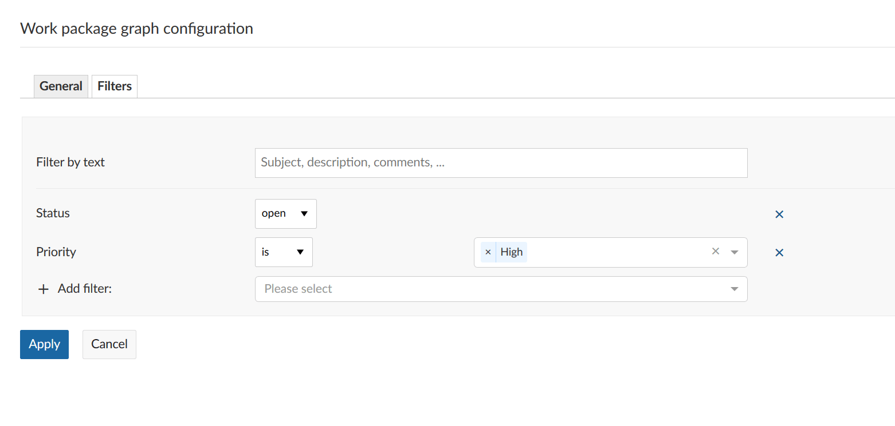

Click the blue **Apply** button to save your changes.

### Work package overview widget

The work package over widget displays all work packages in a project differentiated by a certain criteria.

You can display the graph according to the following criteria:

* Type
* Status
* Priority
* Author
* Assignee

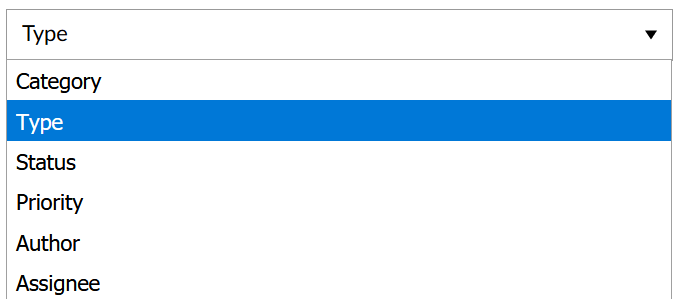

The widget lists all **open** and all **closed** work packages according to this criteria.

### Work package table widget

The work package table widget includes a work package table to the project overview. The work package table can be filtered, grouped, sorted according to the [work package table configuration](/user-guide/work-packages/work-package-table-configuration/), e.g. display only work packages with Priority High.

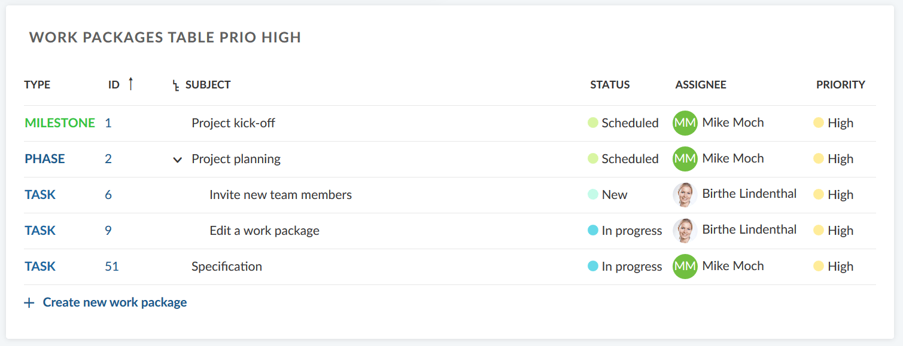

## Re-size and re-order widgets

To **re-order** a widget, click on the dots icon on the upper left hand corner and drag the widget with the mouse to the new position.

To **re-size** a widget, click on the grey icon in the lower right hand corner of the widget and drag the corner to the right or left. The widget will re-size accordingly.

## Remove widget from project overview page

To remove a widget from the project overview page, click on the three dots at the top right corner of the widget and select **Remove widget**.

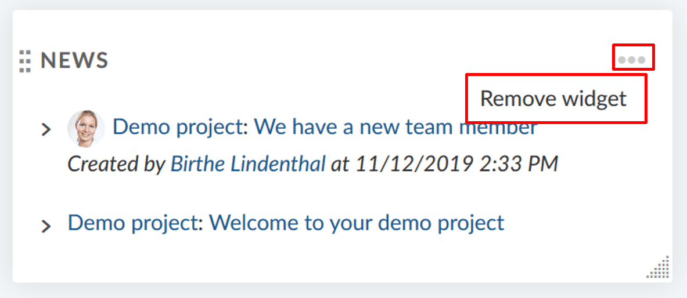

## Frequently asked questions (FAQ)

### Is it possible that we can have a board over all OpenProject tasks and users? 

Yes, to achieve the desired result you can navigate to the main project and on the Kanban view add the filter "subproject" "all". This will display the work packages in the main project and all subprojects.

### What is the best way to maintain an overview of multiple projects in OpenProject? Is it possible to create a dashboard that shows all the projects you are responsible for at once?

You can click on "Select a project" on the upper left side and then choose "View all projects" to get an overview of all projects. You can also apply filters to filter e.g. by projects for which you are set as the responsible. If you want to see the individual work packages in the projects, you can click on the module icon (the icon with the 9 squares) in the upper right side and choose "Work packages" from the dropdown menu. This shows all work packages across all projects you have access to. You can then click on the "Project" column header and select "Group by" to group by project. Additionally, you can then filter based on the project and e.g. only display certain projects.
