---
sidebar_navigation:
  title: Projects
  priority: 600
description: Manage projects in OpenProject
keywords: manage projects
---
# Manage projects

In OpenProject you can create projects to collaborate with your team members, track issues, document and share information with stakeholders, organize things. A project is a way to structure and organize your work in OpenProject.

Your projects can be available publicly or internally. OpenProject does not limit the number of projects, neither in the Community edition nor in the Enterprise cloud or in Enterprise on-premises edition.

| Topic                                                        | Content                                                      |
| ------------------------------------------------------------ | ------------------------------------------------------------ |
| [Select a project](../../getting-started/projects/)          | Open a project which you want to work at.                    |
| [Create a new project](../../getting-started/projects/#create-a-new-project) | Find out how to create a new project in OpenProject.         |
| [Create a subproject](#create-a-subproject)                  | Create a subproject of an existing project.                  |
| [Project structure](#project-structure)                      | Find out how to set up a project structure.                  |
| [Project settings](#project-settings)                        | Configure further settings for your projects, such as description, project hierarchy structure, or setting it to public. |
| [Change the project hierarchy](#change-the-project-hierarchy) | You can change the hierarchy by selecting the parent project ("subproject of"). |
| [Set a project to public](#set-a-project-to-public)          | Make a project accessible for (at least) all users within your instance. |
| [Create a project template](./project-templates/#create-a-project-template) | Configure a project and set it as template to copy it for future projects. |
| [Use a project template](./project-templates/#use-a-project-template) | Create a new project based on an existing template project.  |
| [Copy a project](#copy-a-project)                            | Copy an existing project.                                    |
| [Archive a project](#archive-a-project)                      | Find out how to archive completed projects.                  |
| [Delete a project](#delete-a-project)                        | How to delete a project.                                     |

## Select a project

Find out in our Getting started guide [how to open an existing project](../../getting-started/projects/) in OpenProject.

## Create a new project

Find out in our Getting started guide how to [create a new project](../../getting-started/projects/#create-a-new-project) in OpenProject.

## Create a subproject

To create a subproject for an existing project, navigate to [*Project settings*](#project-settings) -> *Information* and click on the green **+ Subproject** button.

Then follow the instructions to [create a new project](../../getting-started/projects/#create-a-new-project).

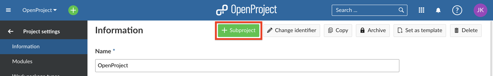

## Project structure

Projects build a structure in OpenProject. You can have parent projects and sub-projects. A project can represent an organizational unit of a company, e.g. to have issues separated:

* Company (Parent project)
  * Marketing (Sub-project)
  * Sales
  * HR
  * IT
  * ...

Also, projects can be for overarching teams working on one topic:

* Launch a new product
  * Design
  * Development
  * ...

Or, a project can be to separate products or customers.

* Product A
  * Customer A
  * Customer B
  * Customer C

OpenProject, for example, uses the projects to structure the different modules/plugin development:

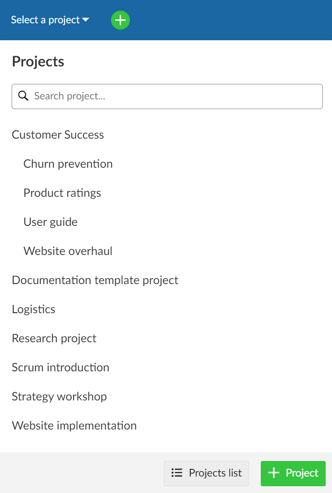

**Note**: You have to be a [member](../members/#add-members) of a project in order to see the project and to work in a project.

## Project Settings

You can specify further advanced settings for your project. Navigate to your project settings by [selecting a project](../../getting-started/projects/#open-an-existing-project), and click -> *Project settings* -> *Information*.

- You can define whether the project should have a parent by selecting **Subproject of**. This way, you can [change the project hierarchy](#change-the-project-hierarchy).

- Enter a detailed description for your project.

- You see the default project **Identifier**. The identifier will be shown in the URL.

**Note**: Changing the project identifier while the project is already being worked on can have major effects and is therefore not recommended. For example, repositories may not be loaded correctly and deep links may no longer work (since the project URL changes when the project identifier is changed).

- You can set a project to **Public**. This means it can be accessed without signing in to OpenProject.
- Click the green **Save** button to save your changes.
- If you like, use the autocompleter to fill in the project attributes.

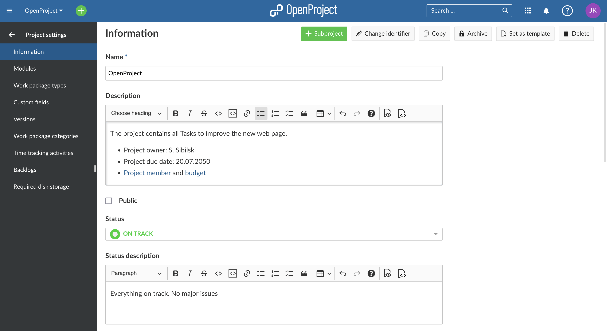

Find out more detailed information about the Project settings [here](project-settings).

### Change the project hierarchy

To change the project's hierarchy, navigate to the [project settings](project-settings) -> *Information* and change the **Subproject of** field.

Press the blue **Save** button to apply your changes.

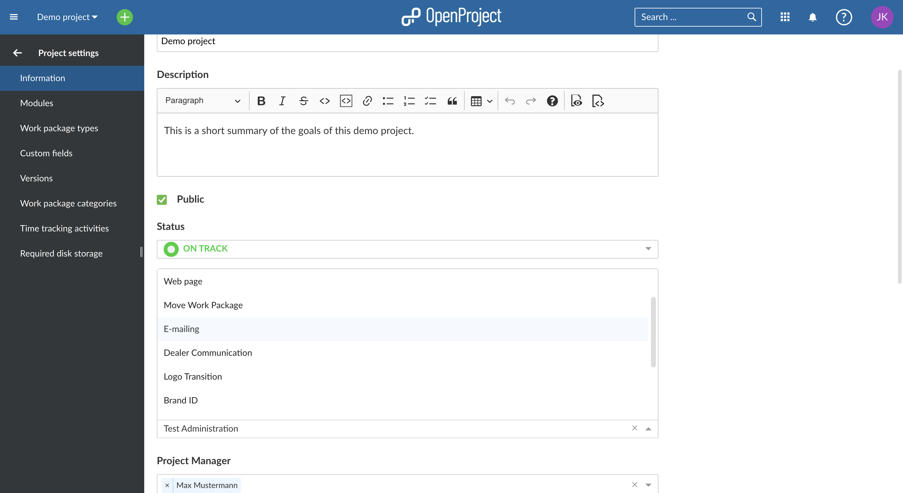

### Set a project to public

If you want to set a project to public, you can do so by ticking the box next to "Public" in the [project settings](project-settings) *->Information*.

Setting a project to public will make it accessible to all people within your OpenProject instance.

(Should your instance be [accessible without authentication](../../system-admin-guide/authentication/authentication-settings) this option will make the project visible to the general public outside your registered users, too)

### Copy a project

You can copy an existing project by navigating to the [project settings](project-settings) and clicking **Copy project** in the upper right of the project settings.

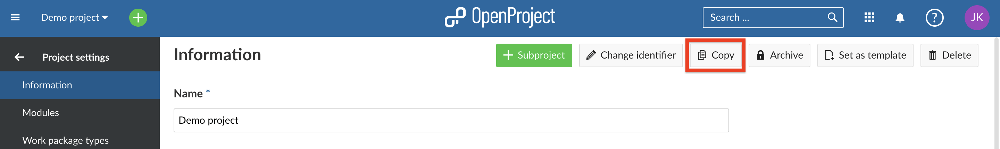

Give the new project a name. Under **Copy options** select which modules and settings you want to copy and whether or not you want to notify users via email during copying.
You can copy existing [boards](../agile-boards) (apart from the Subproject board) and the [Project overview](../project-overview/#project-overview) dashboards along with your project, too.

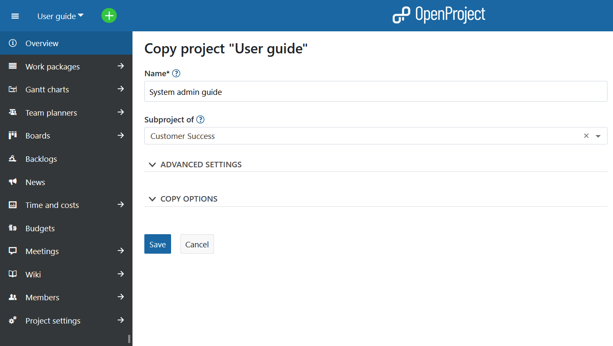

> **!!Attention!!** - **Budgets** cannot be copied, so they must be removed from the work package table beforehand. Alternatively, you can delete them in the Budget module and thus delete them from the work packages as well.

For further configuration open the **Advanced settings**. Here you can specify (among other things) the project's URL (identifier), its visibility and status. Furthermore you can set values for custom fields.

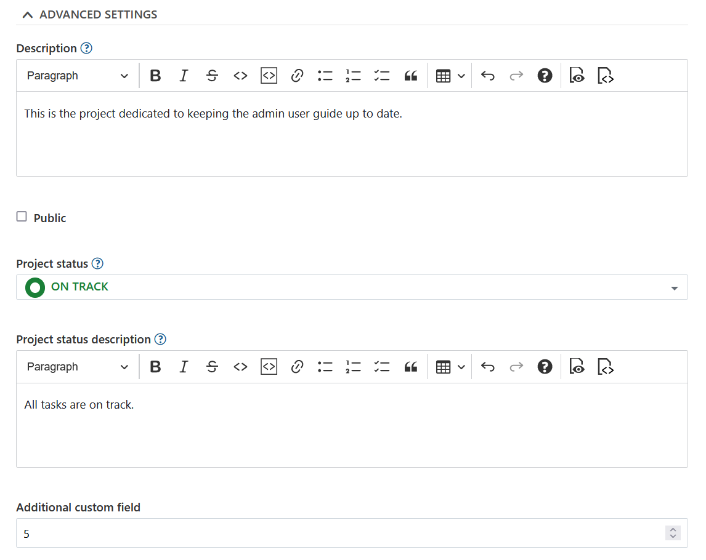

Under the **Copy options** section you can select what additional project data and settings, such as versions, work package categories, attachments and project members should be copied as well.

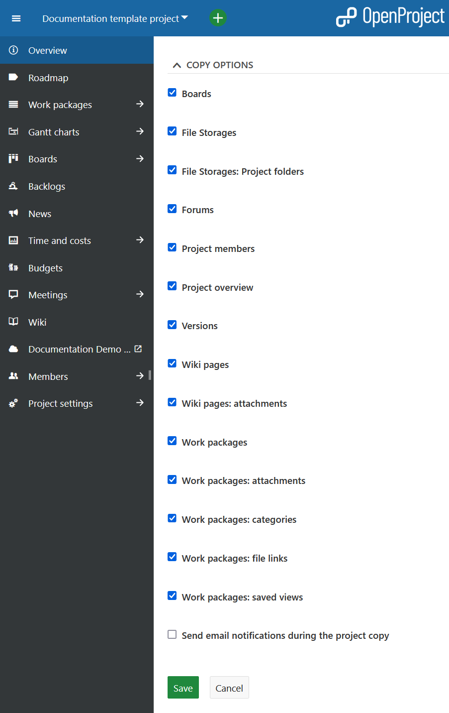

**Note**: the File storages options only apply if the template project had  [OneDrive/SharePoint](../../system-admin-guide/integrations/one-drive) with automatically managed folders activated.

If you select the **File Storages: Project folders** option, both the storage and the storage folders are copied into the new project if automatically managed project folders were selected for the original file storage. For storages with manually managed project folders setup the copied storage will be referencing the same folder as the original project.

If you de-select the **File Storages: Project folders** option, the storage is copied, but no specific folder is set up.

If you de-select the **File Storages** option, no storages are copied to the new project.

Once you are done, click the green **Save** button.

### Archive a project

In order to archive a project, navigate to the [project settings](project-settings), and click the **Archive project** button.

> **Note**: This option is always available to instance and project administrators. It can also be activated for specific roles by enabling the _Archive project_ permission for that role via the [Roles and permissions](../../system-admin-guide/users-permissions/roles-permissions/) page in the administrator settings.

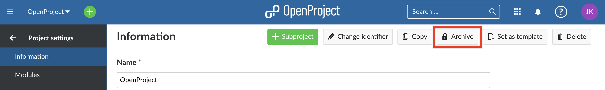

Then, the project cannot be selected from the project selection anymore. It is still available in the **[Project lists](./project-lists)** dashboard if you set the "Active" filter to "off" (move slider to the left). You can un-archive it there, too, using the three dots at the right end of a row.

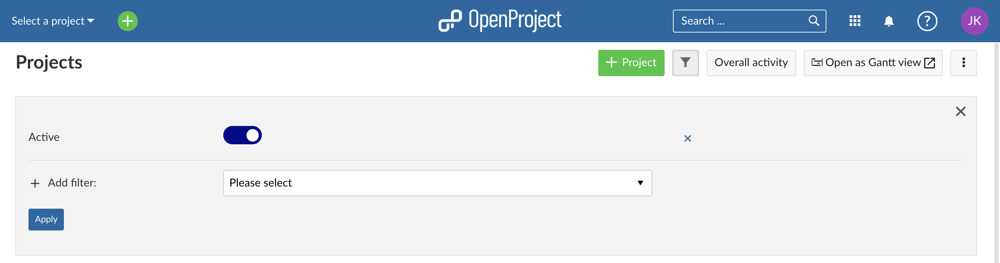

You can also archive a project directly on the [project overview page.](../project-overview/#archive-a-project) 

### Delete a project

If you want to delete a project, navigate to the [Project settings](project-settings). Click the button **Delete project** on the top right of the page.

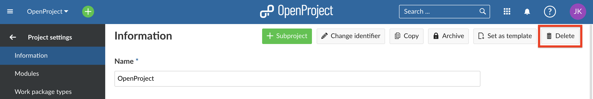

You can also delete a project via the [projects overview list](./project-lists/).

**Note**: Deleting projects is only available for System administrators.
