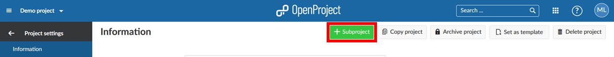
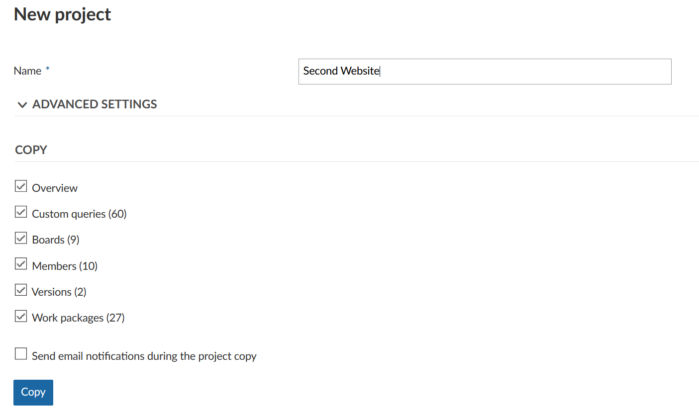
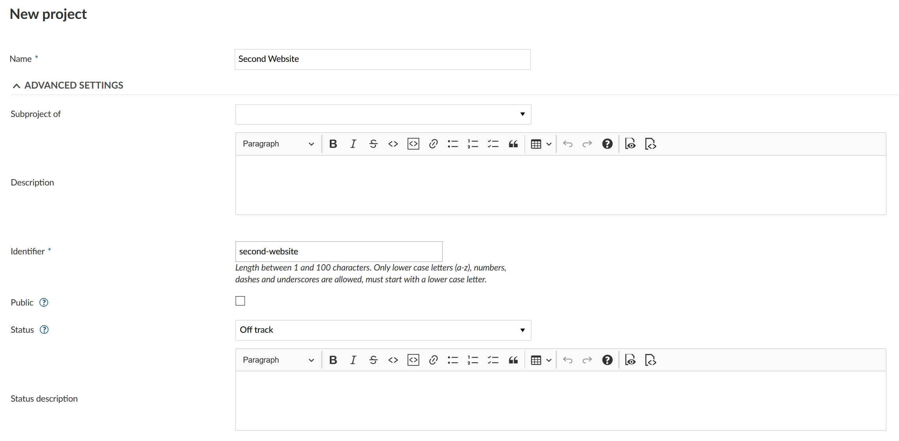
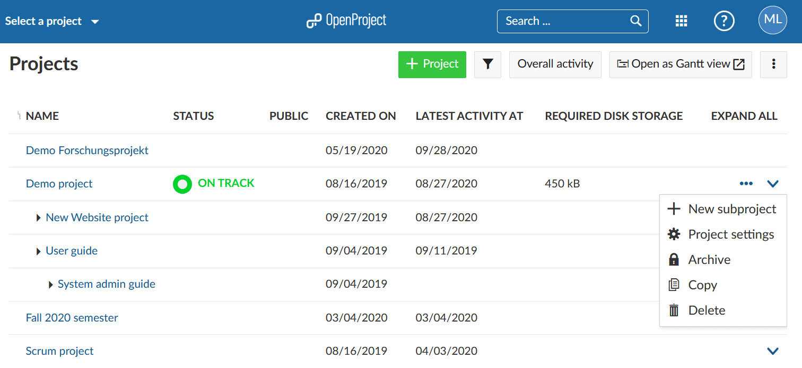
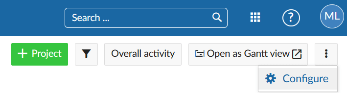

---
sidebar_navigation:
  title: Manage projects
  priority: 600
description: Manage projects in OpenProject.
robots: index, follow
keywords: projects
---
# Manage projects

In OpenProject you can create projects to collaborate with your team members, track issues, document and share information with stakeholders, organize things. A project is a way to structure and organize your work in OpenProject.

Your projects can be available publicly or internally. OpenProject does not limit the number of projects, neither in the Community Edition nor in the Enterprise cloud or in Enterprise on-premises edition.

| Topic                                                        | Content                                                      |
| ------------------------------------------------------------ | ------------------------------------------------------------ |
| [Select a project](../../getting-started/projects/)          | Open a project which you want to work at.                    |
| [Create a new project](../../getting-started/projects/#create-a-new-project) | Find out how to create a new project in OpenProject.         |
| [Create a subproject](#create-a-subproject)                  | Create a subproject of an existing project.                  |
| [Project structure](#project-structure)                      | Find out how to set up a project structure.                  |
| [Project settings](#project-settings)                        | Configure further settings for your projects, such as description, project hierarchy structure, or setting it to public. |
| [Change the project hierarchy](#change-the-project-hierarchy) | You can change the hierarchy by selecting the parent project ("subproject of"). |
| [Set a project to public](#set-a-project-to-public)          | Make a project accessible for (at least) all users within your instance. |
| [Create a project template](#create-a-project-template)      | Configure a project and set it as template to copy it for future projects. |
| [Use a project template](#use-a-project-template)            | Create a new project based on an existing template project.  |
| [Copy a project](#copy-a-project)                            | Copy an existing project.                                    |
| [Archive a project](#archive-a-project)                      | Find out how to archive completed projects.                  |
| [Delete a project](#delete-a-project)                        | How to delete a project?                                     |
| [View all projects](#view-all-projects)                      | Get an overview of all your projects in the projects overview list. |
| [Project overarching reports](#project-overarching-reports)  | How to create project overarching reports across multiple projects? |

<video src="https://www.openproject.org/wp-content/uploads/2020/12/OpenProject-Projects-Introduction.mp4" type="video/mp4" controls="" style="width:100%"></video>

## Select a project

Find out in our Getting started guide [how to open an existing project](../../getting-started/projects/) in OpenProject.

## Create a new project

Find out in our Getting started guide how to [create a new project](../../getting-started/projects/#create-a-new-project) in OpenProject.

## Create a subproject

To create a subproject for an existing project, navigate to the [project settings](#project-settings) -> *Information* and click on the green **+ Subproject** button.

Follow the instructions to [create a new project](../../getting-started/projects/#create-a-new-project).

## Project structure

Projects build a structure in OpenProject. You can have parent projects and sub-projects. A project can represent an organizational unit of a company, e.g. to have issues separated:

* Company (Parent project)
  * Marketing (Sub-project)
  * Sales
  * HR
  * IT
  * ...

Also, projects can be for overarching teams working on one topic:

* Launch a new product
  * Design
  * Development
  * ...

Or, a project can be to separate products or customers.

* Product A
  * Customer A
  * Customer B
  * Customer C

OpenProject, for example, uses the projects to structure the different modules/plugin development:

**Please note**: You have to be a [member](../members/#add-members) of a project in order to see the project and to work in a project.

## Project Settings

You can specify further advanced settings for your project. Navigate to your project settings by [selecting a project](#select-a-project), and click -> *Project settings* -> *Information*.

- You can define whether the project should have a parent by selecting **Subproject of**. This way, you can [change the project hierarchy](#change-the-project-hierarchy).

- Enter a detailed description for your project.

- You see the default project **Identifier**. The identifier will be shown in the URL. 

**Note**: The Identifier cannot be changed later after creating the project.

- You can set a project to **Public**. This means it can be accessed without signing in to OpenProject.

- Click the blue **Create** button in order to save your new project. Or click the blue **Save** button to save your changes.

Find out more detailed information about the [Project settings](project-settings).

### Change the project hierarchy

To change the project's hierarchy, navigate to the [project settings](project-settings) -> *Information* and change the **Subproject of** field.

Press the blue **Save** button to apply your changes.

### Set a project to public

If you want to set a project to public, you can do so by ticking the box next to "Public" in the [project settings](project-settings) *->Information*.

Setting a project to public will make it accessible to all people within your OpenProject instance. 
(Should your instance be [accessible without authentication](../../system-admin-guide/authentication/authentication-settings) this option will make the project visible to the general public outside your registered users, too)

### Create a project template

You can create a project template in OpenProject by [creating a new project](../../getting-started/#create-a-project) and configuring your project to your needs. Name the project so you can identify it as a template, e.g. "Project XY [template]".

Set up everything that you want to have available for future projects.

- Adding project members.
- Selecting the modules.
- Setting up a default project structure in the Gantt chart.
- Creating your work package templates.
- ...

Navigate to the [project settings](project-settings) and click **Set as template** in the upper right corner. You can remove a project from the template collection on the same spot. 

**Please note**: The option to set a project as template or to remove it from templates is only available for Administrators.

### Use a project template

You can create a new project by using an existing template. This causes the properties of the project template to be copied to the new project. Find out in our Getting started guide how to [create a new project](../../getting-started/projects/#create-a-new-project) in OpenProject. 
Another way for using a template project would be to [copy it](#copy-a-project).

<video src="https://www.openproject.org/wp-content/uploads/2020/12/OpenProject-Project-Templates.mp4" type="video/mp4" controls="" style="width:100%"></video>

### Copy a project

You can copy an existing project by navigating to the [project settings](project-settings) and clicking **Copy project** in the upper right of the project settings.

Give the new project a name. Select which modules and settings you want to copy and whether or not you want to notify users via email during copying. 
You can copy existing [boards](../agile-boards) (apart from the Subproject board) and the [Project overview](../project-overview/#project-overview) dashboards along with your project, too.

For further configuration open the **Advanced settings**. Here you can specify (among other things) the project's URL (identifier), its visibility and status. Furthermore you can set values for custom fields (not shown in the screenshot).

Then click the blue **Copy** button.

### Archive a project

In order to archive a project, navigate to the [project settings](project-settings), and click the **Archive project** button. Then, the project cannot be selected from the project selection anymore. It is still available in the **View all projects** dashboard if you expand the filter and select the Archived projects.

**Note**: This option is only available for Administrators.

### Delete a project

If you want to delete a project, navigate to the [project settings](project-settings). Click the button **Delete project** on the top right of the page. 

Also, you can delete a project via the [projects overview](#view-all-projects).

**Note**: This option is only available for Administrators.

## View all projects

To get an overview of all your projects, select the **View all projects** option from the **Select a project** menu in the top left header navigation. 

You will then get a list of all your projects in OpenProject. You can use this projects overview to **create a multi project status dashboard** if you include your own [project custom fields](../../system-admin-guide/custom-fields/custom-fields-projects/), e.g. custom status options, Accountable, Project duration, and more.

**Please note:** Project custom fields are a premium feature and will only be displayed here for Enterprise on-premises and Enterprise cloud.

With the **arrow** on the right you can display the **project description**.

With the horizontal **three dots** icon on the right side of the list you can open **further features**, such as [creating a new subproject](#create-a-subproject), [project settings](project-settings), [archiving a project](#archive-a-project), [copying](#copy-a-project) and [deleting a project](#delete-a-project). Please note that you have to be a System Administrator in OpenProject to access these features.

You can choose the **columns displayed by default** in the [System Settings](../../system-admin-guide/system-settings/project-system-settings) in the Administration. To access it quickly use the **vertical three dots** icon on the upper right.

To change the order of the displayed [custom fields](../../system-admin-guide/custom-fields) (columns) follow the instructions here: [Displaying a project custom field](/system-admin-guide/custom-fields/custom-fields-projects/#displaying-project-custom-fields) 

To **display the work packages** of all your projects **in a Gantt chart** click on the **Open as Gantt view** icon on the upper right. This is a shortcut to quickly get to the report described in the [chapter below](#project-overarching-reports). 
The Gantt chart view can be configured in the [System Settings](../../system-admin-guide/system-settings/project-system-settings) in the Administration.

## Project overarching reports

Often you need to see information about more than one project at once and want to create project overarching reports.

Click on the **Modules** icon with the dots in the header navigation. These are the project overarching modules in OpenProject. 

Here you will find

- The [global projects list](#view-all-projects)
- The global work packages list (see below)
- The global news overview
- The global time and costs module

### Global work packages list

Select **Work packages** from the drop down menu **Modules** in the upper right (nine squares). Now, you will see all work packages in the projects for which you have the required [permissions](../..//system-admin-guide/users-permissions/roles-permissions/).

In this project overarching list, you can search, filter, group by, sort, highlight and save views the same way as in the [work package list](../work-packages/work-package-table-configuration) in each project.

You can group by projects by clicking in the header of the work package list next to PROJECT and select **Group by**. Collapsing the groups will allow you an **overview of the projects' aggregated milestones** as described [here](../../user-guide/work-packages/work-package-table-configuration/#aggregation-by-project).

