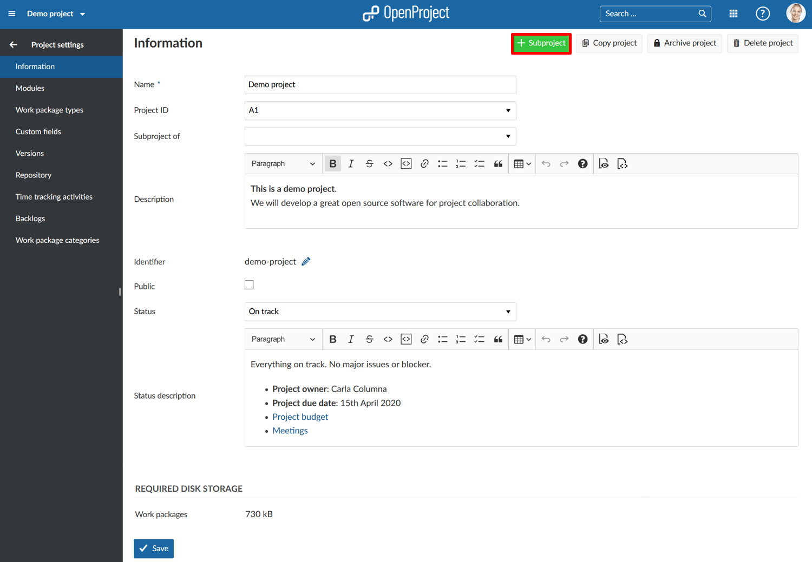
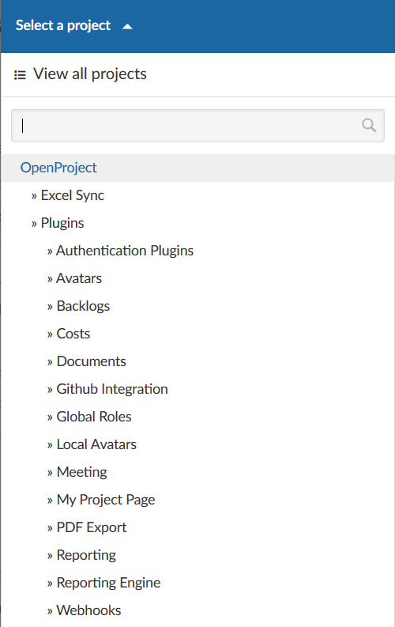
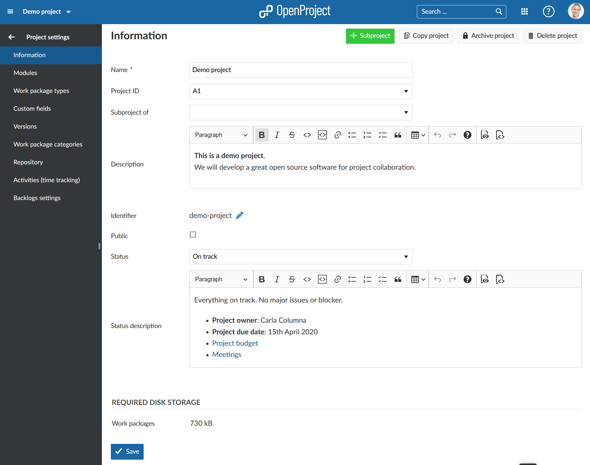
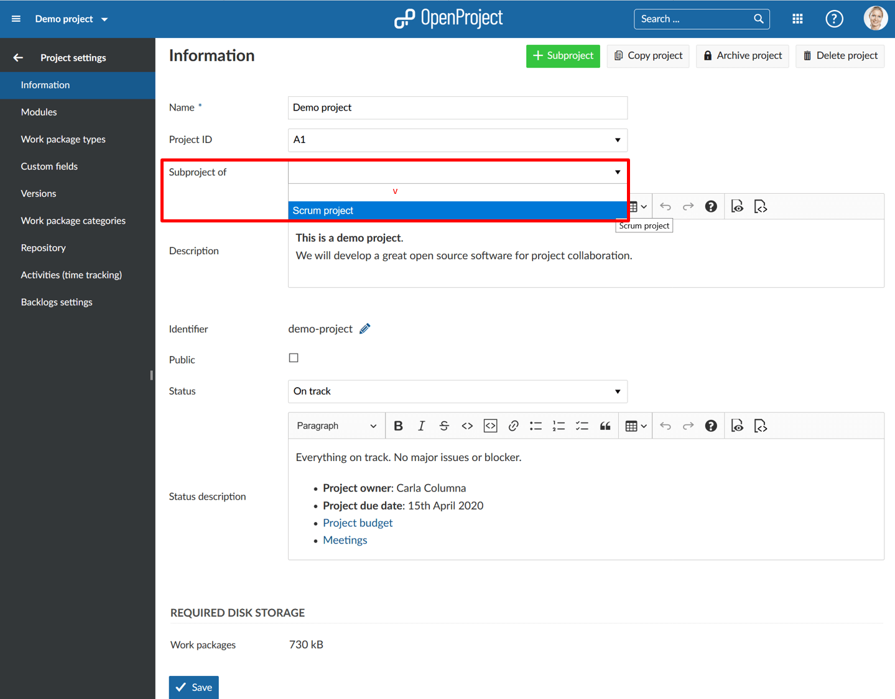
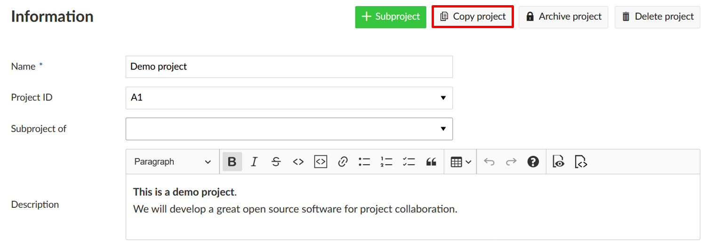
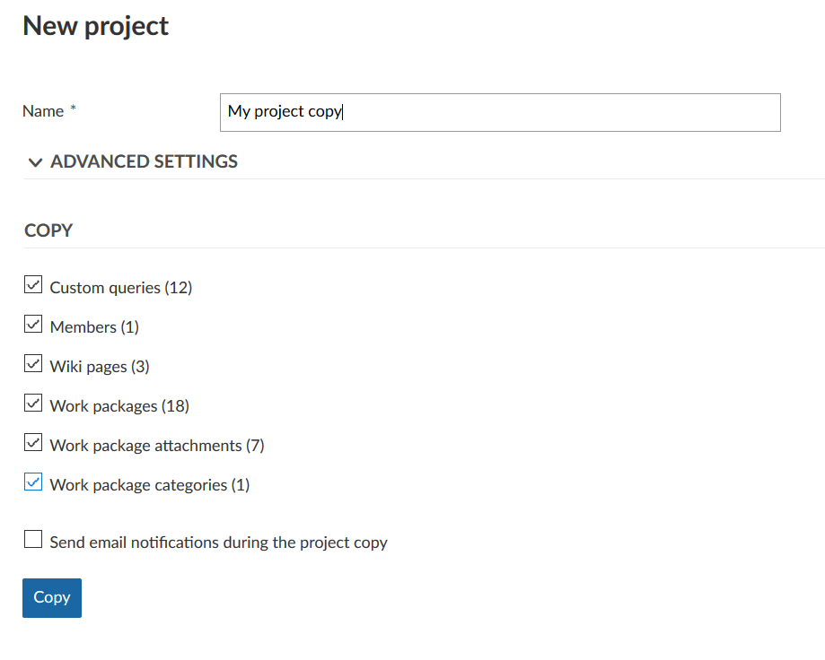
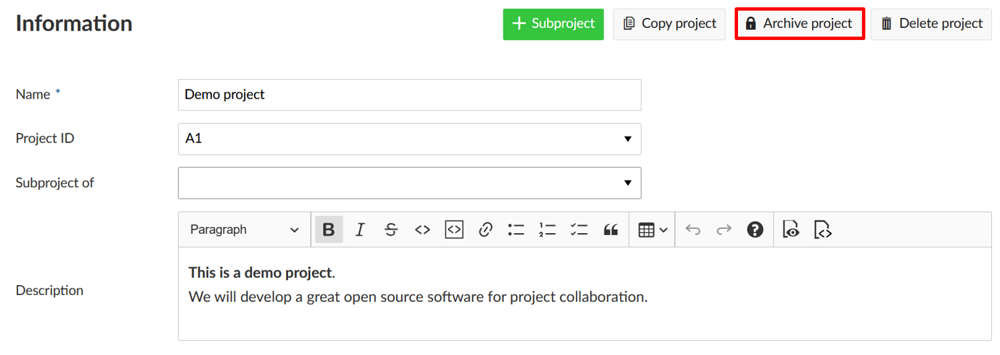
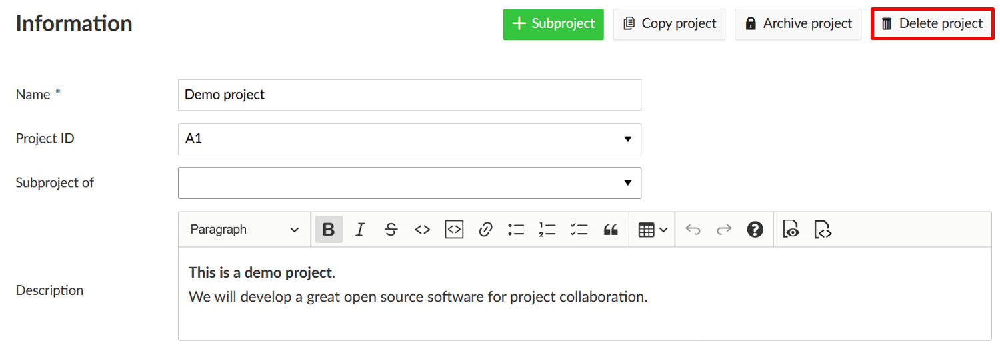
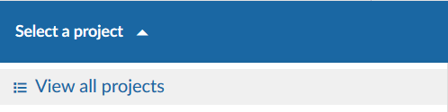
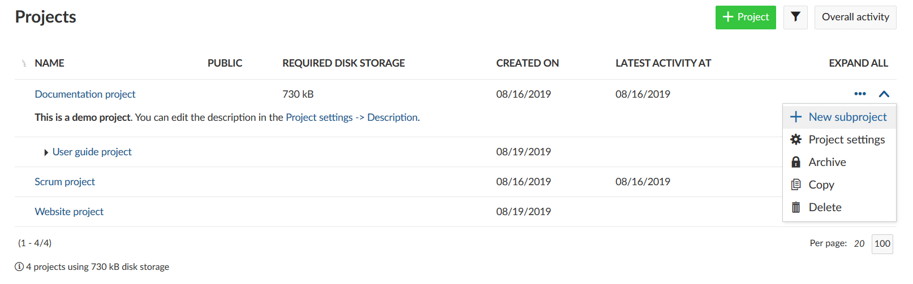

---
sidebar_navigation:
  title: Manage projects
  priority: 600
description: Manage projects in OpenProject.
robots: index, follow
keywords: projects
---
# Manage projects

In OpenProject you can create projects to collaborate with your team members, track issues, document and share information with stakeholders, organize things. A project is a way to structure and organize your work in OpenProject.

Your projects can be available publicly or internally. OpenProject does not limit the number of projects, neither in the Community nor in the Cloud or Enterprise Edition.

| Feature                                                      | Documentation for                                            |
| ------------------------------------------------------------ | ------------------------------------------------------------ |
| [Select a project](../../getting-started/projects/)          | Open a project which you want to work at.                    |
| [Create a new project](../../getting-started/projects/#create-a-new-project) | Find out how to create a new project in OpenProject.         |
| [Project structure](#project-structure)                      | Find out how to set up a project structure.                  |
| [Project settings](#project-settings)                        | Configure further settings for your projects, such as description, project hierarchy structure, or setting it to public. |
| [Change the project hierarchy](#change-the-project-hierarchy) | You can change the hierarchy by selecting the parent parent (subproject of). |
| [Set a project to public](#set-a-project-to-public)          | Set a project to public to have it accessible without signing-in. |
| [Copy a project](#copy-a-project)                            | Copy an existing project.                                    |
| [Archive a project](#archive-a-project)                      | Find out how to archive completed projects.                  |
| [Delete a project](#delete-a-project)                        | How to delete a project?                                     |
| [View all projects](#view-all-projects)                      | Get an overview of all your projects in the project overview list. |
| [Create a project template](#create-a-project-template)      | You can create a project template and use it for future projects. |
| [Project overarching reports](#project-overarching-reports)  | How to create project overarching reports across multiple projects? |

## Select a project

Find out in our Getting started guide [how to open an existing project](../../getting-started/projects/) in OpenProject.

## Create a new project

Find out in our Getting started guide how to [create a new project](../../getting-started/projects/#create-a-new-project) in OpenProject.

## Create subproject

To create a subproject for an existing project, navigate to the [project settings](#project-settings) -> *Information* and click on the green + Subproject button.

Follow the instructions to [create a new project](../../getting-started/projects/#create-a-new-project).

## Project structure

Projects build a structure in OpenProject. You can have parent projects and sub-projects. A project can represent an organizational unit of a company, e.g. to have issues separated:

* Company (Parent project)
  * Marketing (Sub-project)
  * Sales
  * HR
  * IT
  * ...

Also, projects can be for overarching teams working on one topic:

* Launch a new product
  * Design
  * Development
  * ...

Or, a project can be to separate products or customers.

* Product A
  * Customer A
  * Customer B
  * Customer C

OpenProject, for example, uses the projects to structured the different modules/plugin development:

**Note**: You have to be a [member](../members/#add-members) of a project in order to see the project and to work in a project.

## Project Settings

You can specify further advanced settings for your project. Navigate to your project settings by [selecting a project](#select-a-project), and click -> *Project settings* -> *Information*.

- You can define whether the project should have a parent by selecting **Subproject of**. This way, you can [change the project hierarchy](#change-the-project-hierarchy).

- Enter a detailed description for your project.

- You see the default project **Identifier**. The identifier will be shown in the URL. 

**Note**: The Identifier cannot be changed later after creating the project.

- You can set a project to **Public**. This means it can be accessed without signing in to OpenProject.

- Click the blue **Create** button in order to save your new project. Or click the blue **Save** button to save your changes.

Find out more detailed information about the [Project settings](project-settings).

### Change the project hierarchy

To change the project's hierarchy, navigate to the [project settings](project-settings) -> *Information* and change the **Subproject of** field.

Press the blue **Save** button to apply your changes.

### Set a project to public

If you want to set a project to public, you can do so by selecting the option in the [project settings](project-settings).

### Copy a project

You can copy an existing project by navigating to the [project settings](project-settings) and click **Copy project** from the upper right of the project settings (next to the green +Subproject button).

Give the new project a name. Select which modules and settings you want to copy and whether or not you want to notify users via email during copying. 

Then click the blue **Copy** button.

### Archive a project

In order to archive a project, navigate to the [project settings](project-settings), and click the **Archive project** button. 

Then, the project cannot be selected from the project selection anymore. It is still available in the **View all projects** dashboard if you expand the filter and select the Archived projects.

### Delete a project

If you want to delete a project, navigate to the [project settings](project-settings). Click the button **Delete project** on the top right of the page.

Also, you can delete a project via the [projects overview](#view-all-projects).

## View all projects

To get an overview of all your projects, select the **View all projects** option from the Select a project menu in the top left header navigation. 

You will then get a list of all your projects in OpenProject.

With the **three dots** icon at the right in the list you can open further features, such as creating a new subproject, [project settings](project-settings), [archive a project](#archive-a-project), [copy](#copy-a-project) and [delete a project](#delte-a-project).

In the view all projects overview list you can also create a multi project status dashboard if you include [project custom fields](../../system-admin-guide/custom-fields/custom-fields-projects/), such as Status, Status description, Accountable, Project duration, and more.

## Create a project template

You can create a project template in OpenProject by [creating a new project](../../getting-started/#create-a-project) and configure your project to your needs. Name the project so you can identify it as a template, e.g. Project template.

Set up everything that you want to have available for next projects.

- Adding project members.
- Selecting the modules.
- Setting up a default project structure in the Gantt chart.
- Creating your work package templates.
- ...

[Copy the project](#copy-a-project) template if you want to start a new project and give the project a new name.

## Project overarching reports

Often you need to see more than one project in your lists and want to create project overarching reports.

Click on the **Modules** icon with the dots in the header navigation. These are the project overarching modules in OpenProject. 

Select Work packages from the drop down menu. Now, you will see all work packages in the projects where you have the required [permissions](../..//system-admin-guide/users-permissions/roles-permissions/).

You can group by project by clicking in the header of the work package list next to project and select Group by.

In the project overarching list, you can search, filter, group by, sort, highlight and save views the same way as in the project specific work package list.

