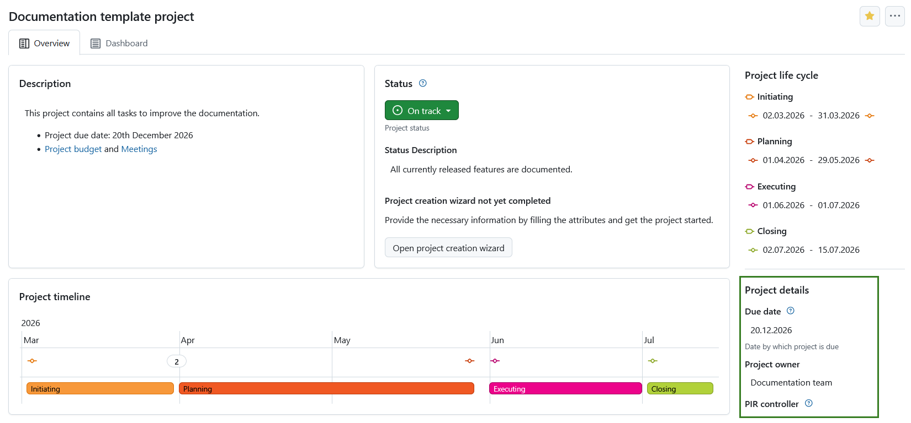
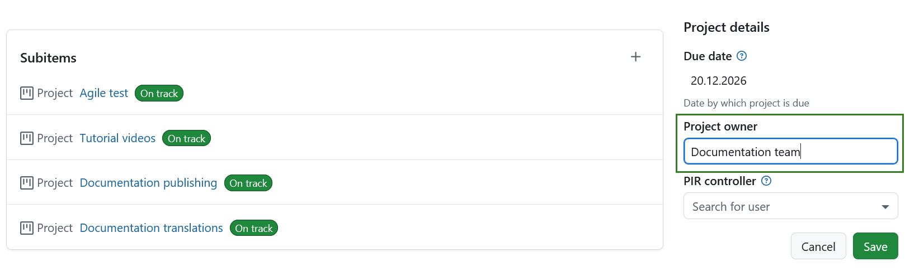
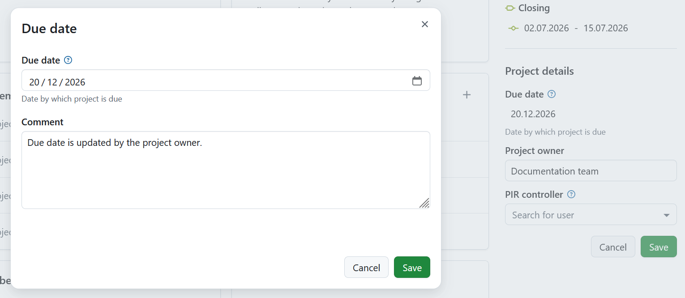
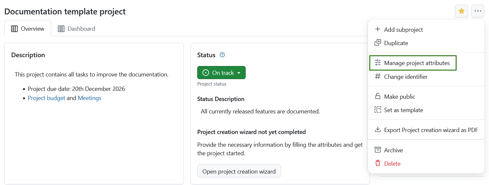

---
sidebar_navigation:
  title: Project attributes
  priority: 800
description: Learn how to configure project attributes
keywords: project attribute, attribute, project custom field, project overview, project information
---

# Project attributes

## Project attributes overview

**Project attributes** are a set of project-level custom fields that let you display certain types of information relevant to your project. Project attributes are displayed on the Overview (first) tab of the project home page.

Project attributes must first be created [on an instance level administration](../../../../system-admin-guide/projects/project-attributes/) and then activated for a specific project under [project settings](../../project-settings/project-attributes/).

The location of project attribute sections can be either in a pane on the right side under _project life cycle phases_, or in the main area under the project related widgets. The location of project attribute sections is determined under [project attribute settings in system administration](../../../../system-admin-guide/projects/project-attributes/).

Project attributes are always grouped in sections.

> [!TIP]
> Your view of the project attributes may vary depending on your  [roles and permissions in OpenProject](../../../../system-admin-guide/users-permissions/roles-permissions/). 
> The project attributes are visible for users with the **View project attributes** permission enabled. The editing icons are visible for users with the **Edit project attributes** permission.

------

To edit the value of any visible project attribute, simply click on that value. For most attributes, you can edit the value directly in place.

Depending on the field type, changes are saved differently. For example, text fields can be confirmed with Enter or canceled with Escape, while checkboxes are saved automatically when changed.

For certain attributes, a modal will be displayed instead. This applies to hierarchy attributes, long text fields shown in the sidebar, or attributes with comments enabled. In this case, you can edit the value in the modal. If the option to add a comment is enabled for this attribute, you will also see a comment field where you can add more information on the value change.

Edit the values for each project attribute and click the **Save** button where applicable to confirm and save your changes.

> [!NOTE]
> If you are an instance administrator and would like to create, modify or add project attributes, please read our [system administration guide on project attributes](../../../../system-admin-guide/projects/project-attributes/).

## Project attribute settings 

To adjust the project attribute settings for a specific project click the **More** (three dots) icon and select _Manage project attributes_. This will lead you directly to the [project attribute settings](../../project-settings/project-attributes/).

> [!NOTE]
> This option is always available to instance and project administrators. It can also be activated for specific roles by enabling the _select_project_attributes_ permission for that role via the [Roles and permissions page](../../../../system-admin-guide/users-permissions/roles-permissions/) in the administrator settings.

## Display project attributes in work packages

Project attributes can also be displayed in a dedicated **Project attributes** tab within work packages, if configured.

To configure this, navigate to **Administration → Work packages → Types**, open the **Project attributes** tab, and select which project attributes should be displayed for a specific work package type.

> [!NOTE]
> The visibility of project attributes in work packages is configured independently from the project overview page. Changing where a project attribute is displayed does not affect the attribute itself or its value. Any changes made to a project attribute are reflected everywhere it is displayed.

For more information, see the documentation on [displaying project attributes in work package forms](../../manage-work-packages/work-package-types#display-project-attributes-in-work-package-forms).