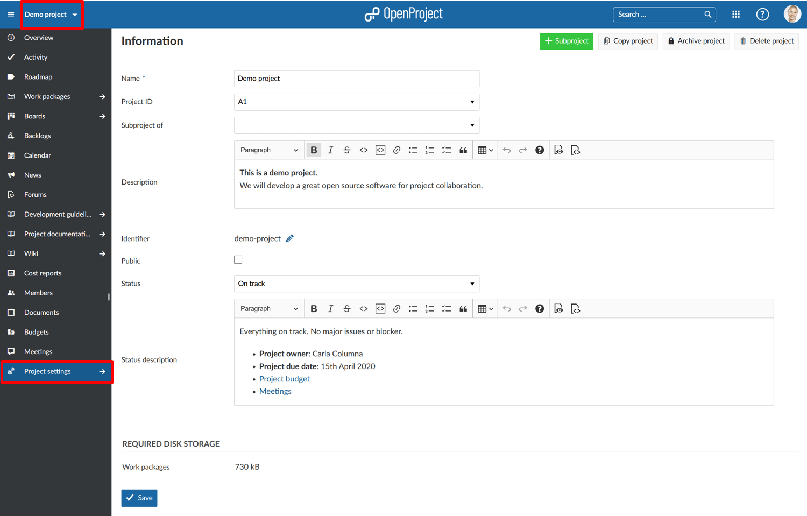

---
sidebar_navigation:
  title: Project settings
  priority: 900
description: Configure your project in OpenProject.
keywords: project settings
---
# Project settings

Customize your project in the project settings.

Open a project via the Select a project drop-down menu and navigate to -> *Project settings* in the project menu.

> **Note**: You have to be a project administrator in order to see and access the project settings.

## Overview

| Topic                                                  | Content                                                      |
| ------------------------------------------------------ | ------------------------------------------------------------ |
| [Project information](project-information)             | Define project name, subproject, description, project status, and much more. |
| [Project attributes](project-attributes)               | View and edit project attributes in a project.               |
| [Modules](modules)                                     | Activate or deactivate modules in a project.                 |
| [Work package types](work-package-types)               | Activate or deactivate work package types in a project.      |
| [Work package categories](work-package-categories)     | Create and manage work package categories.                   |
| [Custom fields](custom-fields)                         | Activate or deactivate custom fields for a project.          |
| [Versions](versions)                                   | Create and manage versions in a project.                     |
| [Repository](repository)                               | Activate and manage a SVN or GIT repository for a project.   |
| [Activities (time tracking)](activities-time-tracking) | Activate or deactivate Activities (for time tracking) in a project. |
| [Backlogs settings](backlogs-settings)                 | Manage backlogs settings for a project.                      |
| [Files](files)                                         | Manage the storages connected to the project, add project folders and activate manual attachment uploads. |
