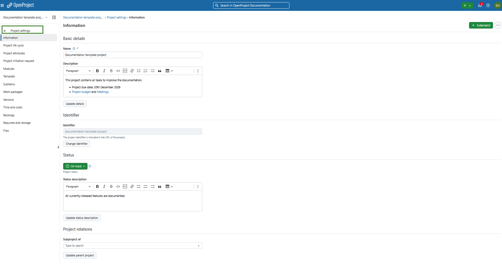

---
sidebar_navigation:
  title: Project settings
  priority: 400
description: Configure your project in OpenProject.
keywords: project settings
---
# Project settings

In OpenProject you can customize your project settings. To do this, open a project via the *Select a project* drop-down menu and navigate to *Project settings* in the project menu.

> [!NOTE]
> You need to be a project administrator in order to see and access the project settings.

## Overview

| Topic                                       | Content                                                      |
| ------------------------------------------- | ------------------------------------------------------------ |
| [Project information](project-information)  | Define project name, subproject, description, project status, and much more. |
| [Project life cycle](project-life-cycle)    | Activate or deactivate project phases in a project.          |
| [Project attributes](project-attributes)    | View and edit project attributes in a project.               |
| [Modules](modules)                          | Activate or deactivate modules in a project.                 |
| [Work package types](work-packages)         | Activate or deactivate work package types in a project.      |
| [Work package categories](work-packages)    | Create and manage work package categories.                   |
| [Work package custom fields](work-packages) | Activate or deactivate custom fields for work packages in a project. |
| [Versions](versions)                        | Create and manage versions in a project.                     |
| [Repository](repository)                    | Activate and manage a SVN or GIT repository for a project.   |
| [Time and costs](time-and-costs)            | Activate or deactivate time tracking activities and cost types in a project. |
| [Backlogs settings](backlogs-settings)      | Manage backlogs settings for a project.                      |
| [Files](files)                              | Manage the storages connected to the project, add project folders and activate manual attachment uploads. |

