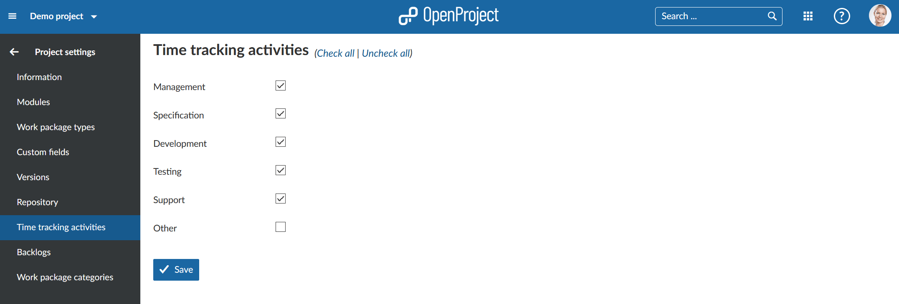

---
sidebar_navigation:
  title: Time tracking activities
  priority: 300
description: Manage activites for time tracking.
robots: index, follow
keywords: activities for time tracking
---
# Manage activites for time tracking

You can configure Activities for time tracking in the System *Administration* -> *Enumerations*. You can activate or deactivate time tracking acitivites per project.

**Time tracking** is defined as a module which allows users to log time on work packages. Once the time tracking module is activated, time can be logged via the action menu of a work package.

Navigate to the -> Project settings -> *Activites (time tracking)*.

Select the activites which you want to activate for time tracking in your project. Press the blue Save button to apply your changes.

