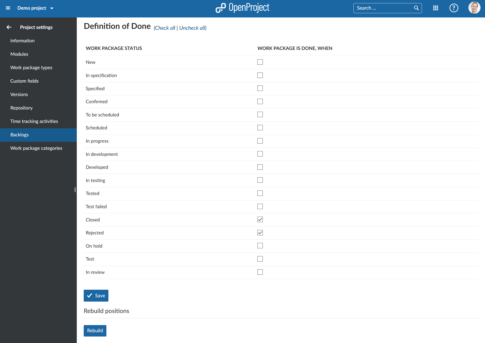

---
sidebar_navigation:
  title: Backlogs settings
  priority: 200
description: Backlogs settings.
robots: index, follow
keywords: backlogs settings
---
# Backlogs settings

Configure your backlogs settings for a project.

## Set the definition of done

You can set the definition of done for your backlogs module. This defines when a work packages should be treated as being done and calculated to the burndown (or burnup chart).

Choose the status which should be treated as done.

Press the blue **Save** button to apply your changes.

The **Rebuild positions button** for the backlogs re-calculates the position of a work package in the product backlog.

