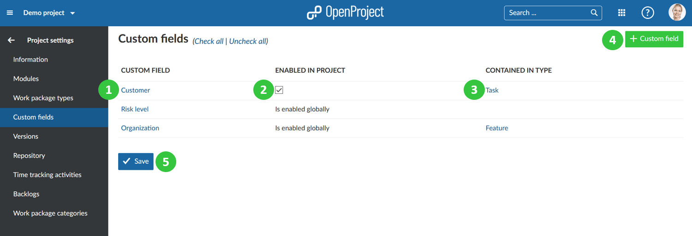

---
sidebar_navigation:
  title: Custom fields
  priority: 700
description: Manage custom fields in a project.
robots: index, follow
keywords: custom fields
---
# Enable custom fields in projects

**Custom fields can be activated or deactivated in a project**. Open the respective project and go to -> *project settings* -> *custom fields*.

**Custom fields** are defined as additional value fields which can be added to existing value fields. The different sections that can use custom fields are work packages, spent time, projects, versions, users, groups, activities (time tracking), and work package priorities.

1. Manage the custom field by clicking on the name. You have to be a System Administrator in order to [manage custom fields in the system administration](../../../../system-admin-guide/custom-fields).
2. **Select if the custom fields shall be enabled in the project**. If enabled globally in the custom fields settings, it will automatically be displayed in all projects.
3. View the work package types for which the custom field is already enabled. Only for the displayed types the custom field will be active.
4. **Create a new custom field** with the green + Custom field button. You have to be a system administrator in order to create new custom fields.
5. Press the blue **Save** button to confirm your changes.

**Note**: Custom fields first need to be created in the System Administration -> Custom fields. Then, they can be activated for certain projects if they are not globally enabled for all projects.

