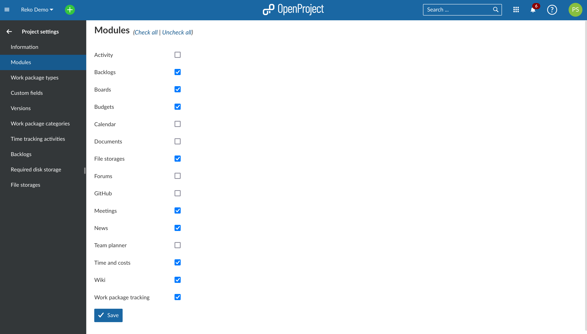
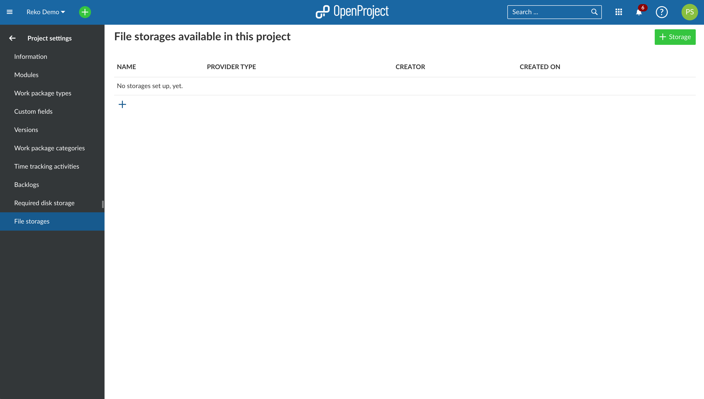
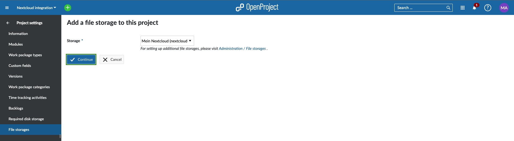
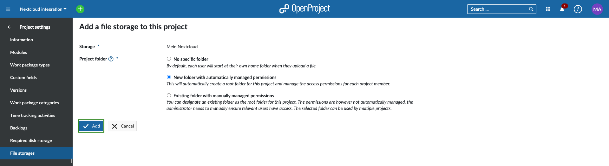
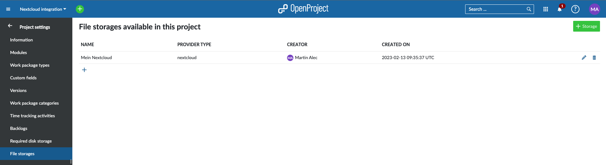
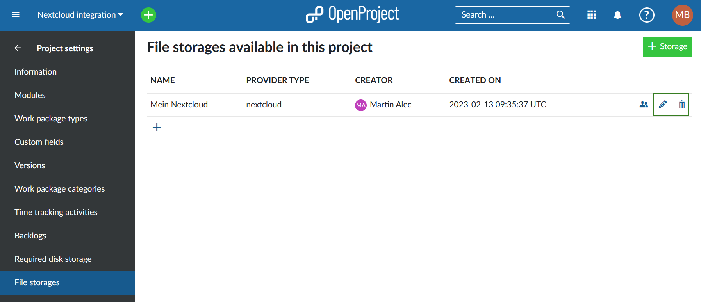
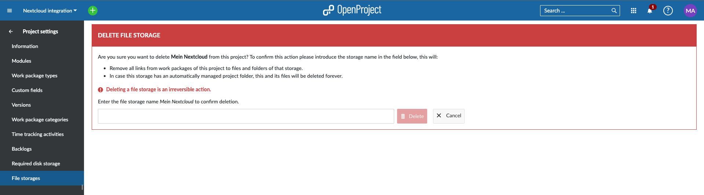
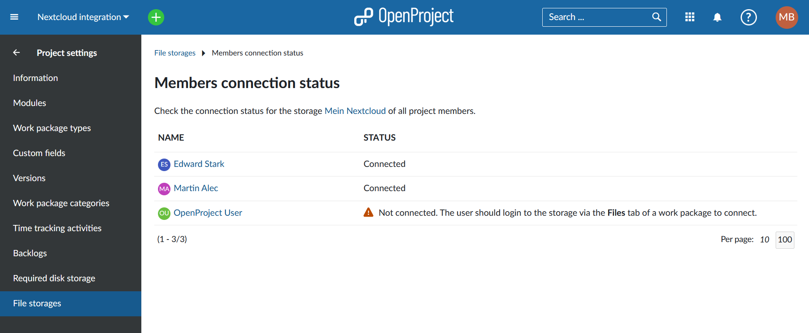

---
sidebar_navigation:
  title: File storages
  priority: 110
description: Manage the storages connected to the project and add a project folder.
keywords: file storages, project folder, storages
---
# File storages

>**Info**: Before a storage service can be added to a project, an administrator must first set up [Nextcloud integration](../../../../system-admin-guide/integrations/nextcloud/) with OpenProject.

| Topic                                                             | Description                         |
|-------------------------------------------------------------------|:------------------------------------|
| [Add storage](#add-your-new-nextcloud-file-storage-to-a-project)  | Add your new storage to a project   |
| [Edit and delete a storage](#edit-and-delete-an-existing-storage) | Edit and delete an existing storage |

## Add your new Nextcloud file storage to a project

Once you are certain that an administrator has set up a Nextcloud storage, navigate to any existing project in your OpenProject instance and click on  **Project settings** **→ Modules**. There, activate the **File Storages** module by clicking on the checkbox next to it and then clicking on **Save**.

Click on this new **Files storages** menu entry. It will take you to a page titled **File storages available in this project**, which is normally empty.

Click on **+ Storage** or the **+** icon below the table.

In the page that follows, you will be able to select one of the file storages set up by your administrator. If you only have one Nextcloud file storage set up (which is the most likely scenario), it should already be selected by default. Once the storage is selected click on the **Continue** button to proceed.

### Project folders

In the last step of the process, you will be able to choose which kind of project folder will be the default folder for file uploads for this project:

1. **No specific folder**: By default, each user will start at their own home folder when they upload a file.
2. **New folder with automatically managed permissions**: This will automatically create a folder for this project and manage the access permissions for each project member. Each project member will automatically get read, write and share access permissions (according to defined [File storages permissions](../../../../system-admin-guide/users-permissions/roles-permissions/#permissions) in the project) to this folder. This option will only be available if the system administrator has [set up the storage with automatically managed folders](../../../../system-admin-guide/integrations/nextcloud/).
3. **Existing folder with manually managed permissions**: Once you selected this option, you can designate an existing folder as the project folder for this project using the button **Select folder**. The permissions are however not automatically managed. The administrator needs to manually ensure relevant users have access. The selected folder can be used by multiple projects.

Click on **Add** to add your new Nextcloud file storage to this project.

The Nextcloud file storage is now available to all work packages in this project. 

> **Note:** For information on how to use the file storage (link Nextcloud user accounts at a user level, link files to a work package, view and download linked files, unlink files), please read our [Nextcloud integration user guide](../../../nextcloud-integration/).

## Edit and delete an existing storage

To edit or remove an existing storage from a project, you can click on the icons on the right side of the list.

For the moment, you will only be able to edit which project folder type is used for that specific storage in this project. Don't forget to click the **Save** button to edit your storage. 

> **Note:** If the previous selected project folder type was **New folder with automatically managed permissions**, changing the project folder type will not delete the already created project folder.

To be able to delete a storage from a project you will be asked to confirm the action by introducing the name of the storage. This action is irreversible and will remove all links from work packages of this project to files and folders of that storage. Also, in case this storage has an automatically managed project folder, it and its files will be deleted forever.

## Project folder member connection status

As a project administrator you can see which of the project members have access to the automatically managed folders. To see the list of users click on the users icon on the right side of the list. 

You will see which project members have have successfully connected and who may need assistance.

