---
sidebar_navigation:
  title: File storages
  priority: 110
description: Manage the storages connected to the project and add a project folder.
keywords: file storages, project folder, storages
---
# File storages

> **Info**: Before a storage service can be added to a project, an administrator must first set up [Nextcloud integration](../../../../system-admin-guide/integrations/nextcloud/) or [OneDrive/SharePoint integration](../../../../system-admin-guide/integrations/one-drive/) with OpenProject.

| Topic                                                        | Description                                       |
| ------------------------------------------------------------ | :------------------------------------------------ |
| [Files module overview](#files-module-overview)              | Files module explained                            |
| [Add Nextcloud storage](#add-a-nextcloud-storage-to-a-project) | Add your Nextcloud storage to a project           |
| [Nextcloud and project folders](#project-folders)            | How to manage Nextcloud project folders           |
| [Edit and delete Nextcloud storage](#edit-an-existing-nextcloud-storage) | Edit and delete an existing Nextcloud storage     |
| [Add OneDrive/SharePoint storage to a project](#add-a-onedrivesharepoint-storage-to-a-project-enterprise-add-on) | Add your OneDrive/SharePoint storage to a project |

## Files module overview

Under the **Files** module you will be able to manage external file storages, such as Nextcloud or OneDrive/SharePoint and manage attachments upload under *Files* tab in work packages. Navigate to **Project settings -> Files** to get here. 

## Show attachments in the work packages files tab

To activate or de-activate the attachments being shown under **Files** tab in work packages, navigate to *Project settings > Files* and select the *Attachments* tab. Here you can decide whether the attachments option will be shown under *Files* tab of work packages detailed view for a specific project. 

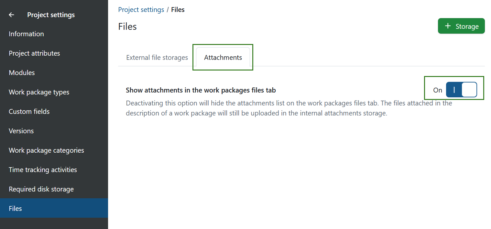

> Please note that you need a *Manage files in project* permission to be able to activate or deactivate this work package attachment option.

## Add a new storage to a project

Click on the **External file storages** tab under **Files**. It will take you to a page showing an overview of all external file storages available in this project, which will initially be empty.

Click on **+ Storage** or the **+** icon below the table.

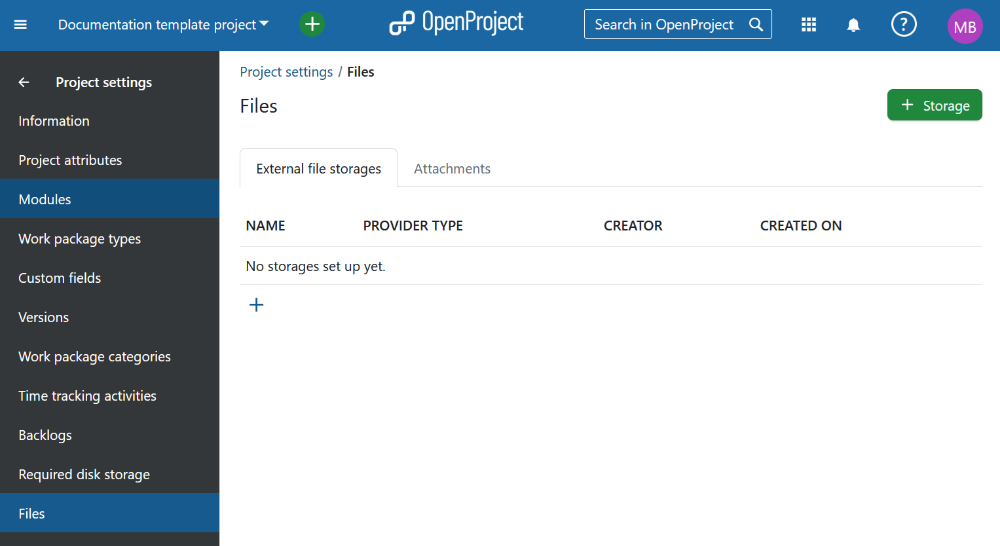

In the page that follows, you will be able to select one of the file storages set up by your administrator. You can select Nextcloud or OneDrive/SharePoint storages from the drop-down menu. If you only have one file storage set up (which is the most likely scenario), it should already be selected by default. Once the storage is selected click on the **Continue** button to proceed.

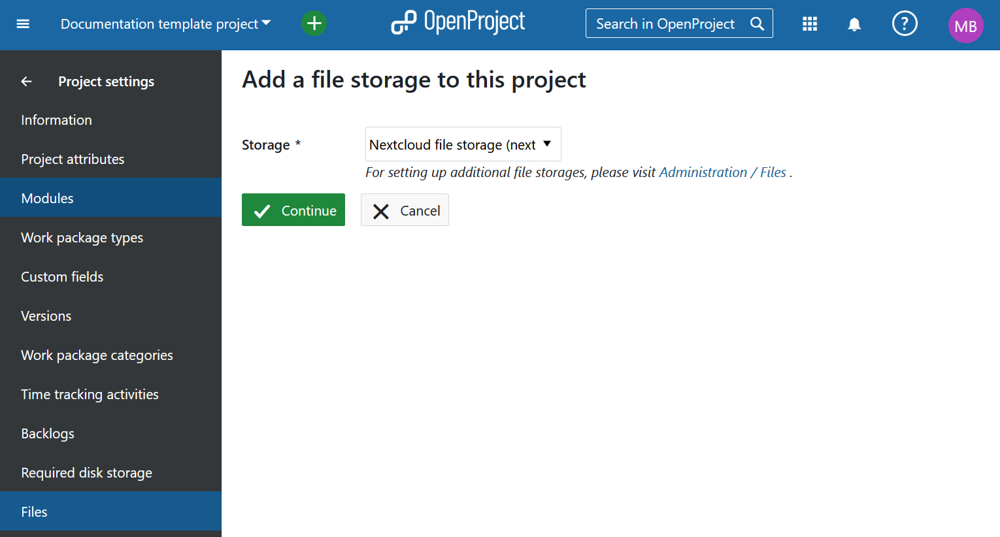

## Add a OneDrive/SharePoint storage to a project (Enterprise add-on)

> **Note**: OneDrive/SharePoint integration is an Enterprise add-on and can only be used with [Enterprise cloud](../../../../enterprise-guide/enterprise-cloud-guide/) or [Enterprise on-premises](../../../../enterprise-guide/enterprise-on-premises-guide/). An upgrade from the free Community edition is easy and helps support OpenProject.

If you have selected the OneDrive/SharePoint option in the previous step of storage selection, you will now see the **Project folder** options.

Here you can choose which kind of OneDrive/SharePoint project folder will be the default folder for file uploads for this project when using SharePoint integration.

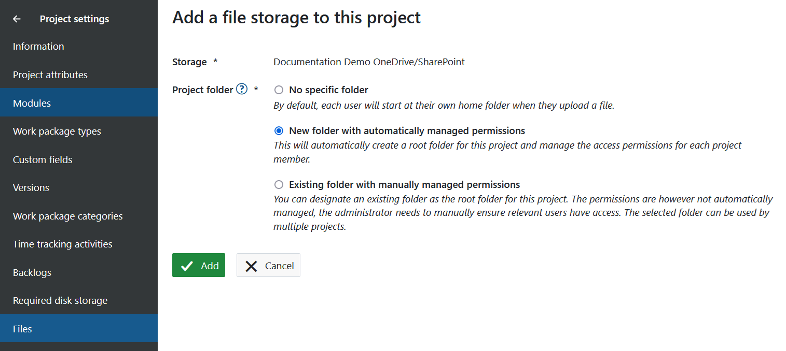

1. **No specific folder**: By default, each user will start at the drive root when they upload a file or select files for linking.
2. **New folder with automatically managed permissions**: This will automatically create a folder for this project and manage the access permissions for each project member. Each project member will automatically have access to this folder according to the user permissions defined in [File storages permissions](../../../../system-admin-guide/users-permissions/roles-permissions/#permissions). This option will only be available if the system administrator has [set up the storage with automatically managed folders](../../../../system-admin-guide/integrations/one-drive/).
3. **Existing folder with manually managed permissions**: Once you selected this option, you can designate an existing folder as the project folder for this project using the button **Select folder**. The permissions are however not automatically managed, **instead the folder and its content inherits the permissions as configured in the SharePoint site or drive**. The administrator needs to manually ensure relevant users have access. The selected folder can be used by multiple projects.

Click on **Add** to add your new OneDrive/SharePoint file storage to this project.

The SharePoint file storage is now available to all work packages in this project.

> **Note:** Please refer to the [OneDrive/SharePoint user guide](../../../file-management/one-drive-integration) for further instructions on using the integration at a user level.

## Add a Nextcloud storage to a project

If you have selected the Nextcloud option in the previous step of storage selection, you will now see the **Project folder** options.

### Project folders

In the last step of the process, you will be able to choose which kind of project folder will be the default folder for file uploads for this project:

1. **No specific folder**: By default, each user will start at their own home folder when they upload a file.
2. **New folder with automatically managed permissions**: This will automatically create a folder for this project and manage the access permissions for each project member. Each project member will automatically get read, write and share access permissions (according to defined [File storages permissions](../../../../system-admin-guide/users-permissions/roles-permissions/#permissions) in the project) to this folder. This option will only be available if the system administrator has [set up the storage with automatically managed folders](../../../../system-admin-guide/integrations/nextcloud/).
3. **Existing folder with manually managed permissions**: Once you selected this option, you can designate an existing folder as the project folder for this project using the button **Select folder**. The permissions are however not automatically managed. The administrator needs to manually ensure relevant users have access. The selected folder can be used by multiple projects.

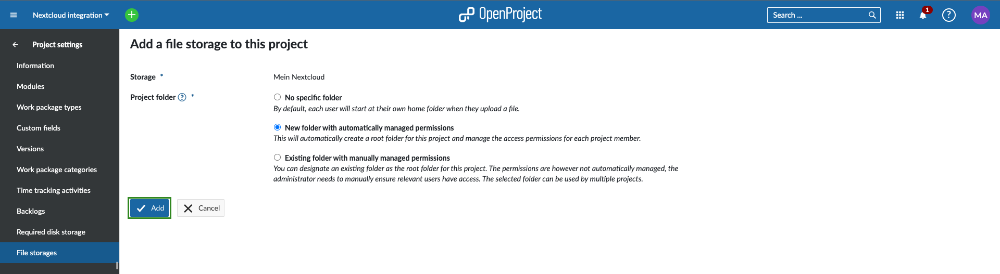

Click on **Add** to add your new Nextcloud file storage to this project.

The Nextcloud file storage is now available to all work packages in this project.

> **Note:** For information on how to use the file storage (link Nextcloud user accounts at a user level, link files to a work package, view and download linked files, unlink files), please read our [Nextcloud integration user guide](../../../file-management/nextcloud-integration/).

If you do not yet have an access token for the file storage in a project, you will be prompted to log into your file storage. You can choose to login immediately to establish the connection or to do it later.

### Project folder member connection status

As a project administrator you can see which of the project members have access to the automatically managed folders for Nextcloud integration. To see the list of users click on the users icon on the right side of the list.

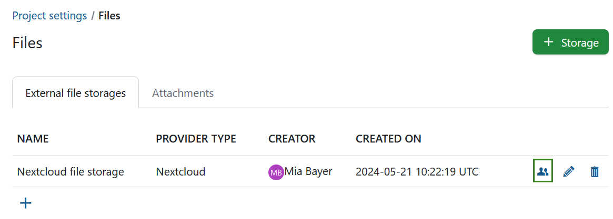

You will see which project members have have successfully connected and who may need assistance.

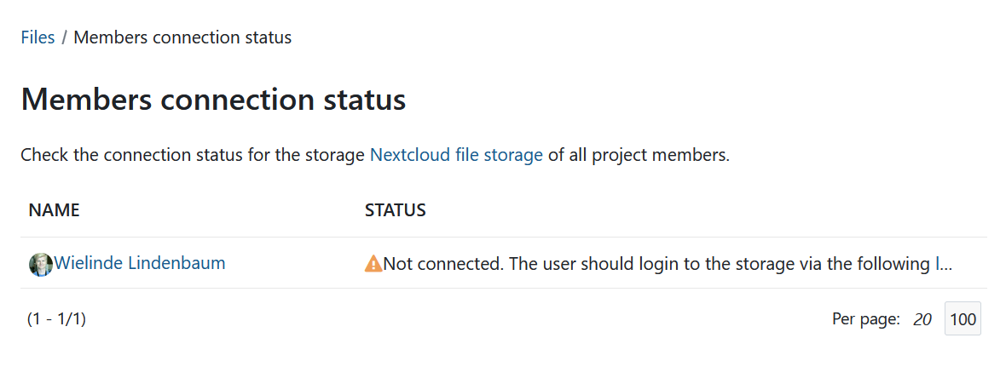

### Edit an existing Nextcloud storage

To edit an existing Nextcloud storage, you can click on the edit icon on the right side of the list of project storages.

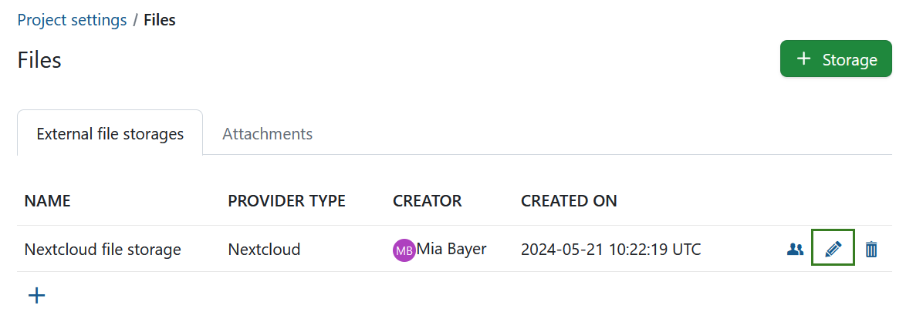

For the moment, you will only be able to edit which project folder type is used for that specific storage in this project. Don't forget to click the **Save** button to edit your storage.

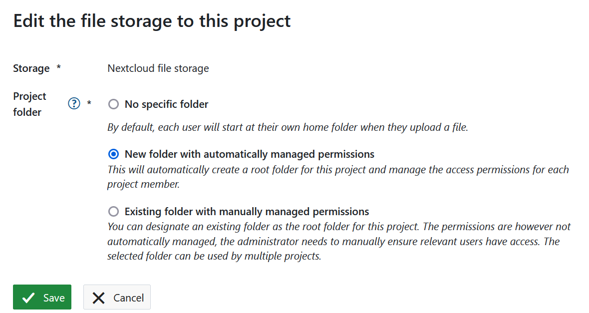

> **Note:** If the previously selected project folder type was **New folder with automatically managed permissions**, changing the project folder type will not delete the already created project folder. Changing it back will try to reconnect the previously created and used project folder.

### Delete an existing file storage

To delete an existing storage, you can click on the delete icon on the right side of the list of project storages.

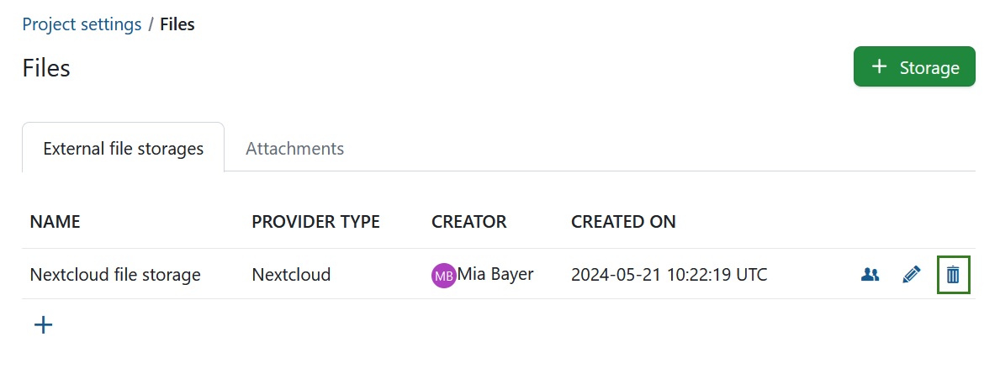

To be able to delete a storage from a project you will be asked to confirm the action by introducing the name of the storage. This action is irreversible and will remove all links from work packages of this project to files and folders of that storage. Also, in case this storage has an automatically managed project folder, it and its files will be deleted forever.

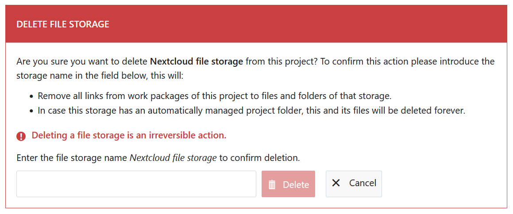
