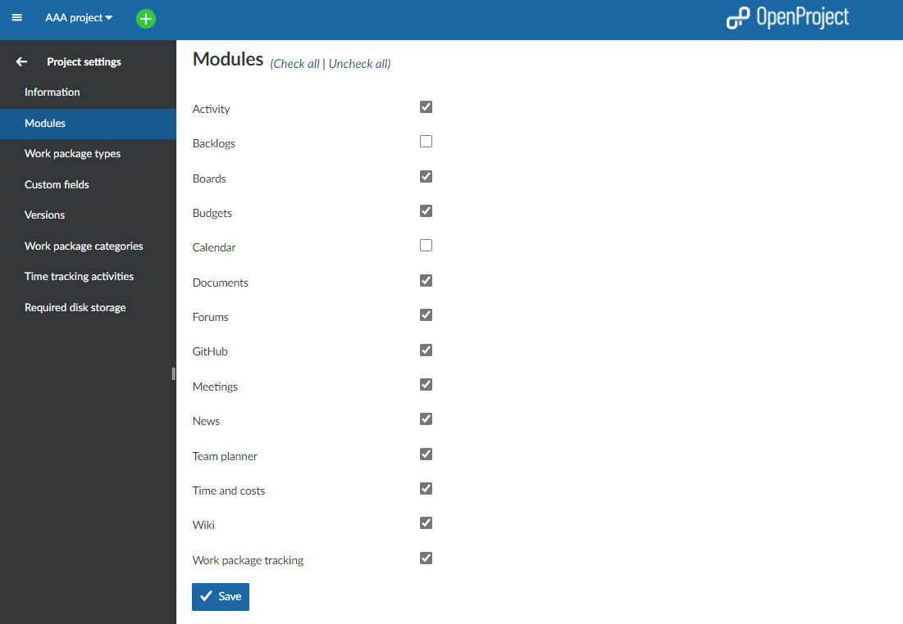

---
sidebar_navigation:
  title: Modules
  priority: 900
description: Enable modules in a project.
keywords: modules, select module in project, add
---
# Enable modules in a project

To **activate or deactivate modules** in a project select a project from the select a project drop-down menu in the left header navigation and choose -> *Project settings* -> *Modules*.

Setting a check mark next to a project module will activate the module in the project and a new menu item will appear in the project menu on the left.

Visit our [user guide](../../../#overview-of-modules-in-openproject) overview to get an explanation of the different modules in OpenProject.
