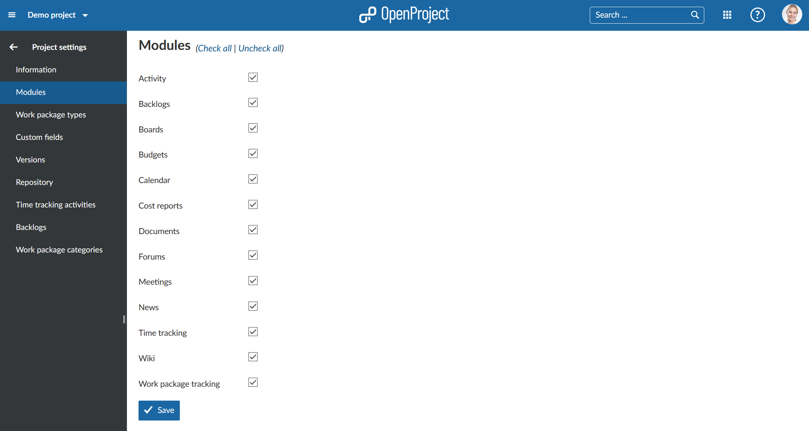

---
sidebar_navigation:
  title: Modules
  priority: 900
description: Enable modules in a project.
robots: index, follow
keywords: modules
---
# Enable modules in a project

To **activate or deactivate modules** in a project select a project from the select a project drop-down menu in the left header navigation and choose -> *Project settings* -> *Modules*.

Setting a check mark next to a project module, the module will be enabled in the project and a new menu item will appear in the project menu.

Visit our [user guide](../../) overview to choose an explanation of the different modules in OpenProject.

