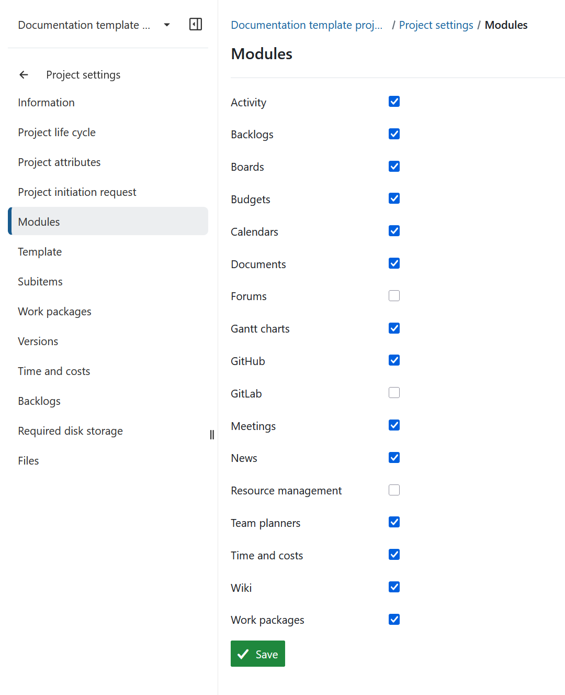

---
sidebar_navigation:
  title: Modules
  priority: 700
description: Enable modules in a project.
keywords: modules, select module in project, add
---
# Enable modules in a project

To **activate or deactivate modules** in a project, select a project from the **Select a project** drop-down menu in the left header navigation, then go to _Project settings -> Modules_.

Setting a checkmark next to a module will activate it for the project, and a new menu item will appear in the project menu on the left.

Visit our [user guide](../../../#overview-of-modules-in-openproject) for an overview of the different modules available in OpenProject.
