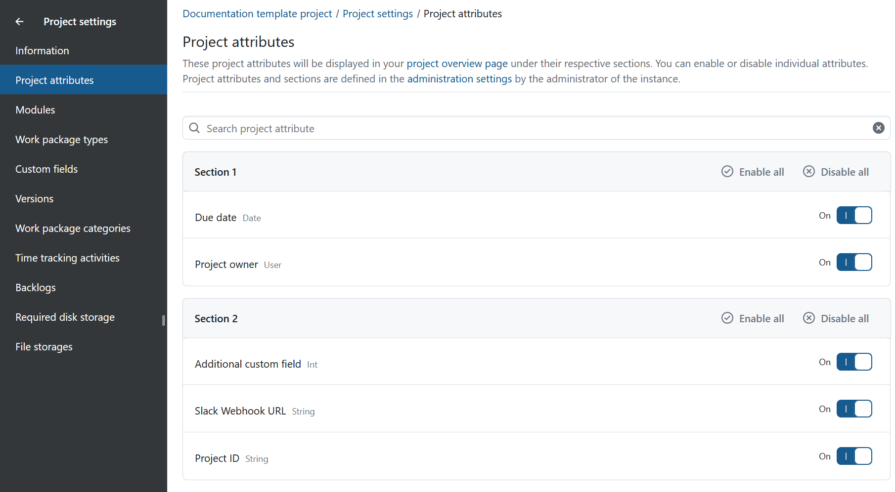

---
sidebar_navigation:
  title: Project attributes
  priority: 985
description: Enabling and disabling project attributes for individual projects in OpenProject
keywords: project attributes, project settings, enable, disable, project admin
---

# Project attributes

**Project attributes** are a set of project-level custom fields that let you display certain types of information relevant to your project in the [Project overview](../../../project-overview) page.

This guide is aimed at project administrators who want to enable or disable certain project attributes for their project.

> [!NOTE]
> Alongside the project administrators, other users can also be given the permission to enable/disable project attributes by enabling the **Select project attributes** permission for their roles.

>[!TIP]
>If you are an instance admin and would like to create, modify or add project attributes, please read our [admin guide to project attributes](../../../../system-admin-guide/projects/project-attributes).

Navigate to **Project settings** → **Project attributes**.

Here, you will see a list of all existing project attributes and sections.

You can use the **On/Off toggle** of each project attribute to enable or disable it in your project. Disabled project attributes are not visible in the [Project Overview](../../../project-overview) page.

You can also use the **Enable all** and **Disable all** buttons visible to the right of each section title to bulk enable or bulk disable all project attributes belonging to that section.

If your instance has a particularly long list of project attributes, you can use the search bar at the top to find specific ones.

>[!TIP]
>The project settings page for project attributes only lets you enable or disable certain attributes. It does *not* let you set the values for each. To do this, go to the [Project Overview](../../../project-overview) page.
