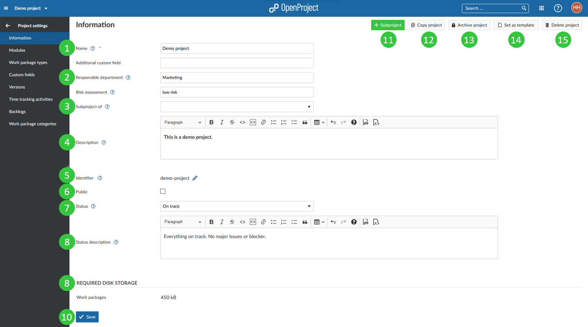

---
sidebar_navigation:
  title: Project information
  priority: 990
description: General project information.
keywords: project information
---
# Manage project information

Manage your project information in the Project settings: select a project and open the -> *Project Settings* -> *Information*.

**To view all details about managing projects**, view our [projects section](../../).

You will have the following options in the project settings.

1. Set a **name for your project**. The name will be displayed in the project list.
2. Set **custom fields**, e.g. Responsible Department, Risk assessment, Project ID, Project accountable, etc. (if activated in the -> *Administration* -> *Custom fields* -> within the custom fields for projects). Find out more about project custom fields [here](../../../../system-admin-guide/custom-fields/custom-fields-projects/).
3. Select the **parent project**.
4. Add a project **description**.
5. Display or edit the **project identifier**. This is the part of the project name shown in the URL, e.g. /demo-project.
6. This check-box sets a project to **public**. This ways users will be able to access the project without being a member of it.
7. Set a **project status**. The project status can be displayed in the [project overview](../../../project-overview). If you want to set additional or different status options you can create and use a [project custom field](../../../../system-admin-guide/custom-fields/custom-fields-projects).
8. Add a **project status description**. The status description will be shown on the [project overview](../../../project-overview) page.
9. Display the required disk storage information.
10. **Save** your changes.
11. **Create a new subproject** for this project with the green **+ Subproject** button.
12. **Copy the project**. When [copying a project](../../#copy-a-project) you can choose which modules you'd like to copy.
13. **Archive a project**. This way the [archived project](../../#archive-a-project) will not appear in the project selection anymore and cannot be accessed by team members. You can view archived projects in the view all project lists.
14. **Set as template** or **Remove from templates**. By [setting a project as template](../../project-templates/#create-a-project-template) it can be copied multiple times to create similar projects.
15. **Delete a project**. By [deleting a project](../../#delete-a-project) the whole project with all included information will be removed.

