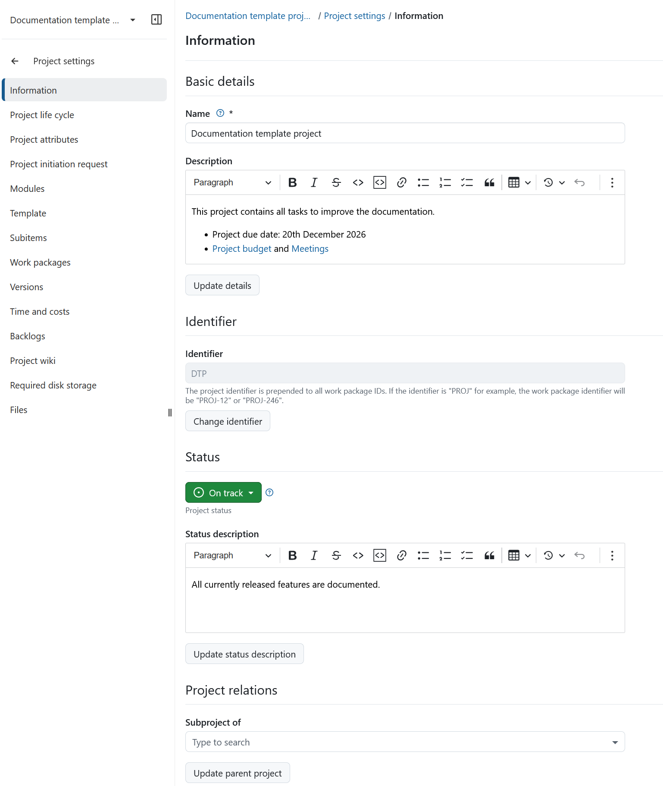
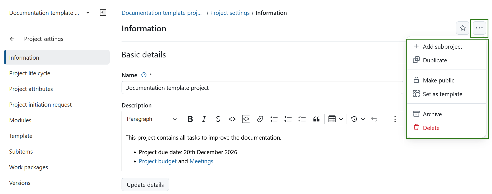
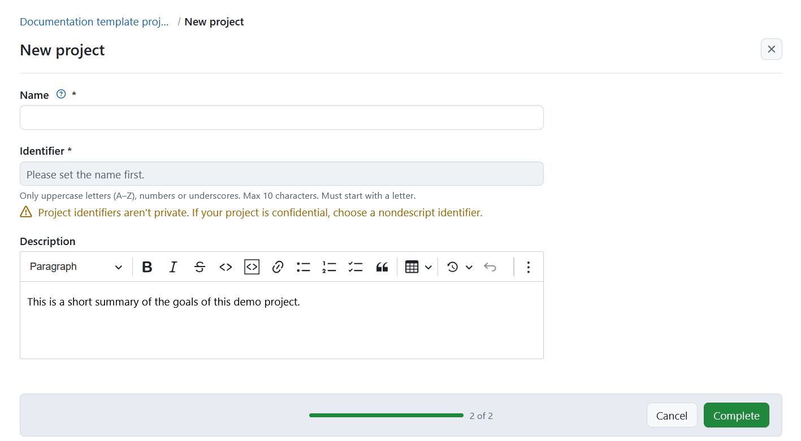
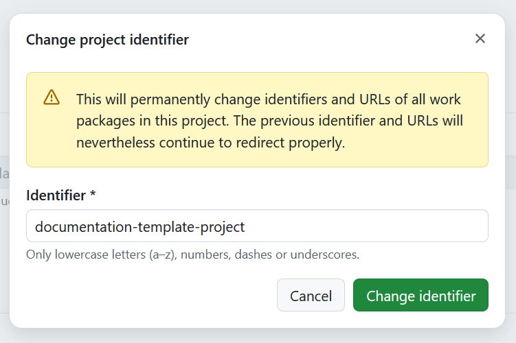
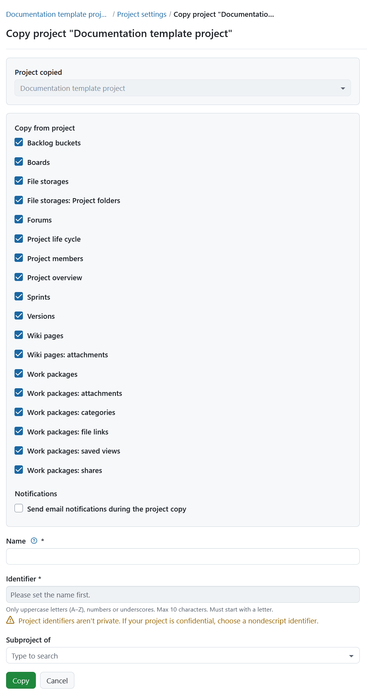
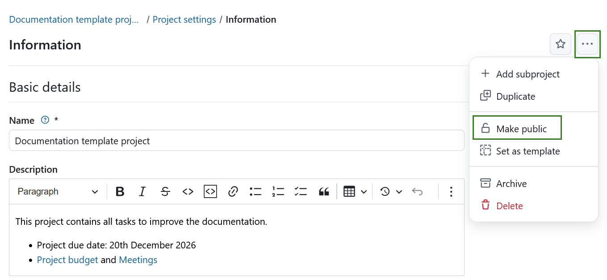
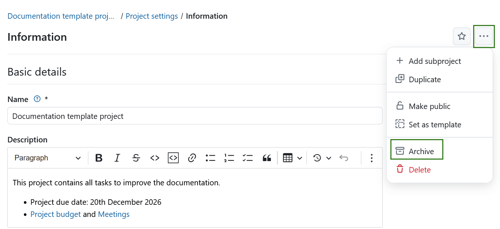
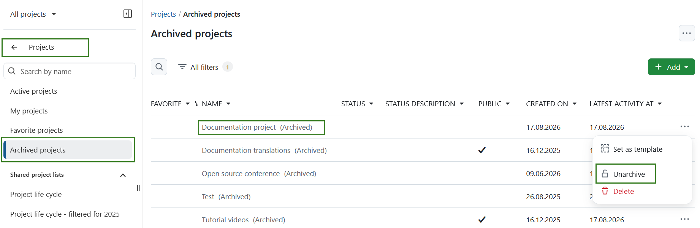
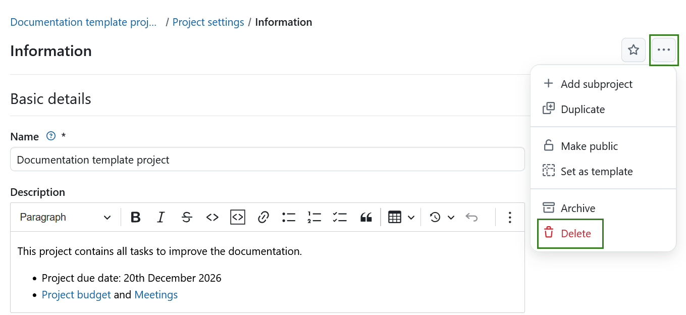

---
sidebar_navigation:
  title: Project information
  priority: 990
description: General project information.
keywords: project information
---

# Manage project information

## Edit project information

To edit your project information in OpenProject, select a project from the **Select a project** drop-down menu. Then navigate to _Project settings → Information_ in the project menu on the left.

Project settings are grouped into four sections:

1. **Basic details**. Here you can edit: 
    - **Project name**. The name will be displayed in the project list.
    - Add a project **description**.
2. **Project identifier**. Here you can [change project identifier](#change-project-identifier).

3. **Project status**. Here you can: 

   - Set a **project status**. The project status can be displayed in the [project home](../../project-home/). If you want to set additional or different status options you can create and use a [project custom field](../../../../system-admin-guide/custom-fields/#add-a-custom-field-to-one-or-multiple-projects).
   - Add a **project status description**. The status description will be shown on the [project home](../../project-home/) page.

4. **Project relations**, where you can select the **parent project**.

**Save** your changes by clicking the **Update** button at the bottom of each respective section.

In the top-right corner, click the **More (three dots)** icon to open a menu with additional project actions:

- [Add a subproject](#create-a-subproject)
- [Duplicate a project](#duplicate-a-project)
- [Make a project public](#make-a-project-public)
- [Set a project as a template](../../project-templates)
- [Archive a project](#archive-a-project)
- [Delete a project](#delete-a-project)

> [!TIP]
>
> All of these project actions are also available on the project homepage.

## Create a subproject

To create a subproject for an existing project, navigate to [_Project settings_](../) → _Information_, click on the **More (three dots)** menu and select **+Add subproject**.

Then follow the instructions to [create a new project](../../../../getting-started/projects/#create-a-new-project).

## Change project identifier

A project identifier is the part of the project name shown in the URL, e.g. /demo-project. To change the project identifier navigate to Project settings and click the **Change identifier** button in the respective section.

You will then see the form to change and save the new project identifier. 

> [!NOTE]
> When changing a project identifier, previous identifiers will remain valid. Requests to an old identifier will still resolve to the same project.
> Retired identifiers cannot be used by other projects. A project can, however, revert to a previously used identifier.

> [!WARNING]
> Keep in mind that once a project identifier is changed, members of the project will have to relocate the project's repositories. 
> Existing links using previous identifiers will continue to work.

## Duplicate a project

You can duplicate an existing project by navigating to the _Project settings → Project information_. Click the **More (three dots)** icon in the upper right corner and select **Duplicate** from the dropdown menu.

> [!NOTE]
> Users who duplicate a project are assigned a **New role for users that create projects** in the duplicated project. Depending on your configuration, this role may grant additional permissions compared to their role in the source project.

> [!NOTE]
> To access the **Duplicate** action from **Project settings**, users must be able to open the project settings (typically through the **Edit project** permission). Alternatively, users can create a new project from a project template if template creation is available to them.

Under the **Copy from project** section you can select what additional project data and settings, such as versions, work package categories, attachments, project life cycle and project members should be copied as well. 
You can copy existing [boards](../../../agile-boards/) (apart from the Subproject board) and the [Project overview](../../project-home/#project-overview) dashboards along with your project, too. 

Select which modules and settings you want to copy and whether or not you want to notify users via email during copying.

> [!IMPORTANT]
> **Budgets** cannot be copied, so they must be removed from the work package table beforehand. Alternatively, you can delete them in the Budget module and thus delete them from the work packages as well.

> [!NOTE]
> The File storages options only apply if the template project had a file storage with automatically managed folders activated.

If you select the **File Storages: Project folders** option, both the storage and the storage folders are copied into the new project if automatically managed project folders were selected for the original file storage. For storages with manually managed project folders setup the copied storage will be referencing the same folder as the original project.

If you de-select the **File Storages: Project folders** option, the storage is copied, but no specific folder is set up.

If you de-select the **File Storages** option, no storages are copied to the new project.

Give the new project a name, identifier and select a parent project if needed.

Click the **Copy** button to proceed.

## Make a project public

If you want to set a project to be public, navigate to the _Project settings → Project information_. Click the **More (three dots)** icon in the upper right corner and select **Make public**.

Setting a project to public will make it accessible to all people within your OpenProject instance.

> [!IMPORTANT]
>
> If your instance is [accessible without authentication](../../../../system-admin-guide/authentication/login-registration-settings/) this option will make the project visible to the general public outside your instance.

## Archive a project

In order to archive a project, navigate to the _Project settings → Project information_. Click the **More (three dots)** icon in the upper right corner and select **Archive project**.

> [!NOTE]
> This option is always available to instance and project administrators. It can also be activated for specific roles by enabling the _Archive project_ permission for that role via the [Roles and permissions](../../../../system-admin-guide/users-permissions/roles-permissions/) page in the administrator settings.

Once archived, a project can no longer be selected from the project list accessible via header navigation. It is still visible in the [Project lists](../../project-lists/) dashboard if you set the "Active" filter to "off" (move slider to the left). You can unarchive the project there, too, using the three dots at the right end of a row and clicking **Unarchive**.

You can also archive a project directly on the [project overview page.](../../project-home/#archive-a-project) 

## Change the project hierarchy

To change the project's hierarchy, navigate to the _Project settings → Information_ and change the **Subproject of** in _Project relations_ section.

## Delete a project

If you want to delete a project, navigate to the [Project settings](../../project-settings/). Click the **More (three dots)** icon in the upper right corner and select **Delete project**.

You can also delete a project via the [projects overview list](../../project-lists/).

> [!NOTE]
> Deleting projects is only available for System administrators.