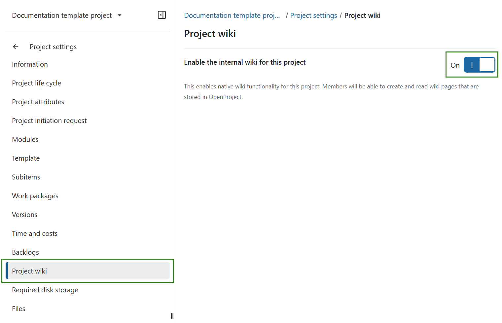
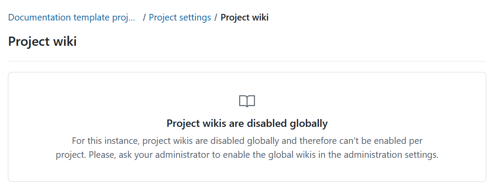

---
sidebar_navigation:
  title: Project wiki
  priority: 250
description: Enable a project wiki in OpenProject.
keywords: wiki, project wiki, wiki settings, activate wiki, create wiki
---

# Project wiki

In OpenProject, project administrators can enable or disable the project wiki for an individual project. 

A requirement for that is that [project wikis](../../../../system-admin-guide/wikis/#project-wikis) have been enabled by your system administrator. 

To enable the project wiki open **Project settings**, select **Project wiki** and turn on the **Enable the OpenProject wiki for this project** toggle switch.

This enables native wiki functionality for all project members. 

> [!TIP]
> If project wikis are disabled globally by your OpenProject administrator, you cannot enable the wiki for an individual project. The Project wiki settings page remains visible and informs you that project wikis must first be enabled globally in the administration settings.

