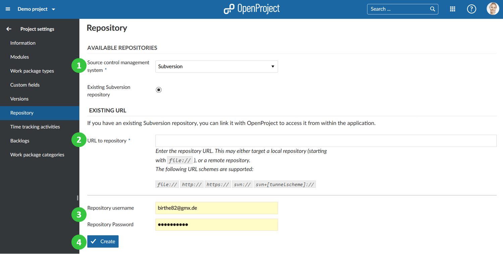

---
sidebar_navigation:
  title: Repository
  priority: 400
description: Manage a repository in a project.
keywords: repository
---
# Manage a repository

**Repository** is defined as a document management system that allows users to manage files and folders via different version control system (SVN or Git).
You can integrate a SVN or GIT repository in a project in OpenProject and access it directly in the project via the module Repositories.

> **Note**: Repositories can only be integrated for Community edition and Enterprise on-premises edition versions.

Navigate to -> *Project settings* -> *Repository*.

1. Choose a **source control management system** (SVN or GIT).
2. Enter the URL of your existing repository.
3. Enter username and password for your repository.
4. Press the blue **Create** button.

