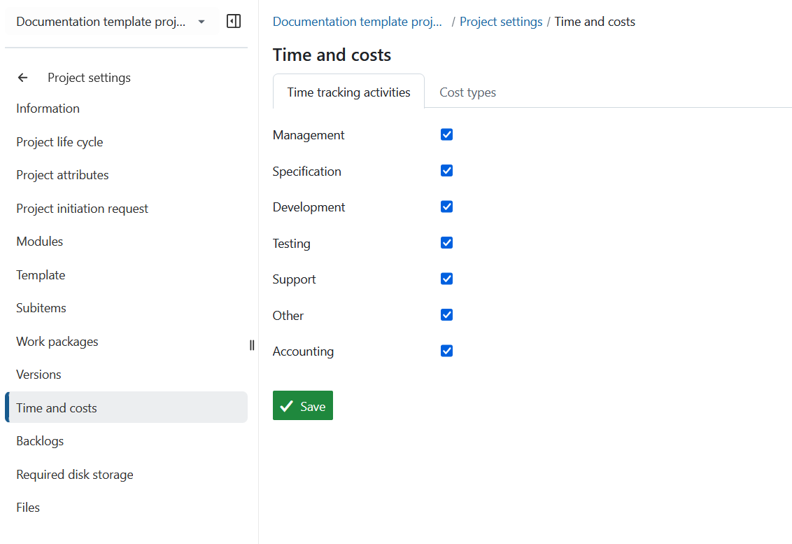
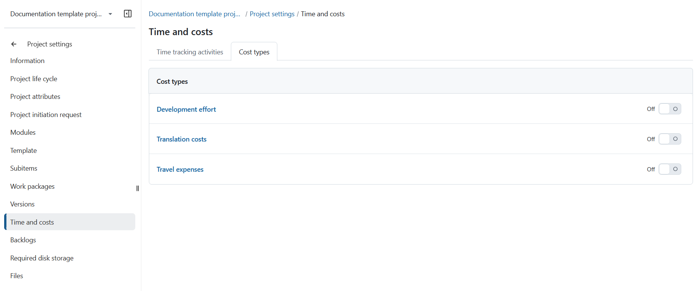
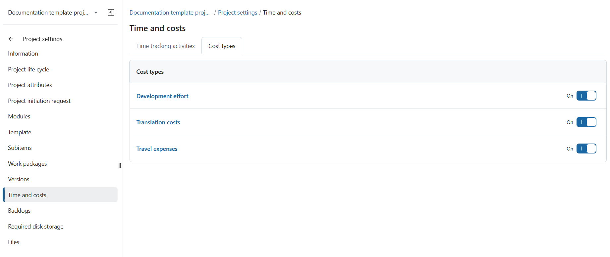

---
sidebar_navigation:
  title: Time and costs
  priority: 400
description: Manage activities for time tracking and cost types
keywords: activities for time tracking, log time settings, log unit costs
---
# Time and costs

You can [configure available activities](../../../../system-admin-guide/time-and-costs/#create-and-manage-time-tracking-activities) for time tracking and cost types in *Administration -> Time and costs -> Time tracking activities*. 

You can activate or deactivate time tracking activities and cost types per project.

**Time and costs** is defined as a module which allows users to log time and unit costs on work packages. Once the time and costs module is activated, time and costs can be logged via the action menu of a work package.

### Manage activities for time tracking

To activate time tracking activities for a specific project, navigate to *Project settings -> Time and costs* -> *Time tracking activities*

Select the activities which you want to activate for time tracking in your project. Press the **Save** button to apply your changes.

### Manage cost types

To enable cost types for a specific project, navigate to *Project settings -> Time and costs* -> *Cost types*

Click the toggle next to a cost type to turn it on and enable it within your project.

> [!NOTE]
>
> A cost type is visible to a user only if they can log costs against it in at least one project where that cost type is active.
