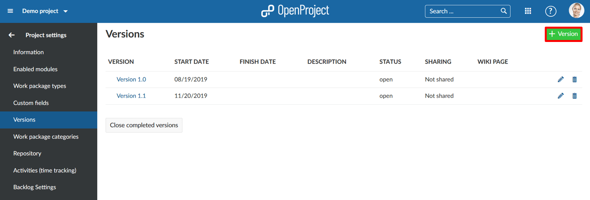
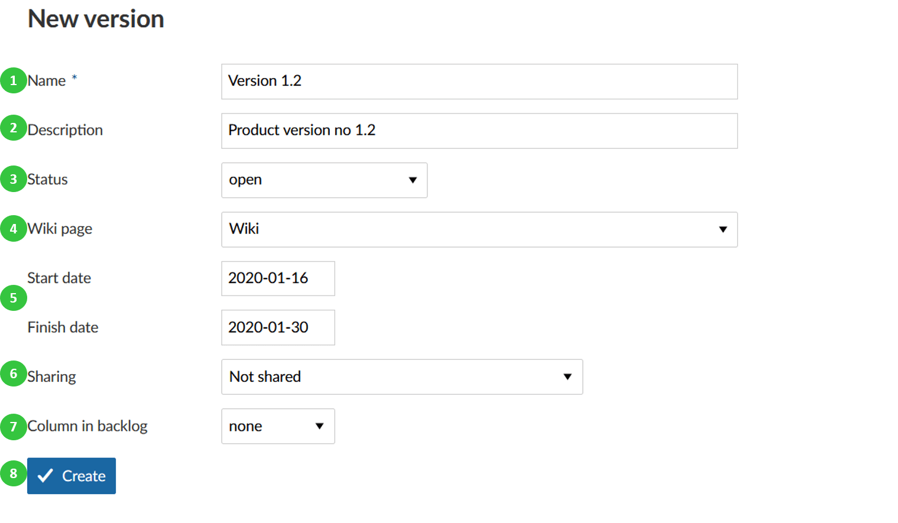
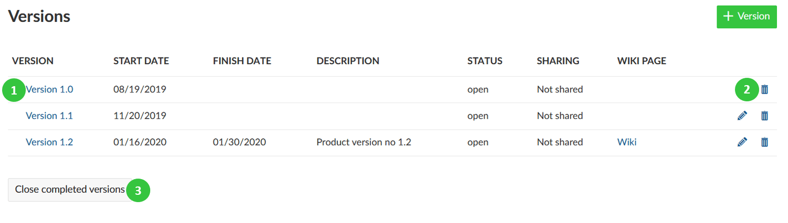
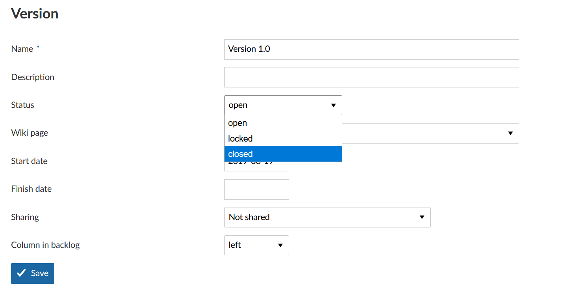

---
sidebar_navigation:
  title: Versions
  priority: 600
description: Manage versions in OpenProject.
keywords: manage versions
---
# Manage versions

Versions will be used, e.g. for roadmap planning to track certain product versions or releases. Work packages can be assigned to a version. They will be displayed in the [Roadmap](../../../roadmap).

Also, version will  be used to enable the Backlogs module, i.e. to create a product backlog and sprints in OpenProject.

[Read here how to create a new backlogs version](../../../backlogs-scrum/manage-sprints).

## Create a new version

Press the green **+ Version** button to create a new version for a project.

You can configure the following information.

1. Set a **name** for the version.
2. Add a **description** to specify the version.
3. Set **status** of a version, the default status is open.
4. Choose a **wiki page** that you want to open directly from a version in the Roadmap.
5. Set a **start date and finish date** for the version.
6. Choose whether the version shall be **shared** with other projects, e.g. in the project hierarchy or subprojects.
**Please note**: To give you maximum flexibility you will have to choose the column in the backlog individually for all projects using this version.
7. Select a **column in backlogs view**. This is only required if you use the versions to manage your [Scrum backlog](../../../backlogs-scrum).
8. Press the blue **Create** button to save your changes.

## Edit or delete versions

1. Click on the **edit** icon at the right of the row to edit the version.
2. Press the **delete** button at the right of the version to delete a version.
3. You can **close all completed versions** with the button at the bottom of the list. In order to close only certain versions, open the details view and adapt the version **Status** (see above).

Please note: You can only edit versions (i.e. edit icon visible) in their original project, not in projects they're shared with.

## Close a version

To close a version, open the details view of a version and set the **Status** to *Closed*.

## Differences between open, locked and closed versions

There are (of course) a few differences between open, locked and closed versions:

- **Open version**: Can be used in all places where version can be used. Work packages can be added and removed. The version is visible in the Backlogs module. It will also be shown in the Roadmap module.
- **Locked version**: No work packages can be added or removed. The version is not visible in the Backlogs module anymore. The version is still visible in the Roadmap module.
  Use case: E.g. the scope of a new software release or a sprint has been decided and should not be changed anymore. It is currently being worked on.
- **Closed version**: No work packages can be added or removed. The version is not visible in the Backlogs module any more. It will also not be shown in the Roadmap module unless you explicitly filter for it.
  Use case: A closed version is meant as a completed version, e.g. the new software release mentioned earlier has been finished and you're working on the next one.
