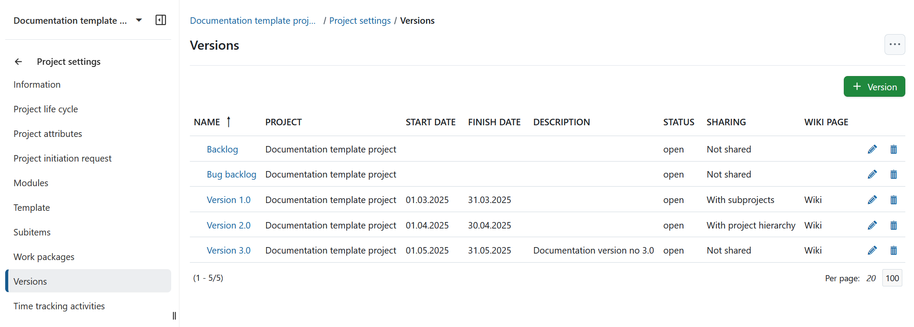
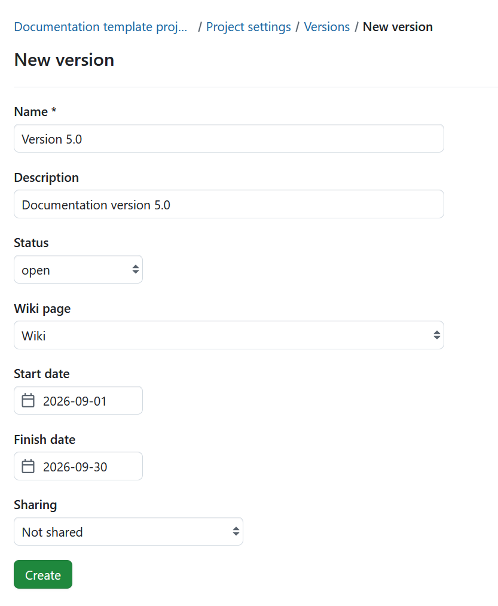
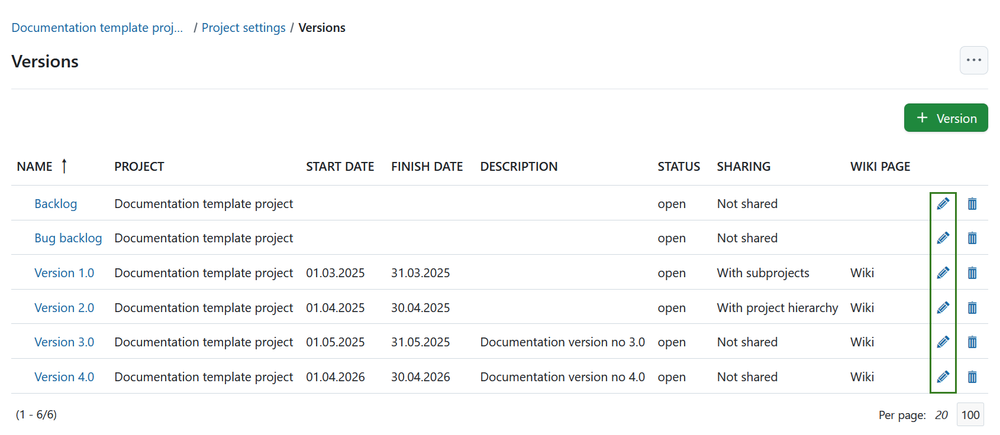
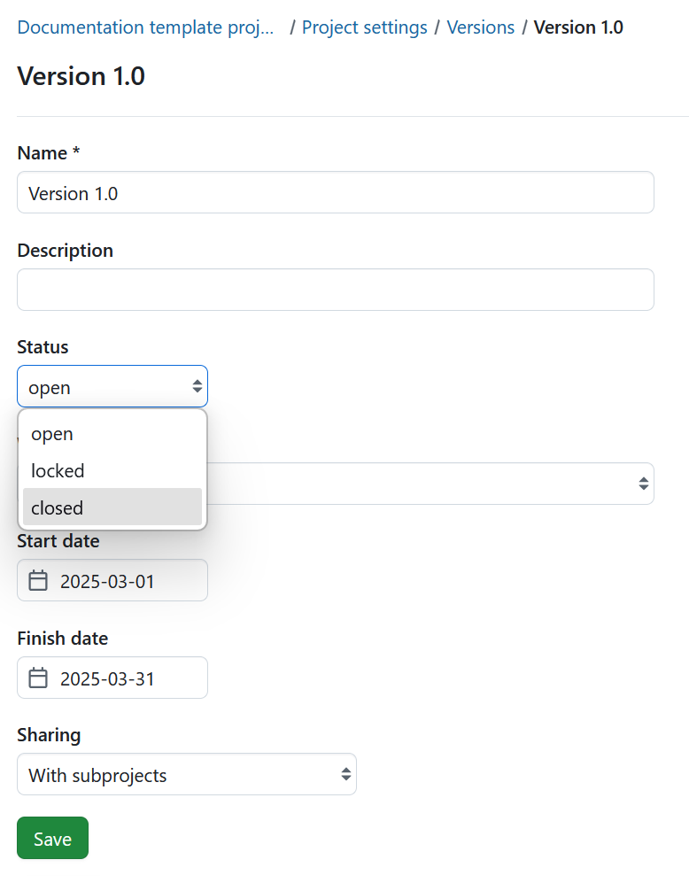
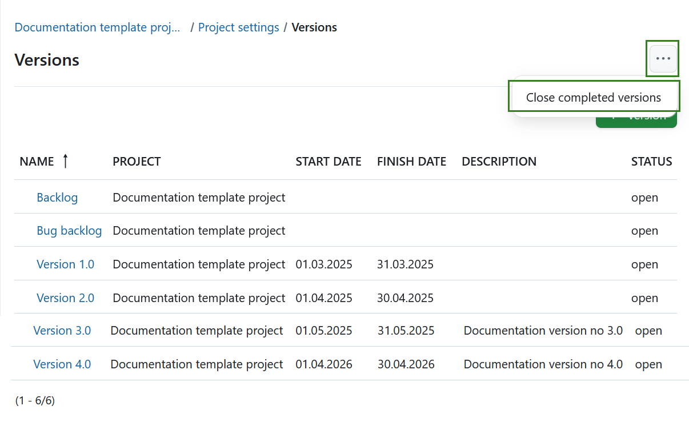
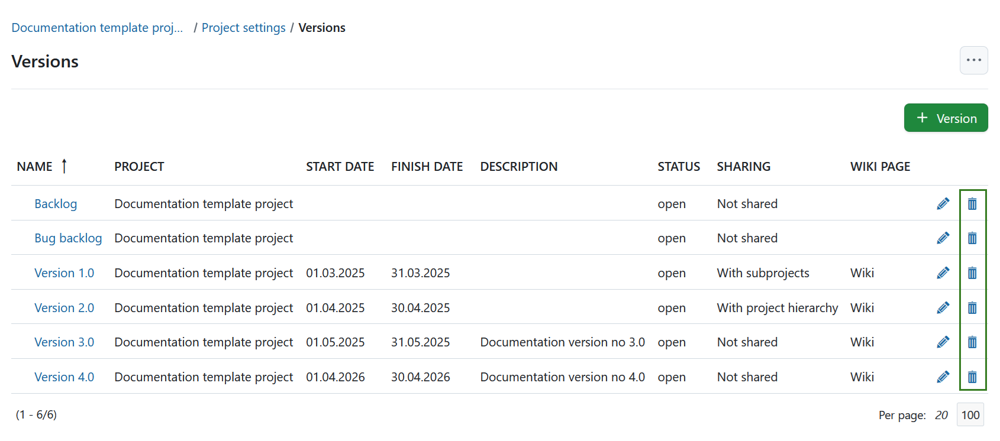

---
sidebar_navigation:
  title: Versions
  priority: 500
description: Manage versions in OpenProject.
keywords: manage versions
---
# Manage versions

Versions are used to track product versions or releases, for example in roadmap planning. Work packages can be assigned to a version and will be displayed in the  [Roadmap](../../../roadmap).

Versions are also used to enable the Backlogs module, i.e., to create a product backlog and manage sprints in OpenProject.

[Learn how to create a new backlogs version](../../../backlogs-scrum/#create-and-manage-sprints).

## Create a new version

Navigate to _Project settings → Versions_ in the project menu. You will see an overview of all existing versions. Per default, the existing versions will be sorted by the _Name_, which is indicated by an arrow next to the column header. To change the sorting order, click the name of any column you wish to use for sorting instead. 

 To create a new version for your project, click the green **+ Version** button. 

You can configure the following details:

- **Name**: Set a name for the version.
- **Description**: Add a description to clarify the purpose of the version.
- **Status**: Choose the status of the version. The default status is open.
- **Wiki page**: Select a wiki page to link directly from the version in the Roadmap.
- **Start and finish date**: Set the planned start and finish dates.
- **Sharing**: Choose whether the version should be shared with other projects (e.g., in the project hierarchy or with subprojects).

> [!NOTE]
> You’ll need to configure the backlog column separately in each project that uses the version.

- **Column in backlog**: Select a column for this version in the backlogs view. This is only necessary if you’re managing a [Scrum backlog](../../../backlogs-scrum).

Click the Create button to save your changes.

## Edit a version

Click on the **edit** icon at the right of the row to edit the version.

> [!NOTE]
> You can only edit versions in the project they were originally created in. In projects where a version is shared, the edit option won’t be available.

## Close a version

To close a version, open its details and set the **Status** to _Closed_.

## Close completed versions

To close all completed versions at once, click the **More (three dots**) icon in the top right corner and click **Close completed versions**.

## Delete a version

To remove a version, press the respective **delete** button at the end of the corresponding line in the Versions overview.

## Differences between open, locked and closed versions

There are a few differences between open, locked and closed versions:

- **Open version**:
Versions in this state can be used throughout the system. Work packages can be added or removed. The version is visible in both the Backlogs and Roadmap modules.
- **Locked version**:
Work packages cannot be added or removed. The version is **not** visible in the Backlogs module but is still shown in the Roadmap module.
_Use case:_ You’ve finalized the scope of a sprint or release and want to prevent changes while it's being worked on.
- **Closed version**:
Work packages cannot be added or removed. The version is no longer shown in the Backlogs or Roadmap modules, unless you explicitly filter for closed versions.
_Use case:_ The release or sprint is complete, and you’ve moved on to the next one.
