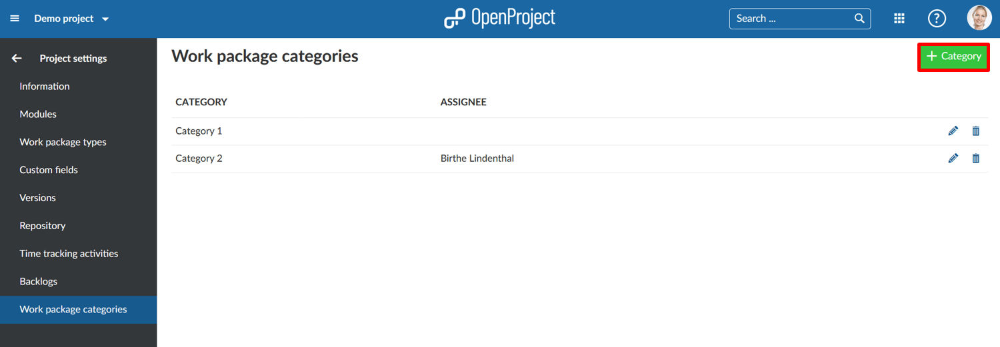
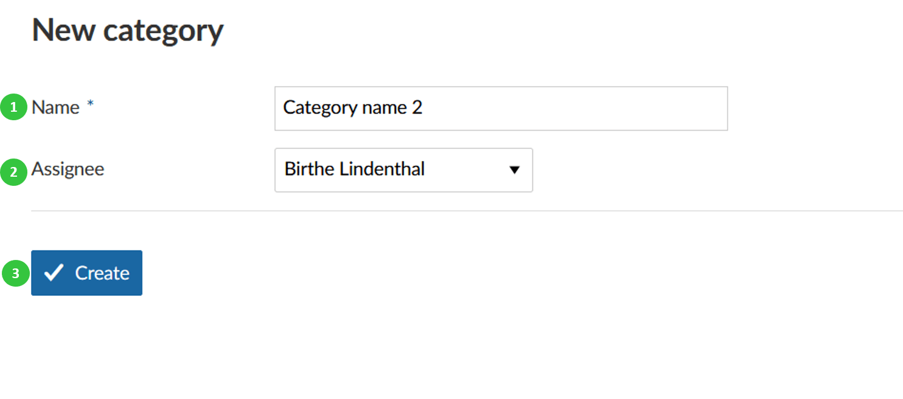
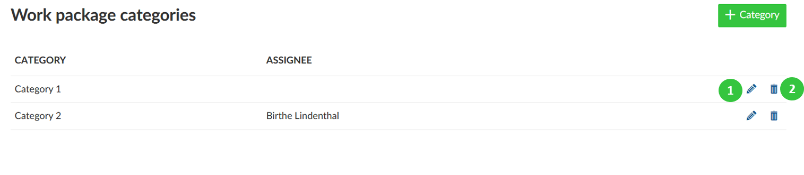

---
sidebar_navigation:
  title: Work package categories
  priority: 500
description: Manage work package categories.
robots: index, follow
keywords: work package categories
---
# Manage work package categories

In the work package forms you have the default attribute to select **work package categories** to differentiate work packages, filter, and group by certain attributes.

You can manage these work package categories in the -> *Project settings* -> *Work package categories*.

## Create a new work package category

Press the green **+ Category** button to create a new category for a project.

You can enter the following information.

1. **Name** your category
2. Choose a default **Assignee** if the work package has this category.
3. Press the blue **Create** button.

## Edit or delete a category

From the list of categories you can choose a category to edit or delete.

1. Press the **edit** button to make changes to a category.

2. Press the **delete** button to delete a category.

   