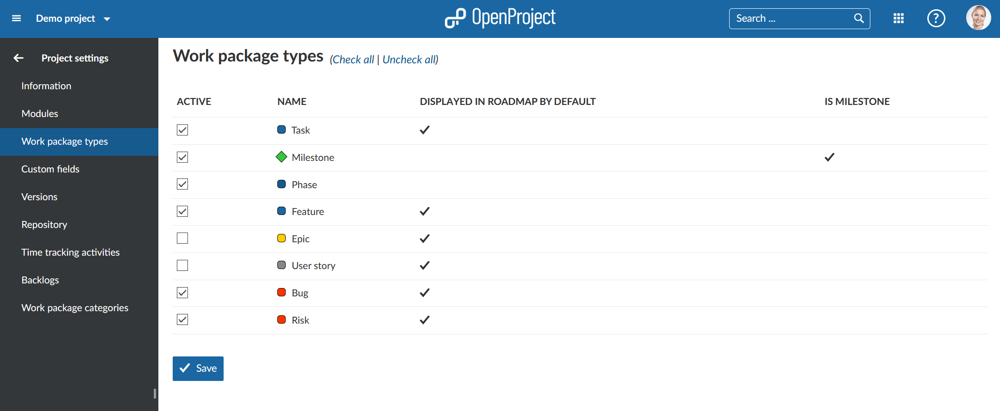

---
sidebar_navigation:
  title: Work package types
  priority: 800
description: Enable or disable work package types in a project.
robots: index, follow
keywords: work package types
---
# Work package types

**Activate or deactivate work package types for a project**. 
Select the respective project via the project drop-down menu at the top left in the header navigation and choose -> *Project settings* -> *Work package types* in the project menu.

Check the different types which you want to enable for your project. In the table you will also see if the work package types is displayed in the roadmap by default and if it is a milestone.

Press the blue **Save** button to confirm your changes.

[Work package types can be managed](../../../../system-admin-guide/manage-work-packages/work-package-types) in the System *Administration* -> *Work packages* -> *Types*.