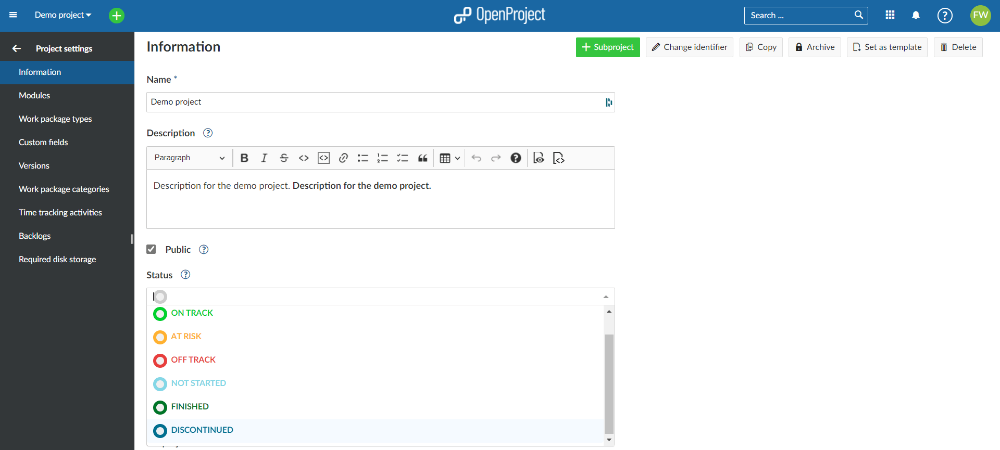
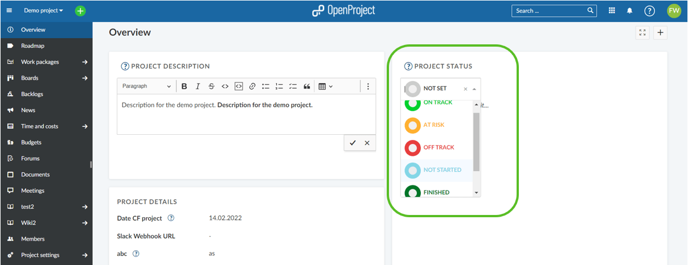
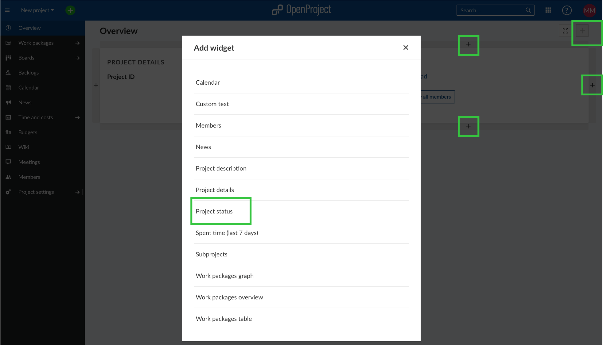
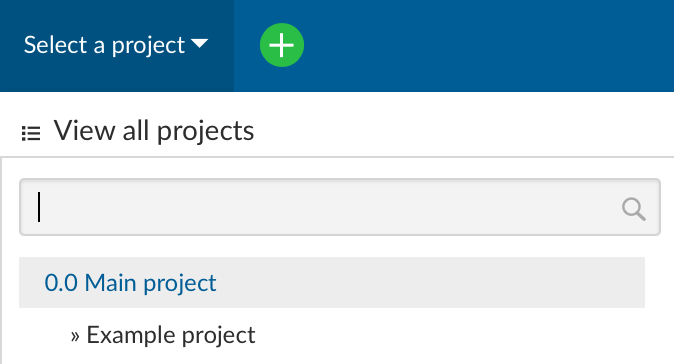
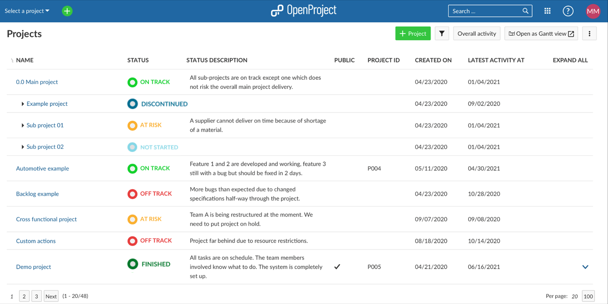
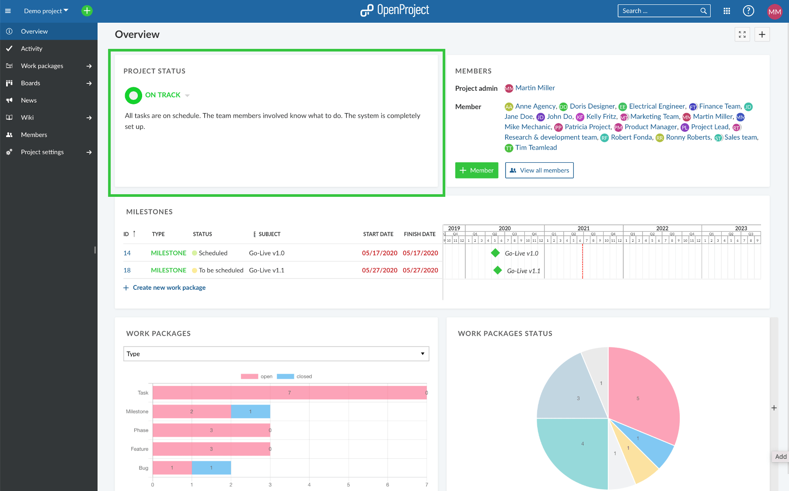

---
sidebar_navigation:
  title: Project status
  priority: 700
description: How to set and display the project status.
keywords: project status
---
# Project status

The project status serves as an information for yourself and the team if the project is on track to then being able to quickly act in case it is off track.

## Set the project status

You can set your project status in the **project settings**. For this, click on **project settings** in the menu on the left and then select the relevant status. To add more information to your project status, you can use the status description directly underneath to manually describe changes, project KPIs etc.

Alternatively, you can also set the project status in the **project overview**. If you haven't configured anything yet, the project status widget will be displayed by default and you can set the project status by using the drop down.

If the widget is not yet displayed on the project overview, you can add the project status to your **project overview** widget by clicking on **+** at the top right corner. Then you can choose where you would like to position your additional widget by clicking on the respective **+** at the top, bottom, left or right of existing widgets. Then set your project status from the drop down as shown above.

## Display the project status

The project status is displayed in different OpenProject modules.

### Project list

Select **View all projects** from the header menu, it will then open your [project list](../../projects/project-lists/) which displays all your projects including the project status.

### Project overview

Your [dashboard](../../project-overview/) will also display your project status. The project status is a widget that you can drag and drop to configure your view in the project overview.

## FAQ

### Can I create a custom project status?

There are six project status to choose from: on track, at risk, off track, not started, finished and discontinued. These cannot be changed. However, if you want to add additional information, you can do so in the status description or you can create an additional [project custom field](../../../system-admin-guide/custom-fields/custom-fields-projects/). Both, status description and the project custom field can be displayed in the **project list**.
