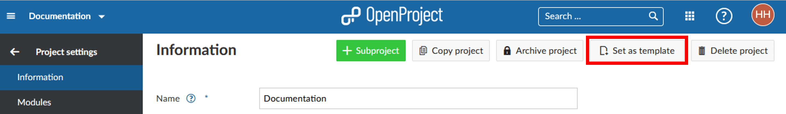

---
sidebar_navigation:
  title: Project templates
  priority: 600
description: How to create project templates.
keywords: project templates
---
# Project templates

Project templates can be used for several projects that are similar in structure and members. Creating project templates can save time when creating new projects.

## Create a project template

You can create a project template in OpenProject by [creating a new project](../../../getting-started/projects/#create-a-new-project) and configuring your project to your needs. Name the project so you can identify it as a template, e.g. "Project XY [template]".

Set up everything that you want to have available for future projects.

- Adding project members.
- Selecting the modules.
- Setting up a default project structure in the Gantt chart.
- Creating your work package templates.

Navigate to the [project settings](../project-settings) and click **Set as template** in the upper right corner. You can remove a project from the template collection on the same spot.

> **Please note**: The option to set a project as template or to remove it from templates is only available for Administrators.

## Use a project template

You can create a new project by using an existing template. This causes the properties of the project template to be copied to the new project. Find out in our Getting started guide how to [create a new project](../../../getting-started/projects/#create-a-new-project) in OpenProject.
Another way for using a template project would be to [copy it](../#copy-a-project).

<video src="https://openproject-docs.s3.eu-central-1.amazonaws.com/videos/OpenProject-Project-Templates.mp4" type="video/mp4" controls="" style="width:100%"></video>
