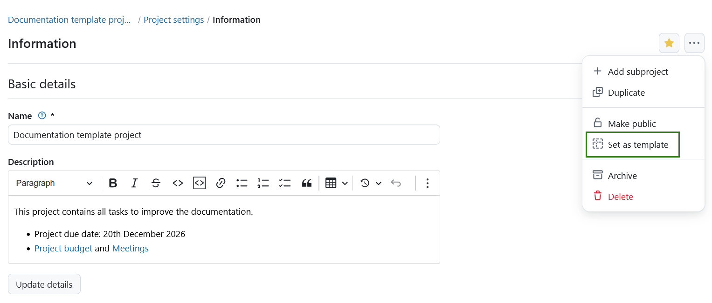
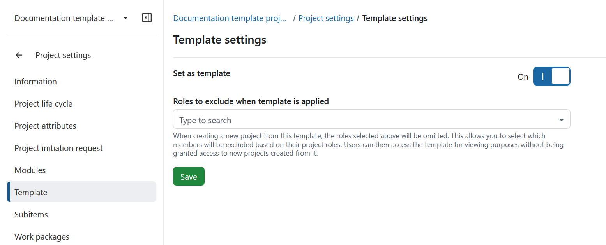

---
sidebar_navigation:
  title: Project templates
  priority: 500
description: How to create and configure project templates.
keywords: project templates
---

# Project templates

Project templates are useful for projects that share a similar structure or team composition. They help save time when setting up new projects.

## Create a project template

You can create a project template in OpenProject by [creating a new project](../../../getting-started/projects/#create-a-new-project) and configuring your project to your needs. Give the project a clear name to identify it as a template, e.g., _Project XY [Template]_.

Configure everything you want included in future projects:

- Add project members.
- Select and populate the necessary modules.

> [!IMPORTANT]
> Settings and data from the _Budgets_ and _Time and costs_ modules are not included when copying a template. For this reason, these modules should not be configured in templates, as any projects created from them will not contain the corresponding data.

- Set up the default project structure in the Gantt chart.
- Create work package templates.

Once you have configured the project, navigate to _Project settings → Information_. Click the **More (three dots)** icon in the upper right corner and select **Set as template** from the dropdown menu.

Alternatively, navigate to _Project settings → Templates_ and activate the **Set as template** toggle.

## Configure a project template

To configure template-specific settings, navigate to _Project settings → Templates_.

Here you can configure the following:

- **Set as template**: Activate or deactivate the toggle to set or remove the current project as a template.
- **Roles to exclude when template is applied**: Select the project roles whose members should not be included when a new project is created from this template.

The **Roles to exclude when template is applied** setting allows you to control which members are copied to projects created from the template. Members with one of the selected project roles will be omitted when the template is applied.

This allows users to access the template for viewing purposes without automatically being granted access to new projects created from it.

Click **Save** to save your changes.

> [!NOTE]
> Only administrators can set or remove projects as templates.

## Use a project template

You can create a new project by using an existing template. This copies the template's settings and structure to the new project. Find out in our Getting started guide how to [create a new project](../../../getting-started/projects/#create-a-new-project) in OpenProject.

> [!TIP]
> If you do not see any template options, this may be because no projects have been set as project templates yet, or because you do not have access to any template projects. Only templates that are public or where you are a project member are shown, allowing different user groups to see only the templates relevant to them.

Alternatively, you can [duplicate the project](../project-settings/project-information/#duplicate-a-project) to use it as a template.

<video src="https://openproject-docs.s3.eu-central-1.amazonaws.com/videos/OpenProject-Project-Templates.mp4"></video>

For more information, see our blog articles on [Creating, configuring and managing projects in OpenProject](https://www.openproject.org/blog/create-configure-manage-projects-openproject/) and [Project templates in OpenProject](https://www.openproject.org/blog/project-templates/).