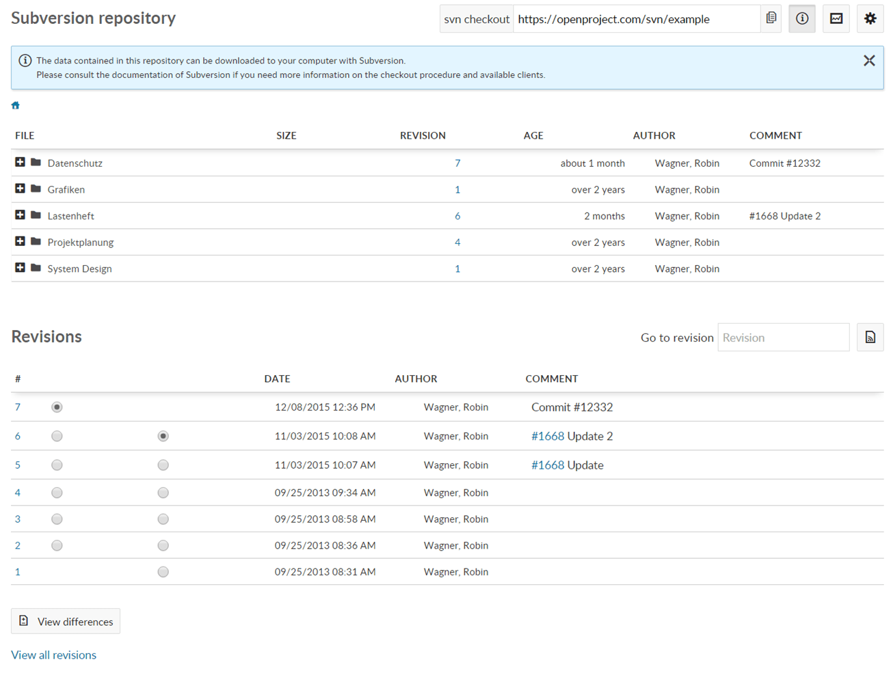
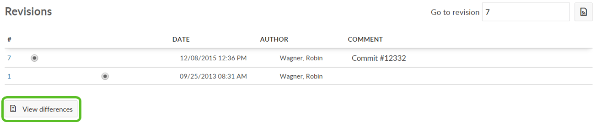

---

sidebar_navigation:
  title: Repository
  priority: 700
description: Manage repositories with SVN or GIT in OpenProject.
robots: index, follow
keywords: svn, git, repository management
---

# Repository for source code control

**Repository** is defined as a document management system that allows users to manage files and folders via different version control system (SVN or Git).

**Note**: in order to use Repository functionality please make sure that the Repository module is [activated in the project settings](../projects/project-settings/modules/).

## Repository browser view

An important part of working on a project as a team is sharing files and source code. Keeping track of the latest versions can sometimes be a challenge. Therefore, OpenProject provides two types of version control systems (Git and Subversion) which – after being properly configured – can be used to store relevant data in the different projects.

In OpenProject you can view the files under *Repository*. Please keep in mind that from your OpenProject website you can only view or download the files. For commiting new files you need an SVN- or Git-client.

In order to be able to edit files and to upload the updated versions to repository, you need to check out your repository. The following steps assume you have configured your OpenProject repository to work with subversion (but many of the options are very similar or identical when using Git). Please check out the repository and save it locally through an SVN client of your choice.

Below the list of files you can see the latest revisions and the changing comments. If you select a specific file, you will see the list its revisions.

You can create a comparison of two versions to see the changes made for specific files. Please keep in mind that this comparison option is available for single files, so a specific file has to be selected, not a folder. Hint: the comparison only works for plain Text Files (e.g. xml, yaml, json, html, etc.) and not for Binary Files (e.g. pdf, ppt, doc, images, audio- or archive files, etc.).

## Working with an SVN client

The data contained in a project repository can be downloaded to your computer using one of several clients, for example [Tortoise SVN](https://tortoisesvn.net/).

The specifics of working of the selected version control client may vary. Please refer to the documentation of your version control software client for more information. If you choose to use Tortoise SVN, you will find a good guide [here](http://tortoisesvn.net/docs/release/TortoiseSVN_en/tsvn-dug.html).

In the commit message you can reference a workpackge ID (e.g. #1234). In the repository settings (Administration -> System settings -> Repository) you can define keywords that change the status of the referenced work package (e.g. fixes #1234 or closes #1234).

In any textile field you can reference revisions by putting an "r" in front of the revision number (e.g. r123).

## Configure Repositories in OpenProject

Please see our system admin guide [how to configure repositories in OpenProject](../../system-admin-guide/system-settings/repositories/).

## Repository integration

See our Installation and operations guide how to [integrate repositories in Openproject](../../installation-and-operations/configuration/repositories/#repository-integration-in-openproject).