---
sidebar_navigation:
  title: Resource management
  priority: 869
description: Manage project resources and plan team capacity with Resource management in OpenProject.
keywords: resource management, capacity planning, resource planner, staffing, allocations
---

# Resource management

[feature: resource_management]

The **Resource management** module in OpenProject enables project managers to plan work based on people's availability, skills and capacity. Instead of only planning *what* needs to be done, you can also plan *who* should do the work and *when*.

Within a project, you can create one or more **resource planners** to organise work packages, allocate work to users and monitor team capacity using different planner views.

## Resource management module

### Prerequisites

Before starting with Resource management:

- Activate the **Resource management** module under [**Project settings → Modules**](../projects/project-settings/modules).
- Ensure users have configured working schedules for realistic capacity planning. For more information, see the [**Schedule and availability** guide](../account-settings/schedule-and-availability).

To open the Resource management module, select a project and then select **Resource management** from the project menu.

The Resource management overview consists of a navigation sidebar and a list of existing resource planners.

The navigation sidebar contains:

- a search bar for easier navigation
- the **Staffing** view
- all public resource planners
- your private resource planners

Favourite resource planners are marked with a star icon.

The main content area lists all existing resource planners in the project, including their names, number of work packages and members, and start and finish dates. Select a planner name to open it.

Select the **More** menu (...) at the end of a planner row to:

- edit the planner
- add or remove it from your favourites
- make it public or private
- delete it

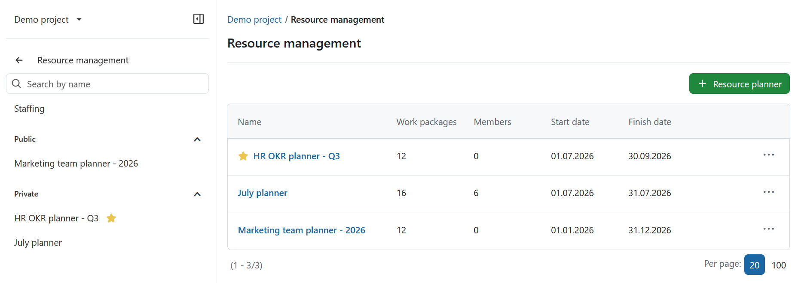

## Resource planners

A **resource planner** defines how resources are displayed within a project. Each planner can contain one or more **planner views**, allowing you to analyse the same project data from different perspectives.

You can create multiple resource planners for different teams, departments, planning periods or scenarios.

### Create a resource planner

To create a new resource planner, select the **+ Resource management** button.

In the form that opens, specify the following details:

- **Name** of the resource planner
- **Date range**
- **Default view** type. Available options are:
  - Work packages timeline
  - Users timeline
  - Work packages list
  - Users card list

  Depending on the selected [planner view](#planner-views), you will specify additional settings in the next step.
- **Public** checkbox
- **Favourite** checkbox

Select **Next**.

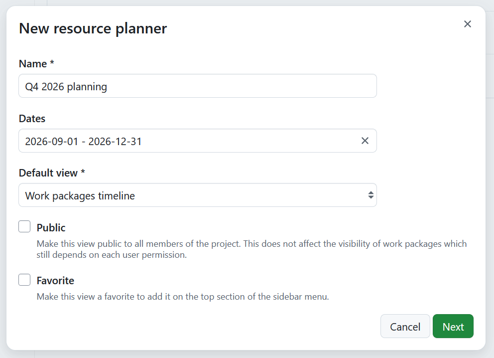

Next, configure the first planner view. This can be changed later.

Specify:

- **Name** of the planner view
- How the view should be populated:
  - **Automatically filtered** – displays all work packages matching the selected filters.
  - **Manually hand-picked** – allows you to add and remove work packages individually.

If you choose **Automatically filtered** for one of the two work package views, define which work packages should be included by specifying:

- status
- additional work package filters, including work package attributes and custom fields

Select **Create**.

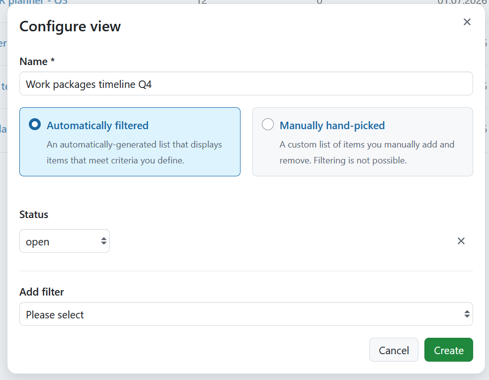

The new resource planner opens with its first planner view.

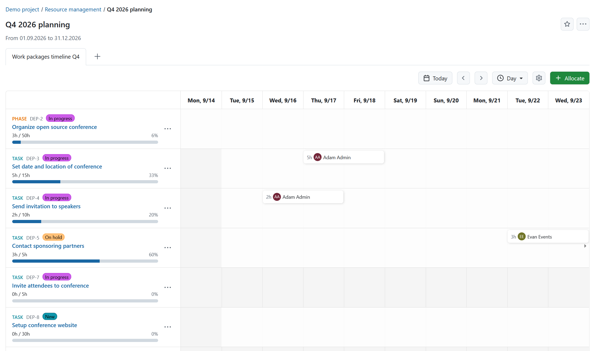

### Edit a resource planner

You can edit a resource planner either from the Resource management overview or from within an open resource planner.

To edit a planner:

1. Select the **More** menu (...).
2. Select **Edit**.

You can update:

- planner name
- date range
- default view
- public visibility
- favourite status

You can also:

- add planner views
- rename planner views
- edit planner view filters
- delete planner views

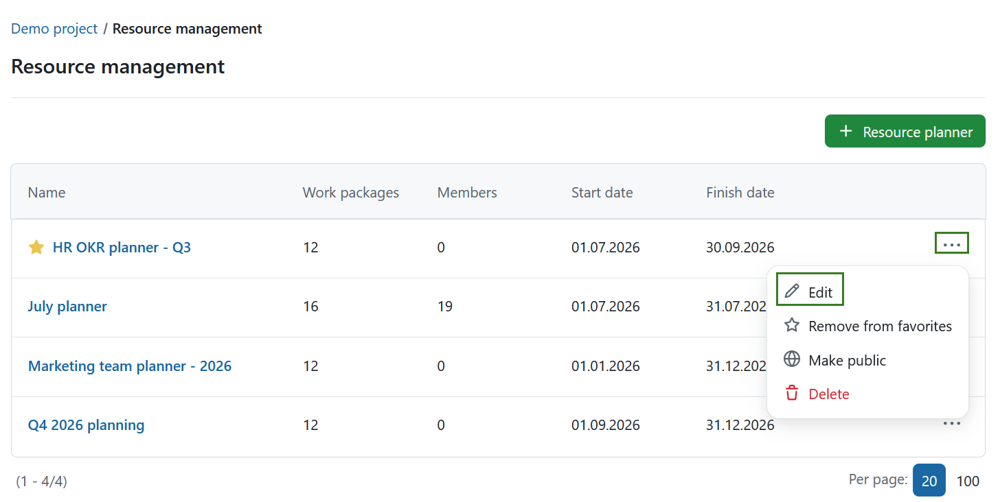

### Delete a resource planner

You can delete a resource planner either from the Resource management overview or from within an open resource planner.

To delete a resource planner:

1. Select the **More** menu (...).
2. Select **Delete**.
3. Confirm the deletion.

> [!NOTE]
> Deleting a resource planner removes the planner and all of its planner views. It does not delete any work packages, allocated times or project data.

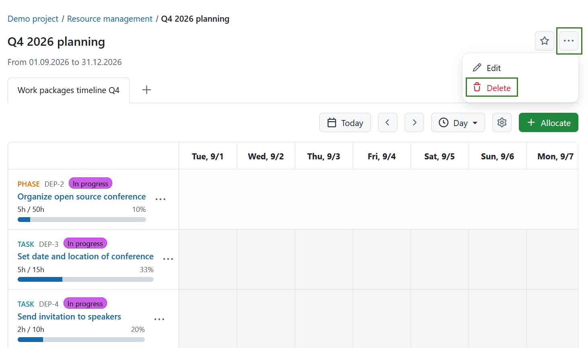

## Planner views

Each resource planner can contain multiple planner views. Planner views display the same planning data in different ways, allowing you to focus on work packages, users or staffing activities.

You can add additional planner views at any time. To do so, select the **+** icon next to the existing planner view tabs and choose the desired planner view type.

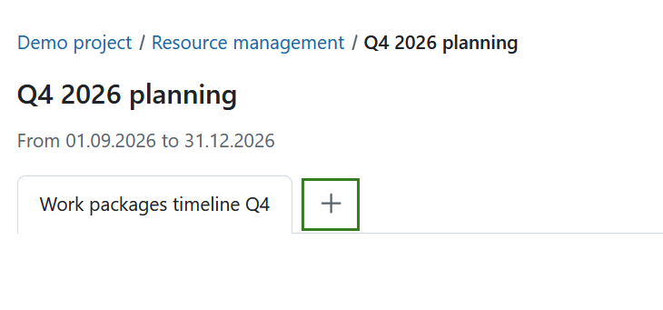

Timeline views share the same toolbar, which lets you:

- select **Today** to return to the current date
- navigate forwards or backwards using the arrow buttons
- change the zoom level (**Day**, **Calendar week** or **Month**)
- configure the current view
- create a new allocation

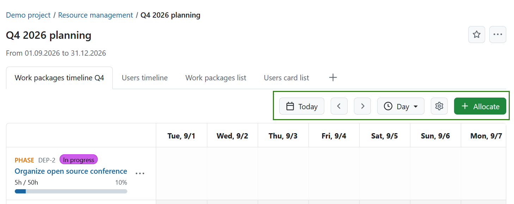

### Work packages timeline

The **Work packages timeline** displays work packages together with their planned allocations over time.

The left side lists all work packages included in the planner.

Each work package displays:

- work package type
- ID
- status
- subject
- allocated hours
- completion progress

Select the **More** menu (...) for additional actions, including:

- **See allocation**
- **Edit total work**

The timeline displays allocations across the selected time scale.

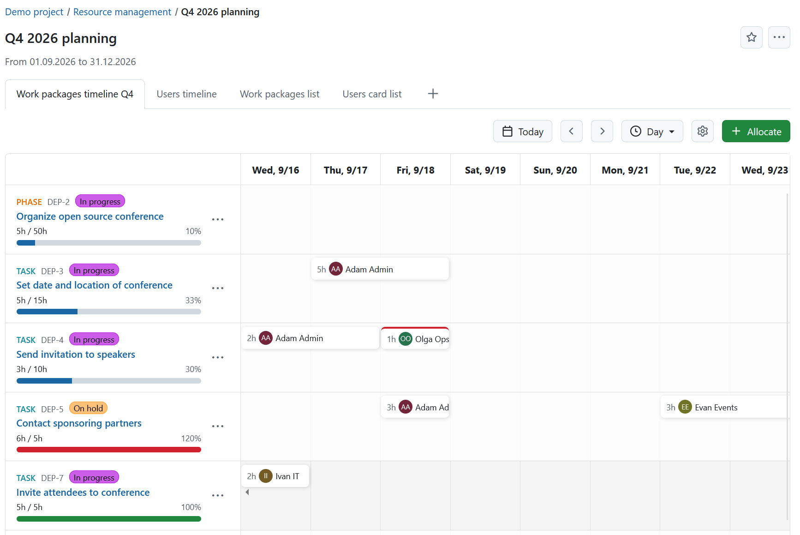

### Users timeline

The **Users timeline** groups planned work by user instead of by work package.

> [!TIP]
>
> Resource planners do not include placeholder users. 

This view helps identify:

- available capacity
- overallocated users
- users without configured working schedules

Warning icons indicate users who:

- have no configured working schedule
- are allocated beyond their available capacity

The timeline displays each user's planned allocations across the selected period.

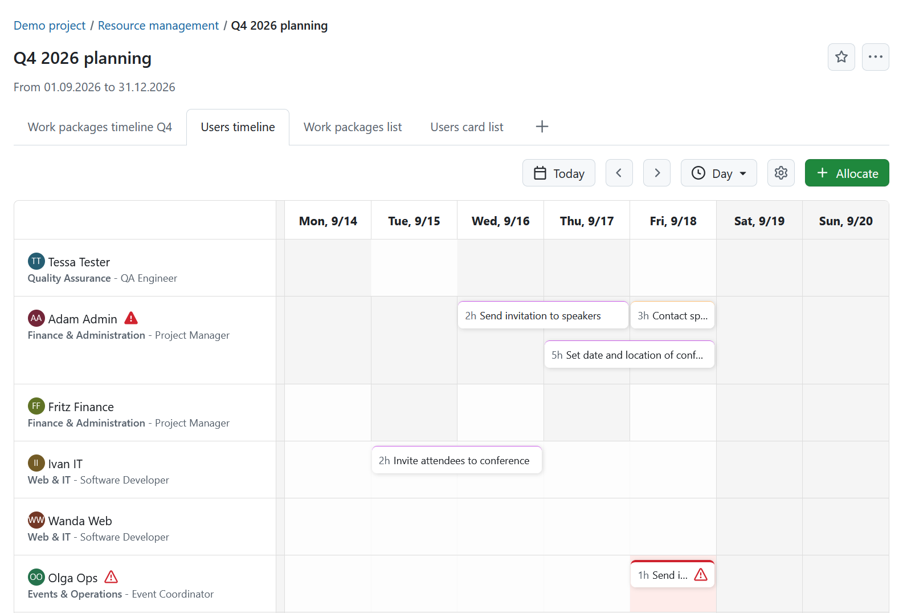

### Work packages list

The **Work packages list** displays planning information in a table.

Use this view when you prefer working with planning data in a table instead of a timeline.

Besides the standard work package information, it includes planning-specific columns such as:

- Allocation
- Allocated members

Each row provides work package-specific actions in the **More** menu (...), including:

- **See allocation**
- **Edit total work**
- **Add user group**
- **Add filter criteria**

Use the **Configure view** icon to customise the displayed columns.

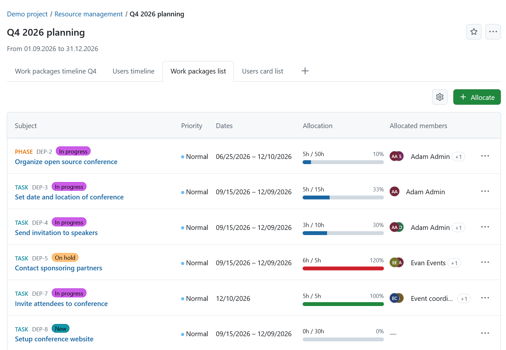

### Users card list

The **Users card list** provides an overview of available project members.

Each card displays information that helps with staffing decisions, including:

- user name
- department (if configured)
- status
- configured working hours
- user attributes, such as spoken languages or key skills, as configured for the view
- current utilization
> [!TIP]
> The utilization bar is relative to the date range of the resource planner. It will show the user's utilization within that given range. If no range is set up, no utilization is displayed.

Use the **Configure view** icon to choose which user attributes are displayed on the cards.

Use this view to quickly identify users with the required skills and available capacity.

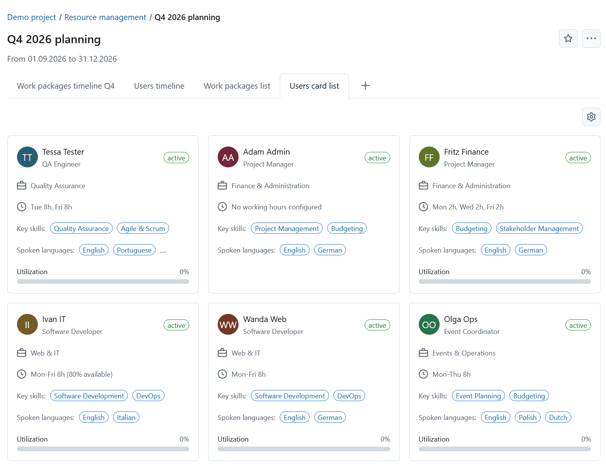

## Allocate work

You can create allocations from all planner views.

Depending on the current planner view, you can:

- select the **+ Allocate** button above the planner
- select **See allocation** from the **More** menu (...) of a work package
- select a user card
- select a work package directly in the timeline

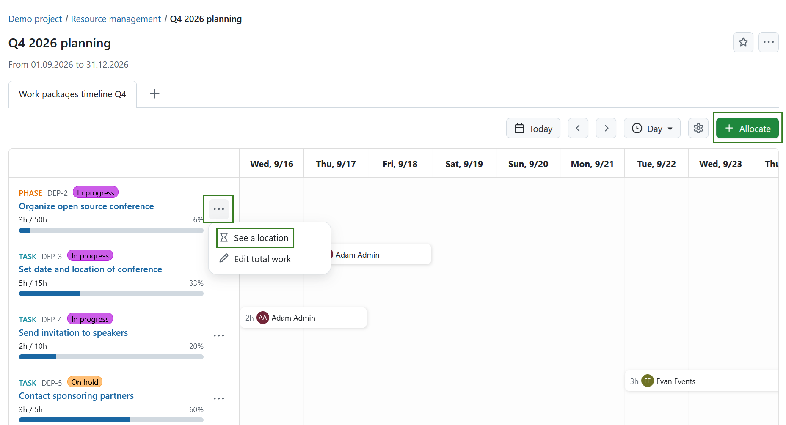

The **Allocation** dialog displays all existing allocations for the selected work package.

Select **Allocate resource** to create a new allocation.

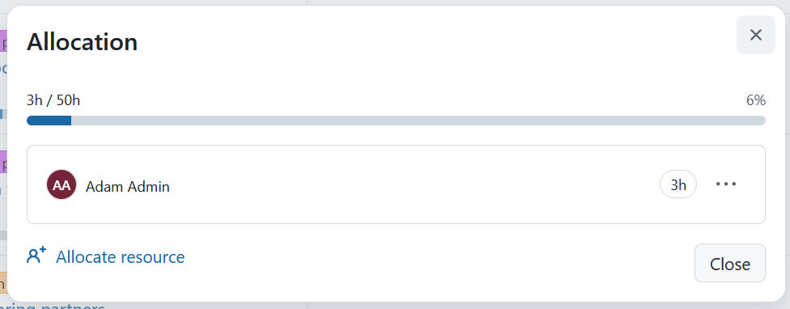

You can allocate work by **User** or **Filter criteria**.

Select the desired option and then select **Next**.

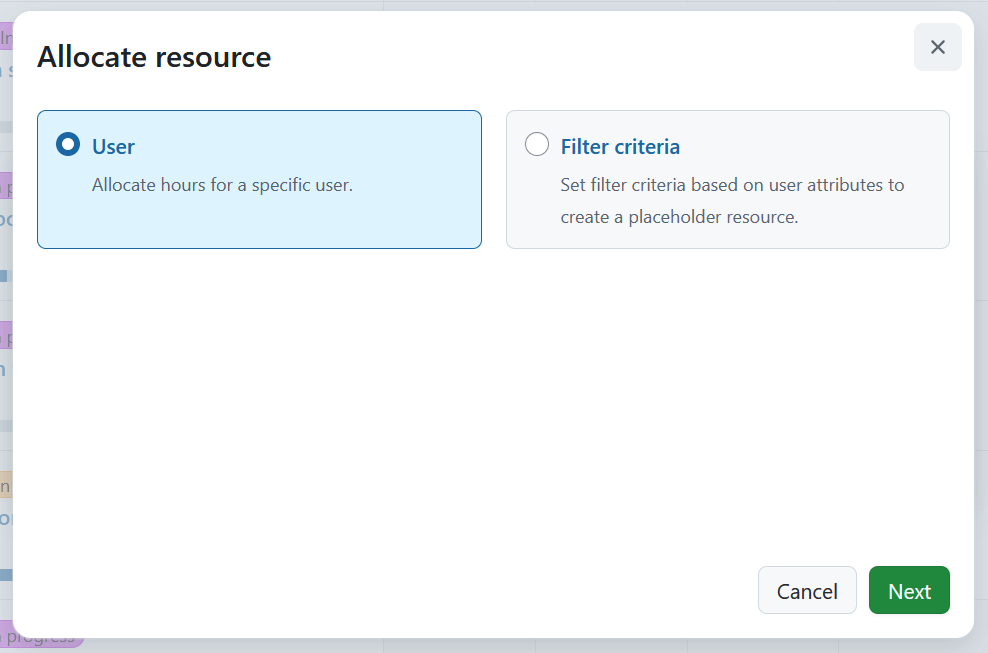

### Allocate by user

Allocating work by **User** assigns planned hours to a specific project member.

Specify:

- **Assignee** – select a project member.
- **Work package** – this field is pre-filled when creating an allocation from a work package.
- **Allocation dates** – if the selected dates fall outside the work package dates, OpenProject displays a warning.
- **Hours** – enter the planned number of hours.

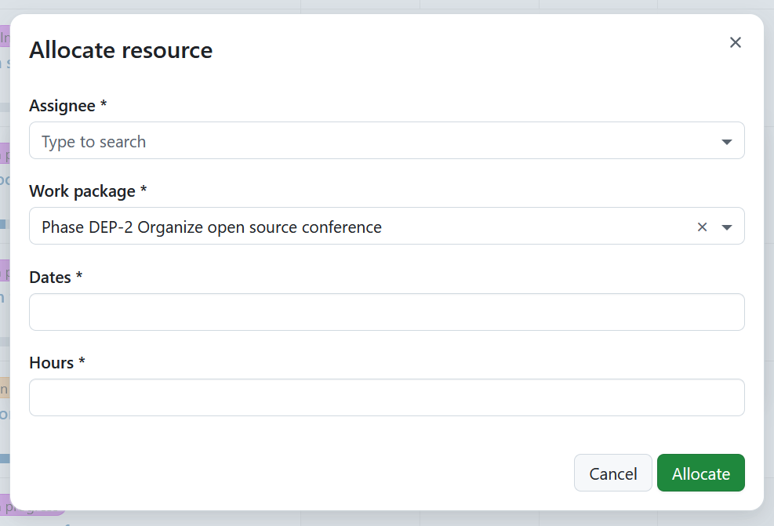

Select **Allocate**.

The new allocation is immediately displayed in the planner. Allocated hours and utilisation are updated automatically. 
> [!TIP]
> If the selected user is over-allocated, a warning message is displayed.

### Allocate by filter criteria

Allocating work by **Filter criteria** creates a placeholder resource request based on user attributes instead of assigning work to a specific user.

Specify one or more user attributes as filter criteria. For example, you can request a resource with a specific language, certification or other user attribute. For more information, see the [User attributes](../../system-admin-guide/users-permissions/user-attributes/) guide.

Enter a **Resource filter name** and select **Allocate**.

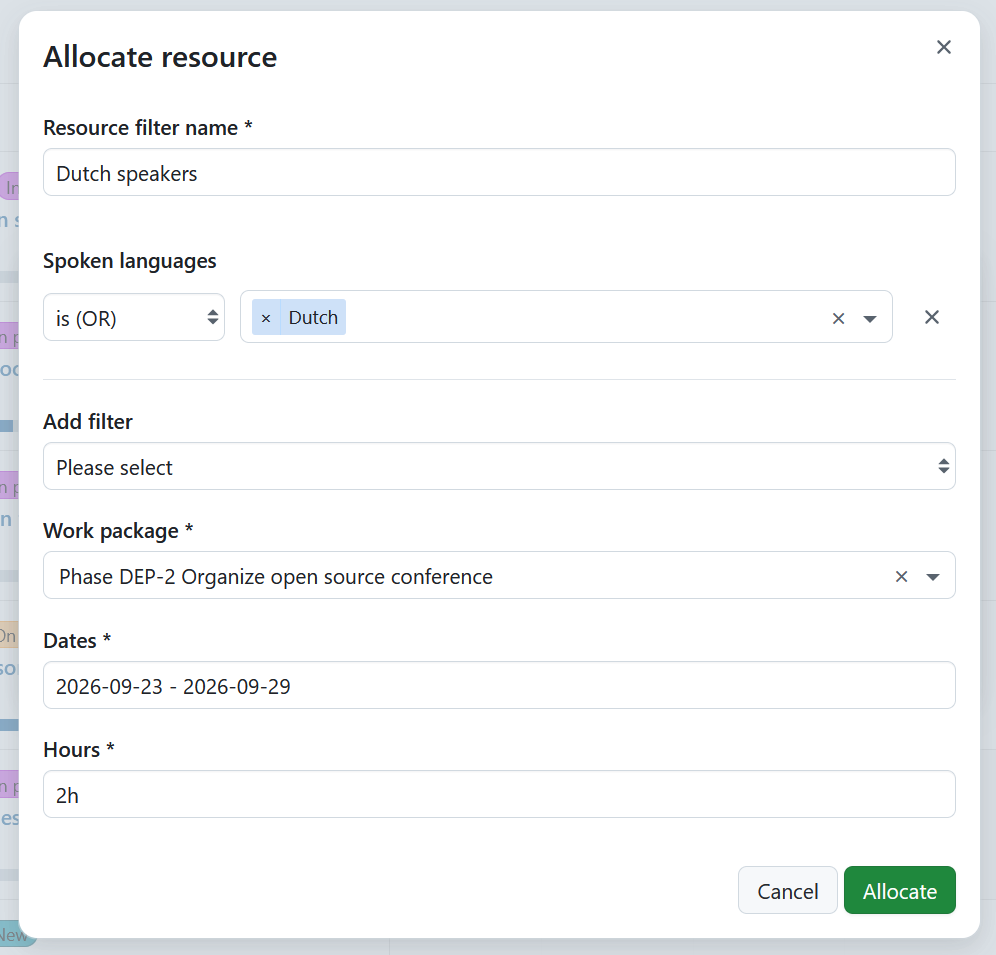

The allocation is created as an open resource request in the [Staffing](#staffing) view, where it can later be assigned to a project member.

## Staffing

The **Staffing** view helps assign open resource requests to suitable project members.

Instead of assigning work directly to a specific user, you can first create a resource request based on user attributes or filter criteria. The Staffing view then helps you match these requests with suitable project members based on their availability, skills or other user attributes.

This is useful when you know which skills or role are required, but have not yet decided who will perform the work.

The Staffing view lists open resource requests that have not yet been assigned to a specific user. It displays:

- resource request
- work package
- requested hours
- date range

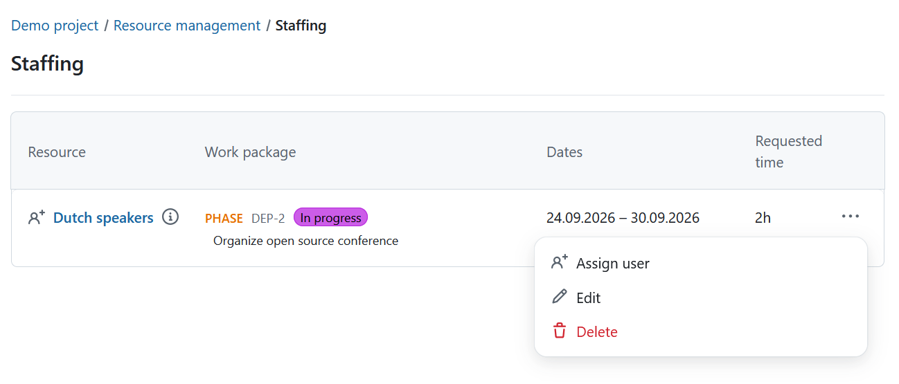

Select the **More** menu (...) to:

- assign a user
- edit the resource request
- delete the resource request

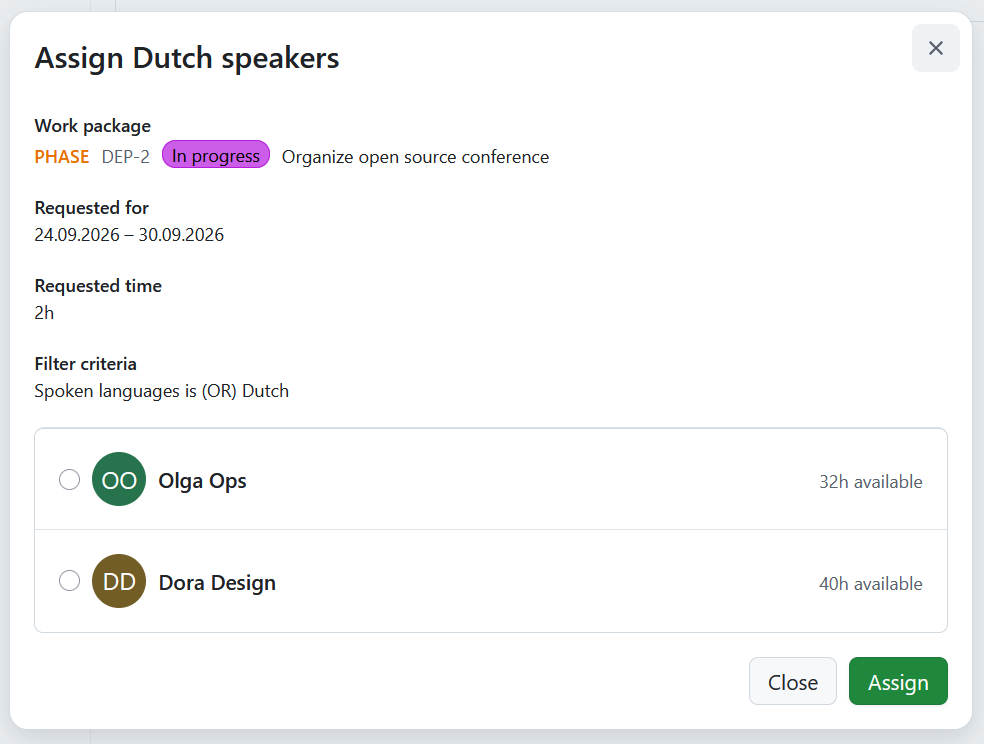

The **Assign** dialog lists all available users matching the selected filter criteria together with their remaining available capacity.

Select a user and then select **Assign** to assign the resource request.