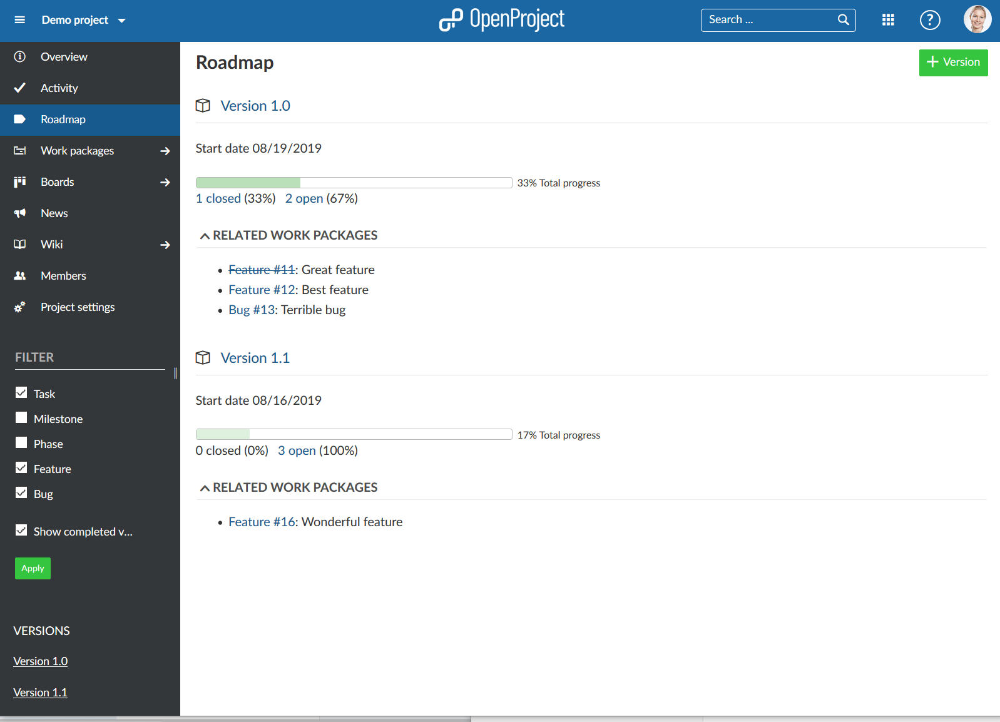
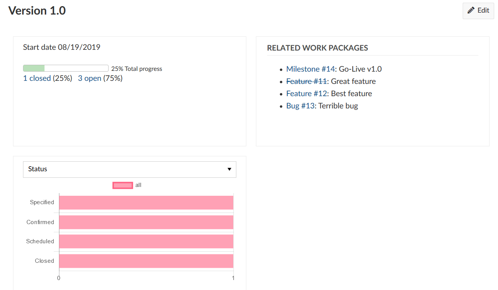
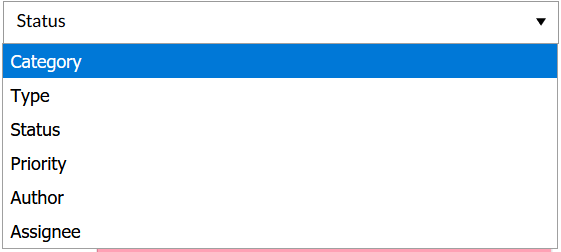

---
sidebar_navigation:
  title: Roadmap
  priority: 880
description: Find out about the Product Roadmap and Release planning in OpenProject
robots: index, follow
keywords: roadmap, release planning
---

# Product roadmap release planning

**Roadmap** is defined as an overview page displaying the versions sorted alphabetically and the work packages assigned to them. The roadmap is displayed in the project navigation when the work package module is activated and a version has been created (project settings).

Plan and manage your product roadmap in OpenProject. Visualize, and communicate your product roadmap. Share your product roadmap with your stakeholders, get feedback about your ideas and break it down into a detailed release plan.

In the roadmap, you can see all work packages and their status listed by versions at a glance.

For each version, the related work package can be assessed from the list displayed in the roadmap view. Subjects which are crossed out represent closed work packages.

This view also provides information on the **project’s progress** for each version by displaying the percentage of closed vs. open work packages and the **total progress**.

Clicking the title of a version allows you to evaluate further information of this version.

The chart displays all work packages listed by a certain attribute. Select the drop-down list to change the attribute:

Note: A roadmap is only displayed in the project menu when at least one [version](../projects/) exists in a project.

