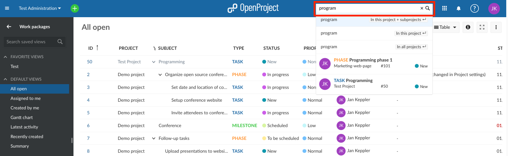
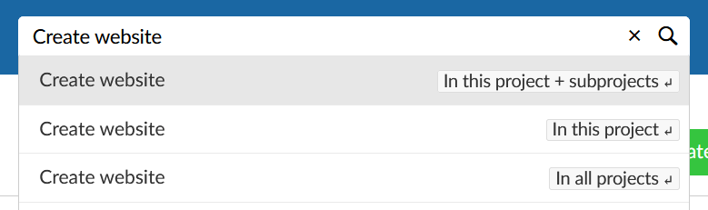
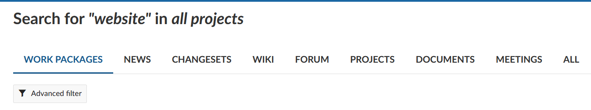

---
sidebar_navigation:
  title: Search
  priority: 000
description: How to use the search bar and search feature in OpenProject
robots: index, follow
keywords: search, find, filter, search bar
---

# Search features

There are two ways to search for work packages, documents, projects, etc. in OpenProject: The search bar and the advanced search. 

## Search bar

The search bar can be found at the upper right of the application. To search for work package subjects, enter the terms you're looking for and do not press the Enter key. An auto-completer will suggest matching work packages from all projects you have access to. You can either click on them or right-click and open them in a new tab.

Searching for e.g. "big cat" will also return work packages with the description "big old cat".

## Advanced search

To access the more detailed, advanced search, choose one of the options shown below the search bar with your arrow keys (then press the Enter key) or by using the mouse.

If you do not have a project open at the moment, the first two options won't be shown.

Now, you can find the results for your search term from different categories/parts of OpenProject. In the work packages section you can click on **Advanced filter** to access additional filter options (the same as in other work package lists).

Please note: It is not possible to find content from archived projects. You will have to un-archive them first on the [global projects overview page](../projects/#global-projects-overview---view-all-projects).

## Full text search, incl. work package attachments

The search bar of Openproject is configured to allow a full text search. This means that you can search not only headings but also descriptions and texts, such as a wiki text or the description of a work package.

The title and the description of a work package can also be found by [filtering by text](../work-packages/work-package-table-configuration/#filtering-by-text).
Aside from full-text search, you can search work packages based on their attached file name or even within the content of an attachment.

**Note** Full text search is a Premium Feature in OpenProject and can only be used with [Enterprise cloud](../../enterprise-guide/enterprise-cloud-guide/) or [Enterprise on-premises](../../enterprise-guide/enterprise-on-premises-guide/). An upgrade from the free Community Edition is easily possible.

