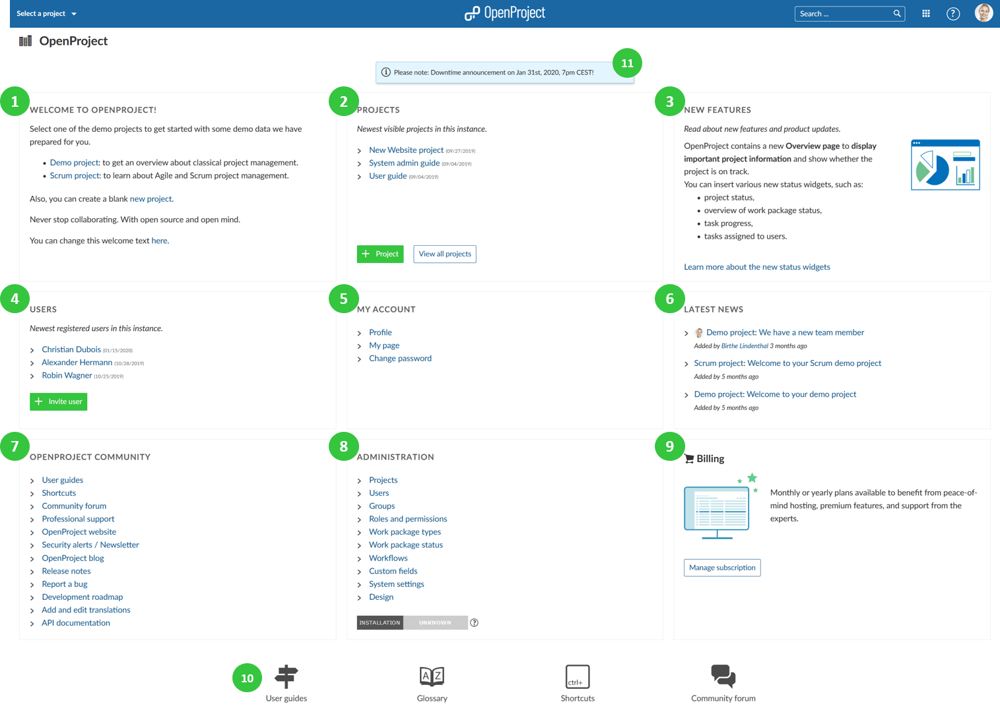

---
sidebar_navigation:
  title: Start page
  priority: 990
description: What do I see on the application start page?
robots: index, follow
keywords: application start page
---

# Application start page

On the **application start page** (home page) you will get an overview about important information.

To get to the application start page, click on the logo in the header of the application.

1. **Welcome text block** to welcome your team members, share important project information, or any other information. You can configure the [welcome text](../../system-admin-guide/system-settings/general-settings/#welcome-block-text) block under -> *Administration* -> *System settings* -> *General*.
2. The **projects block** displays your latest project. You can [create a new project](../../getting-started/#create-project) or [view all projects](../../getting-started/projects/#view-all-projects).
3. The **new features block** displays latest feature announcements and developments.
4. The **Users block** displays latest registered users on the instance. You can [invite new users](../../getting-started/invite-members/) with the green **+ Invite users** button.
5. The **My Account block** links to important account settings, such as the [user profile](../../getting-started/my-account/#edit-your-user-information), the [My page](../../getting-started/my-page/), and the [change password](../../getting-started/sign-in-registration/#reset-your-password) section.
6. The **latest news block** displays latest news from all your projects. Click on the link of the news to read the details.
7. The **OpenProject Community block** displays links to important community information, such as release notes, forum, or the API documentation.
8. **Administration block** displays links to important system administration resources. Also, the [application security badge](../../system-admin-guide/system-settings/general-settings/) will be displayed when activated.
9. The **Billing block** will be displayed for the [OpenProject Cloud Edition](../../cloud-edition-guide). The **Enterprise Edition** block will be displayed for the [OpenProject Enterprise Edition](../../enterprise-edition-guide)). You will get links to the respective section.
10. At the bottom of the page, you will get links to **user guides, glossary, system shortcuts, and the community forum**.