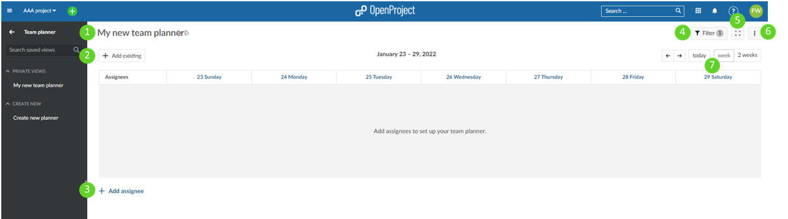
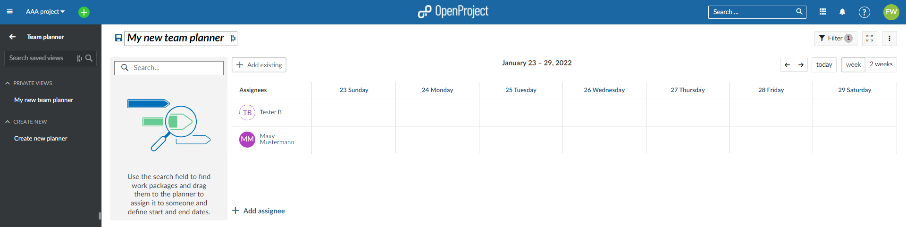
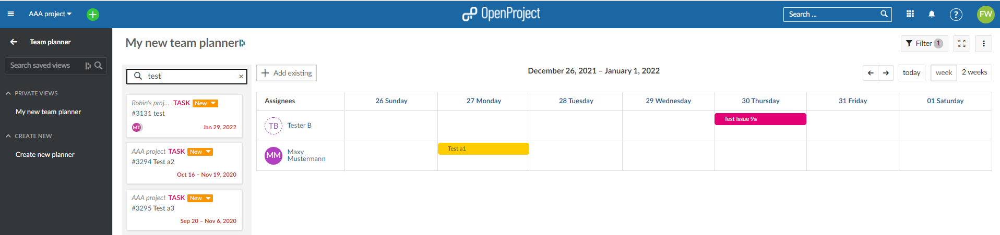
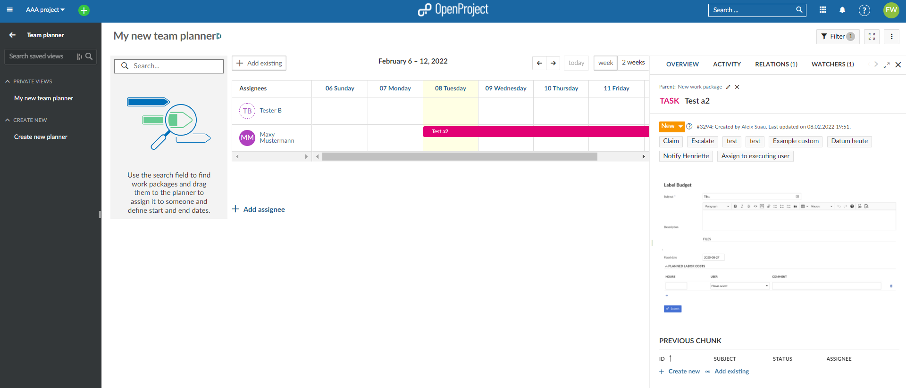

---
sidebar_navigation:
  title: Team planner
  priority: 890
description: Using the team planner in OpenProject.
robots: index, follow
keywords: team planner,planning calendar, resource management
---

# Team planner

The team planner is a module that can assist getting a better overview of which team member is working on what work package at what time. It is also a useful tool to schedule those team members for different tasks on different times.

A few notes: 

1. The work package module has to be enabled as a prerequisite for the team planner
2. You can have multiple public, private, as well as favorite team planning calendars. They will all appear in the left menu bar.

| Topic                 | Content                                     |
| ------------------------------------- | :------------------------------------------ |
| [Main view - planning calendar basics](team-planner) | What do the various buttons do? |
| **Getting started** |  |
| [Step 1: Adding team members](team-planner) | How to add team members? |
| [Step 2: Adding/working with work package strips](team-planner) | How to work with work package strips? |
| [Work package strip detail view](team-planner) | How to access the work package detail view? |
| [Removing a work package strip](team-planner) | How to remove a work package strip? |

## Main view - planning calendar basics

What do the various buttons do? - The numbers below correspond with the above image:

1. Edit the name of your new team planning calendar in the top header. The top header is in edit mode by default. This is where you can type a new name. Your new name gets saved automatically by exiting the top header by clicking somewhere else, for example.

2. Use the "+ add existing" button to add an existing work package to your view. Note: You cannot create new work packages from the team planner module. Create new work packages in the work package module, then select them in the team planner.
3. Add a new team member to you planning calendar using the "+ add assignee"
4. There is a filter button by which you can focus what's displayed on your calendar (i.e. only certain team members or work packages).
5. This switches you team planning calendar to full screen mode.
6. Saving, renaming and saving a copy (saving as), or deleting can also be accomplished using the button with the three vertical dots. This is also where you can modify the visibility options. Use "public" to allow others in your organization to see your planning calendar. If "public" is not selected, the calendar is "private" and can only be seen by you.
7. By default the planning calendar only shows the current week. Use these buttons to toggle between the 1-week and 2-week view.

## Getting started

- ##### Step 1: Adding team members

The first step in setting up your team planning calendar is to add team member. This is done via the "+ add assignee" button 		in #3 above. Press the "+ add assignee" button, and then simply select the team member from the drop-down list. Clicking 		on a given assignee's name will open up a new window with a quick overview of which projects that member is assigned to.

Repeat this step until you have all team members relevant for this planner added, and then save it. 

**Note: Once you are done adding members to the planner, click the floppy disk icon in the top header to save.**

- **Step 2: Adding/working with work package strips**

Next, add specific work packages to your planner. Do this by pressing the "+ add existing" button" we introduced in step 2 of the main view overview. Once you press the "+ add existing" button, start typing the name of the work package you are looking to add. Once found, drag & drop the work package strip. Should the work package have a duration exceeding the current 1 or 2 week view, a horizontal scroll bar will display, with which it is possible to scroll to the end date of the longest running work package.

**Note: You can only add existing work packages here. If you need to create some first, create them in the work package module as new work packages cannot be created from the team planner module.**

- **Work package strip detail view**

Click on any given work package strip to open up a split screen showing the work package detail view.

- **Removing a work package strip**

  Work package strips are never really removable, since the planning calendar is simply a view of the information pertaining to a given work package. There are, however, a few options to make the strip disappear from your view:

  1. Adding a filter that would exclude that work package.
  2. Removing the assignee, or changing the assignee to one that has not been added to the planner (and is thus not visible).
  3. Changing the start/end dates so the currently visible date range does not fall in between them.
