---
sidebar_navigation:
  title: Team planner
  priority: 863
description: Using the team planner module in OpenProject.
keywords: team planner, planning, calendar, resource management, assign, team view
---

# Team planner

The team planner module helps you get a complete overview of what each member of your team is working on. You can use it to track the current progress of work packages your team is working on, schedule new tasks, reschedule them or even reassign them to different members.

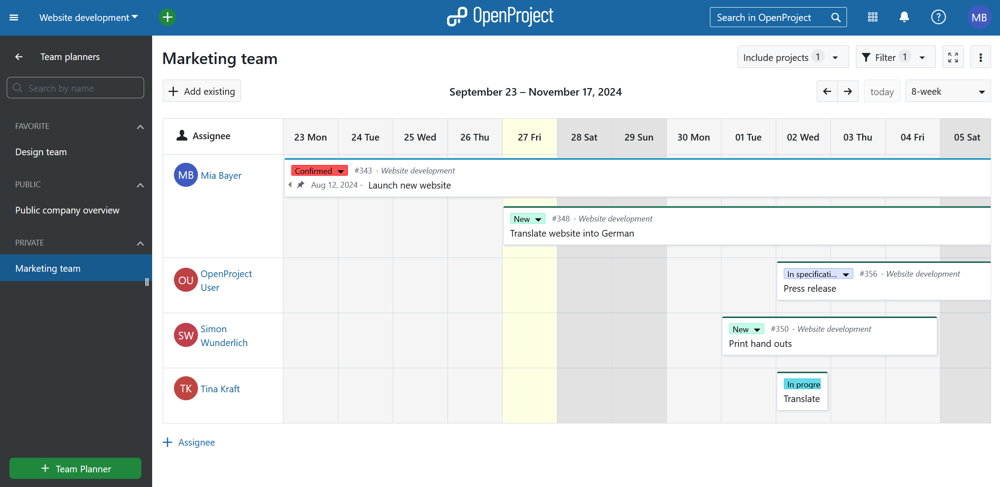

Essentially, the team planner is a calendar view with an assignee column on the left side. Each work package assigned to a team member will appear as a card that spans a certain duration (start date to finish date). These cards can be moved, stretched, shortened or removed to organize the planning of your team.

> [!NOTE]
> Team planner is an Enterprise add-on and can only be used with [Enterprise cloud](../../enterprise-guide/enterprise-cloud-guide/) or  [Enterprise on-premises](../../enterprise-guide/enterprise-on-premises-guide/). An upgrade from the free community edition is easy and helps support OpenProject.

To use this module, you must have the work packages module enabled.

| Topic                                                                        | Content                                                              |
|------------------------------------------------------------------------------|:---------------------------------------------------------------------|
| [Module overview](#module-overview)                                          | See a list of all existing team planners or create a new one         |
| [Team planner basics](#team-planner-basics)                                  | Understanding the basics of how a team planner is organized          |
| [Adding team members and work packages](#add-team-members-and-work-packages) | Add team members and schedule, reschedule and reassign work packages |
| [Work package detail view](#work-package-details-view)                       | View or edit a specific work package                                 |
| [Removing a work package](#remove-a-work-package)                            | Removing (unscheduling) visible work packages                        |

## Module overview

Clicking on the **Team planners** entry on the left sidebar takes you to the team planner module with a list of all existing team planners:

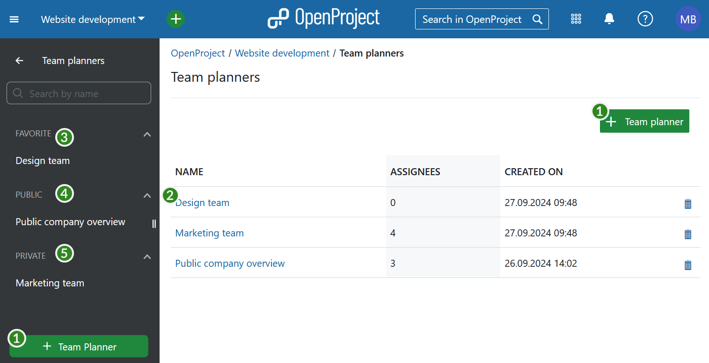

1. You can create a new team planner using either the **+ Team planner** button in the top right near your avatar or at the bottom of the left menu bar.
2. Click on an existing (saved) team planner to open it.
3. Team planners marked as *favorite* under visibility settings appear under the **Favorite** heading in the menu bar.
4. Team planners with *public* visibility settings appear under the **Public** heading in the menu bar.
5. New team planners by default appear under the **Private** heading in the left menu bar. These are visible only to you.

> [!TIP]
> Both *public* and *private* team planners can be added as **favored** planners.

## Team planner basics

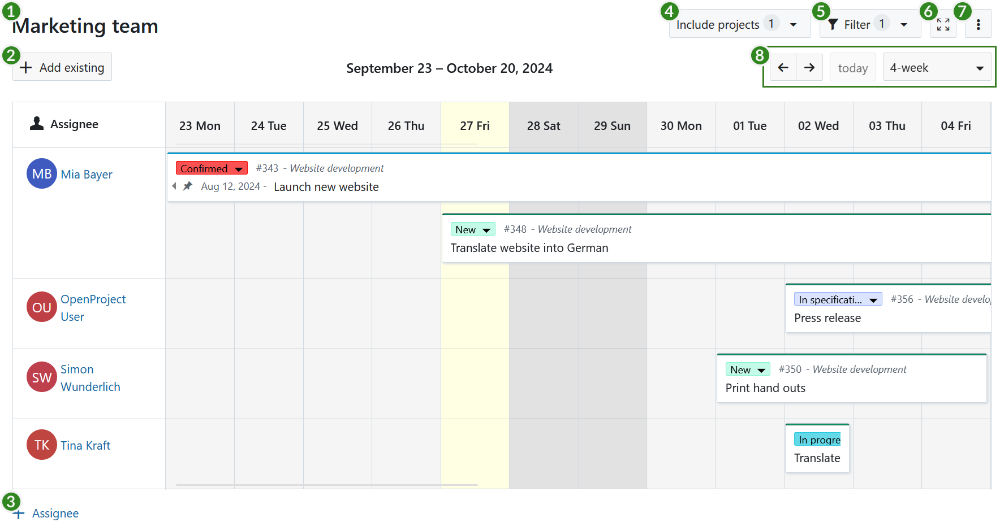

A team planner has a number of features numbered 1 to 8 in the above screenshot:

1. Click on the name of your team planner (*Marketing Team* in the example above) to edit it. Unless it's a new team planner, this change has to be confirmed by pressing the floppy disk icon that appears next to the name after you change it.
2. Use the **+ Add existing** button to add an existing work package  to the team planner. You do this by searching for work package and dragging its card to an assignee, at a certain time. This will then update the *assignee*, *start date* and *finish date* attributes of that work package.
3. Add a new team member to the assignee column by Clicking on the **+ Assignee** button.
4. By default, the team planner will only show assigned work packages belonging to the current project. However, it is possible to also add assigned work packages belonging to other projects. You can make these work packages from other projects visible by using **Include projects** feature and selecting additional projects to be included in this view.
5. Use the **Filter** feature (same as in the [work packages](../work-packages/work-package-table-configuration/#filter-work-packages) module) to display only work packages that meet certain filter criteria. You could, for example, filter such that only work packages of certain types, certain status or certain custom field values are visible.
6. The **Fullscreen** button lets you view the team planner in fullscreen mode.
7. The  **\[⋮\]** (more) button gives you additional options, such as saving, renaming and saving a copy (saving as), or deleting the team planner. This is also where you can modify the visibility options.
8. By default the team planner only shows the [work week](../../system-admin-guide/calendars-and-dates/#working-days-and-hours) (week excluding the weekend and non-working days). Use the drop down to toggle between work week, 1-week, 2-week, 4-week or 8-week views. With the arrows you can navigate the weeks back and forth. The Today button brings you to the current week.

> [!TIP]
> The team planner will highlight non-working days in the calendar with a darker background color. By default, a work package cannot be dragged or resized such that it begins or ends on these days unless the "Working days only" switch is turned off for that work package. To learn how to do this, refer to the documentation on [Working days and duration](../work-packages/set-change-dates/#working-days-and-duration).

## Add team members and work packages

### Add team members

When you create a new team planner, it will be empty, like so:

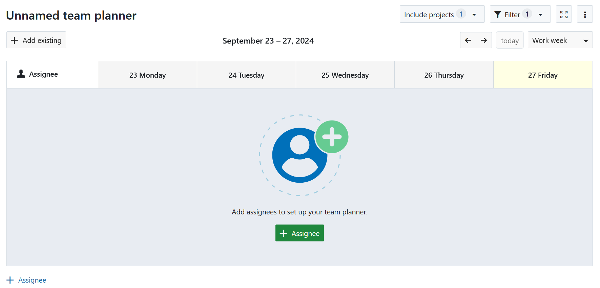

The first step in setting up your team planning calendar is to add team members. To do so, click on the **+ Assignee** button then search for the team member you would like to add from the the drop-down list (1). This will add a new row to the calendar view for that team member.

Repeat this step until all relevant team members are added and then save it using the floppy disk icon in the top header (2).

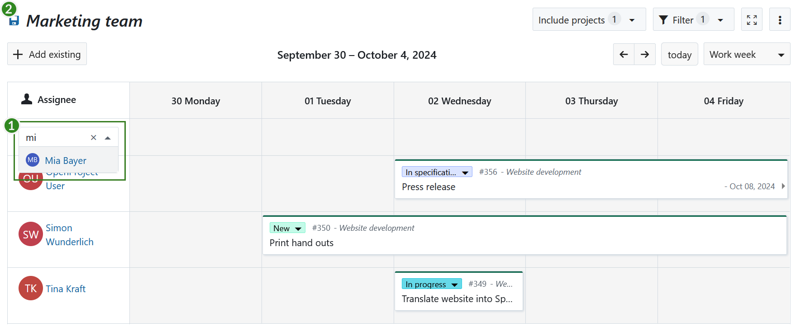

If you need to remove a member from this list, hover over their name and click on the **X button** that appears next to their name. (This action simply removes the row and does not affect the user's status in the project).

Once you are finished adding members to the team planner, click on the floppy disk icon in the top header to save.

### Add and edit work packages

Next, you can add existing work packages to your planner. You can do this by either creating a new work package or by adding existing work packages.

#### Create a new work package

You can create a new work package for a particular member of your team by clicking on a cell in that team member's assignee row.

> [!TIP]
> You can also click and drag across a date range to create a work package that spans those dates. The first square will be the start date and the last one the finish date.

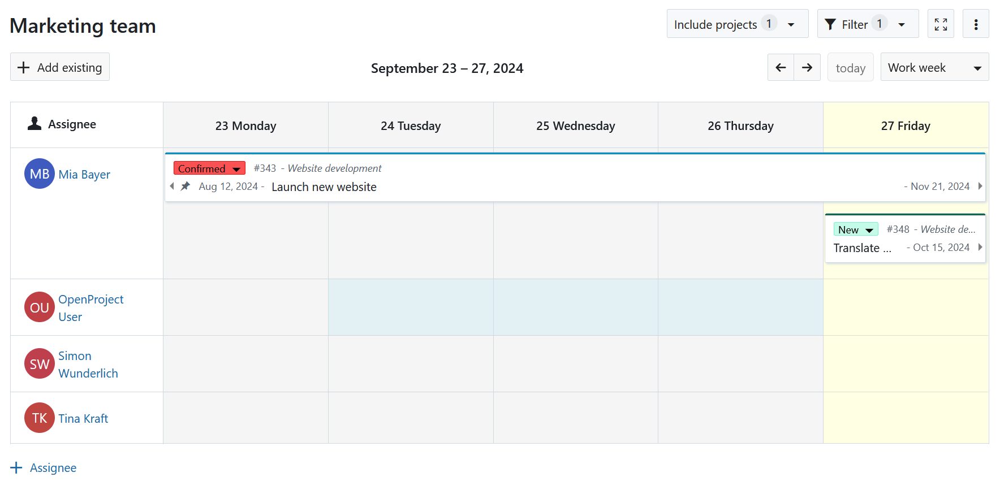

A **new work package dialog** will open. The assignee, start and finish dates will already be set based on where you clicked to create the work package. You can add any additional details, such as subject, work package type, a description and add attachments. Scrolling further down on the split screen also gives you access to other attributes such as cost and time and custom fields that might exist.

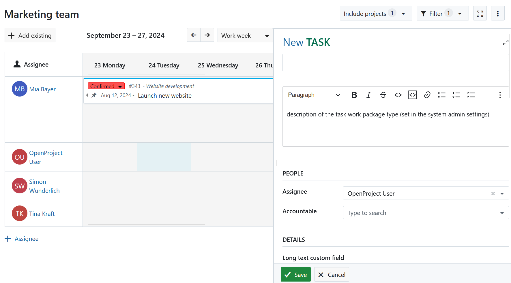

#### Add an existing work package

If you would like to take an existing work package and assign it to your team member for a certain start date, the team planner makes it easy to do so.

Start by pressing the **+ Add existing** button below the name of the team planner and search for the work package you would like to add. Once you find it, drag and drop the work package card to the calendar, depending to whom you would like to assign it, and to which start date. The finish date will automatically be derived based on the duration of the work package.

> [!NOTE]
> Scheduling tasks by adding existing work packages is easier in the one or two week view, especially if you have work packages that can span a weekend.

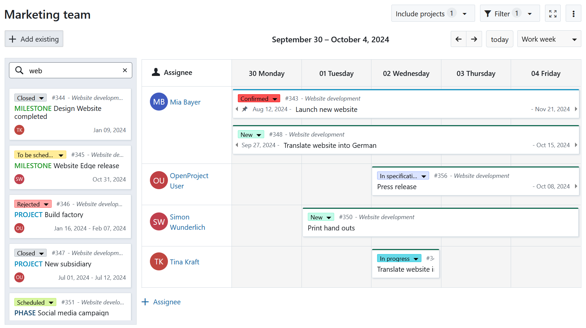

Sometimes, it is not possible to assign an existing work package to a particular team member for a variety of reasons: they might not be a member of the project the selected work package belongs to, might not have the necessary permissions, or you yourself might not have the necessary permissions to edit the dates or the assignee for that work package. In this case, a small error message will indicate that the operation was not successful.

#### Move and resize a work package

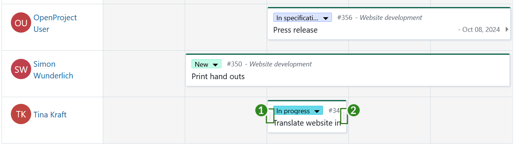

The team planner allows you to quickly re-schedule and re-assign work packages cards:

- To re-assign work packages, **click and drag a card** from one team member's row to another.
- To change the start date only, hover over the work package and **click and drag the *drag handles* on the left edge** (1) of the work package card to shorten or lengthen the total duration.
- To change finish date only, hover over the work package and **click and drag the *drag handles* on the right edge** (2) of the work package card to shorten or lengthen the total duration.
- To maintain duration but to move the work package forwards or backwards in time, **simply click and drag the work package horizontally**.

> [!NOTE]
> Work packages can also expand and retract in width depending on how many non-working days are spanned (for example, a 3-day task starting on Thursday and ending on Monday will spread across 5 calendar days;  dragging that same work package so that it starts on a Tuesday and ends on a Thursday means that it will spread across 3 calendar days. In both cases, the duration remains 3 days.

Sometimes, it is not possible to modify the dates or the assignee of work packages for a variety of reasons. It could be, for example, because you might not have the necessary permissions to make that change or because existing relations make it impossible. In such cases, an error message will appear on the top of the screen to let you know that the change was not possible.

## Work package details view

When you want to understand what a team member is working on, or want to re-schedule work packages, it can be important to get the full context of each work package. Team planners make this possible by giving you easy access to work package details.

To open the work package details in split screen, hover on a work package card and click on the **i icon** (information):

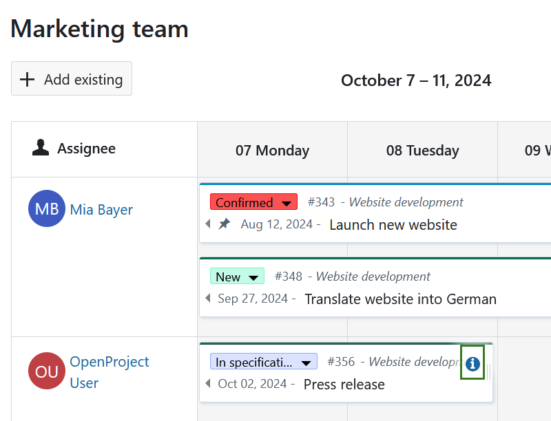

This will open the work package details in split screen view, where you can view and edit all work package attributes, consult recent activity, view linked files and link new or attach ones and view and create work package relations.

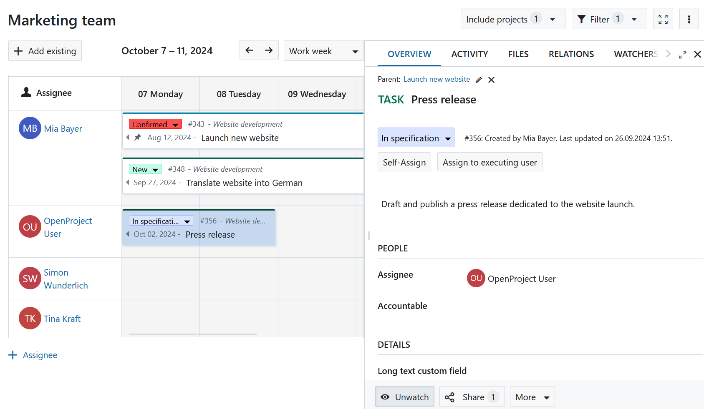

## Remove a work package

Since the team planner is simply a view that displays work packages for certain assignees over a certain period of time, removing a work package simply means not making it visible in the current view. This can be achieved in a number of ways:

1. Adding a filter that will exclude that work package (for example, filtering for type *Task* will remove work packages of other types from that view).
2. Removing the start and finish dates or changing them such that they do not fall in the time period displayed in the team planner.
3. Removing the assignee or changing the assignee to someone who has not been added to this particular team planner.

Alternatively, the team planner offers an easy way to remove a work package by combining 2 and 3 in one action. When you start dragging a work package, a *remove drop zone* appears at the bottom of the team planner. You can drag a work package card to that drop zone to clear the assignee, start date and finish date attributes in one go.

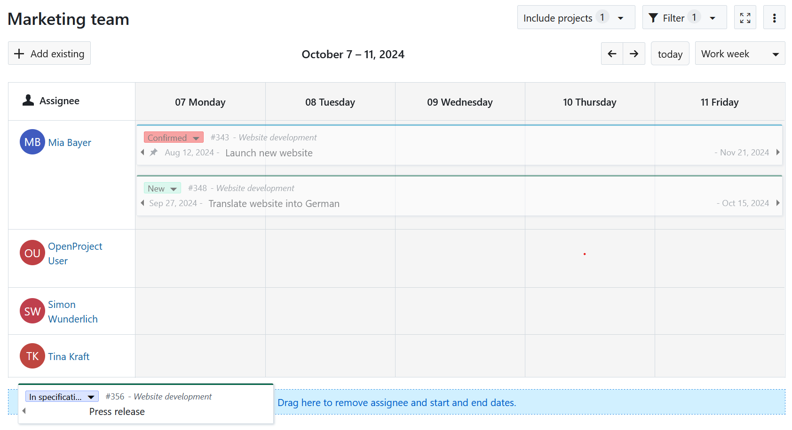
