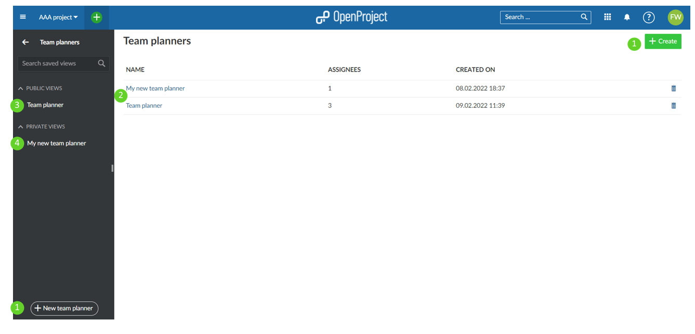
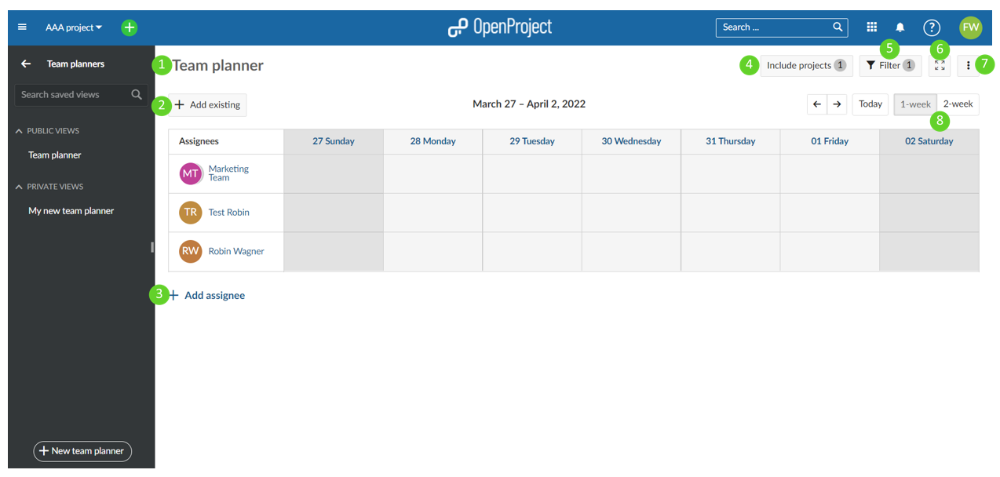
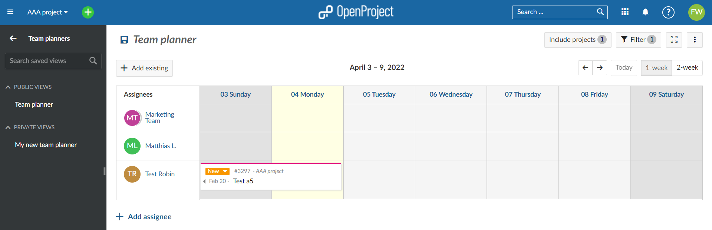
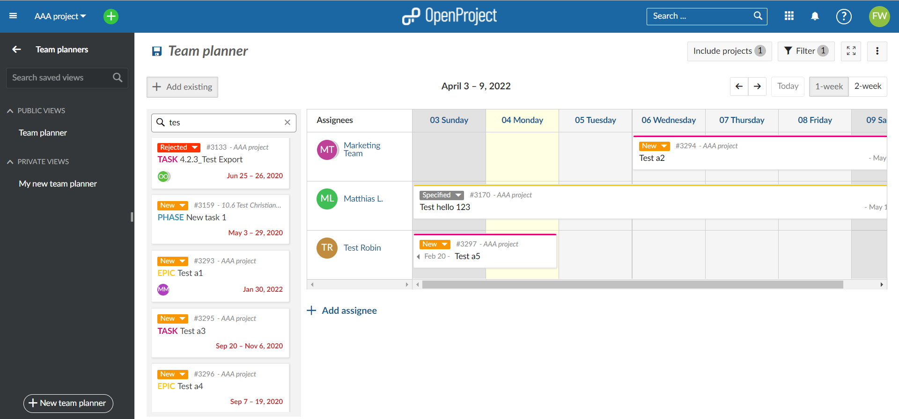
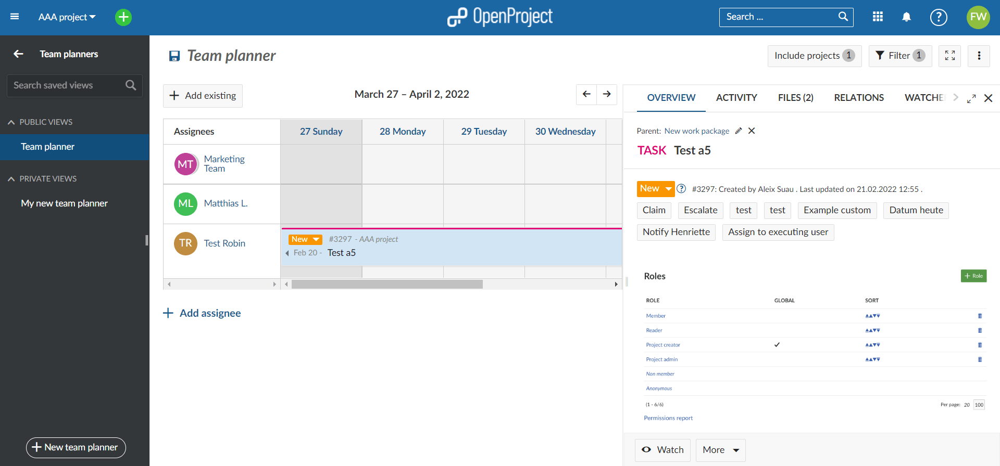

---
sidebar_navigation:
  title: Team planner
  priority: 890
description: Using the team planner in OpenProject.
robots: index, follow
keywords: team planner,planning calendar, resource management
---

# Team planner

The team planner is a module that can assist getting a better overview of which team member is working on what work package at what time. It is also a useful tool to schedule those team members for different tasks on various times.

A few notes: 

1. The work package module has to be enabled as a prerequisite for the team planner
2. You can have multiple public, private, as well as favorite team planning calendars. They will all appear in the left menu bar.

| Topic                                                                                     | Content                                     |
|-------------------------------------------------------------------------------------------|:--------------------------------------------|
| [Main view](#main-view-start-a-new-or-select-an-existing-team-planner)                    | How to start a team planner?                |
| [Planning calendar basics](#planning-calendar-basics)                                     | How to navigate the team planner?           |
| [Getting started](#getting-started)                                                       | How to get started?                         |
| [Adding team members](#step-1-adding-team-members)                                        | How to add team members?                    |
| [Adding/working with work package strips](#step-2-addingworking-with-work-package-strips) | How to work with work package strips?       |
| [Work package strip detail view](#work-package-strip-detail-view)                         | How to access the work package detail view? |
| [Removing a work package strip](#removing-a-work-package-strip)                           | How to remove a work package strip?         |

## Main view - Start a new or select an existing Team Planner

1. You can create a new team planner using either the **+ Create** button in the top right near your avatar, or by clicking the

    **+ New team planner** button at the bottom of the black menu bar.

2. If you created a team planner before, you can select one of the planners from the list.

3. Team planners with the visibility option **public** selected appear under the **Public Views** heading in the black menu bar. 

4. Team planners with the visibility option "public" unselected appear under the **Private Views** heading in the black menu bar. Note: If **public** is not selected, the calendar is automatically **private** and can only be seen by you, not other members.

   Both **public** and **private** calendars can be added as a **favored** planner, and would appear under the heading **Favorite Views** in the black menu bar.

## Planning calendar basics

How to navigate the team planner? - The numbers below correspond with the above image:

1. The top header: Click on the top header (where it says **Team planner** in the picture above) to edit the name of your new team planning calendar. The top header is in edit mode by default, so you can just click right on the text. This is where you can give the new team planning calendar its new name. Your new name gets saved automatically by exiting the top header (by clicking somewhere else, for example).
2. Use the **+ add existing** button to add an existing work package to your view. Note: You cannot create new work packages from the team planner module. Create new work packages in the work package module, then select them in the team planner.
3. Add a new team member to you planning calendar using the **+ add assignee**.
3. **Include projects** filter: By default, this filter will only include the current project you are in. You can select additional projects as you see fit by pressing this filter button and check-marking additional projects. The number in the grey bubble inside of this button will indicate the number of projects that are currently selected inside of the filter.
4. There is a filter button by which you can focus what is displayed on your calendar (for example, only certain team members or work packages).
5. This switches you team planning calendar to full screen mode.
6. Saving, renaming and saving a copy (saving as), or deleting can also be accomplished using the **[⋮]** button. This is also where you can modify the visibility options. Select **public** to allow others in your organization that are members of your respective project to see your planning calendar. If **public** is not selected, the calendar is **private** and can only be seen by you, not other members.
7. By default the planning calendar only shows the current week. Use these buttons to toggle between the 1-week and 2-week view.

## Getting started

### Step 1: Adding team members

The first step in setting up your team planning calendar is to add team members. This is done via the **+ add assignee** button in #3 above. Press the **+ add assignee** button, and then simply select the team member(s) from the drop-down list. Clicking on a given assignee's name will open a new window with a quick overview of which projects that member is assigned to.

Repeat this step until all team members relevant for this planner are added, and then save it using the floppy disk icon (adjacent to the top header in #1 above). 

**Note: Once you are finished adding members to the planner, click the floppy disk icon in the top header to save.**

### Step 2: Adding/working with work package strips

Next, add specific work packages to your planner. Do this by pressing the **+ add existing" button** we introduced in step 2 of the main view overview. Once you press the **+ add existing** button, start typing the name of the work package you are looking to add. Once found, drag & drop the work package strip. Should the work package have a duration exceeding the current 1 or 2 week view, a horizontal scroll bar will display, with which it is possible to scroll to the end date of the longest running work package.

Additional features: You can change the status of a work package, and enter the work package strip detailed view by pressing the info button **(i)** on each respective strip

**Note: You can only add existing work packages here. If you need to create some first, create them in the work package module as new work packages cannot be created from the team planner module.**

## Work package strip detail view

Click on any given work package strip to open up a split screen showing the work package detail view.

## Removing a work package strip

Work package strips are never fully removable, since the planning calendar is simply a view of the information pertaining to a given work package. There are, however, a few options to make the strip disappear from your view:

1. Adding a filter that would exclude that work package.
2. Removing the assignee or changing the assignee to one that has not been added to the planner (and is thus not visible).
3. Changing the start/end dates so the currently visible date range does not fall in between them.
