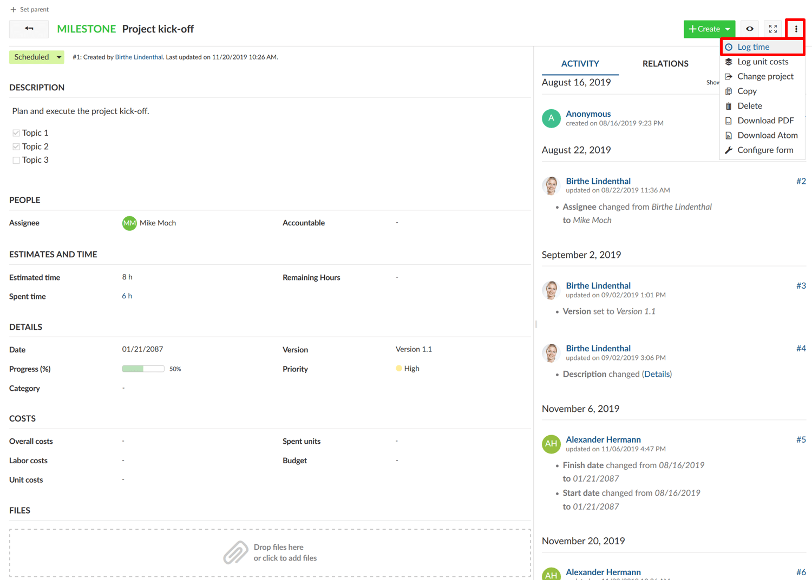
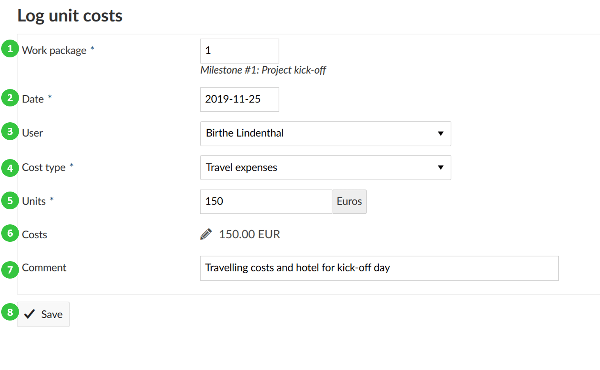
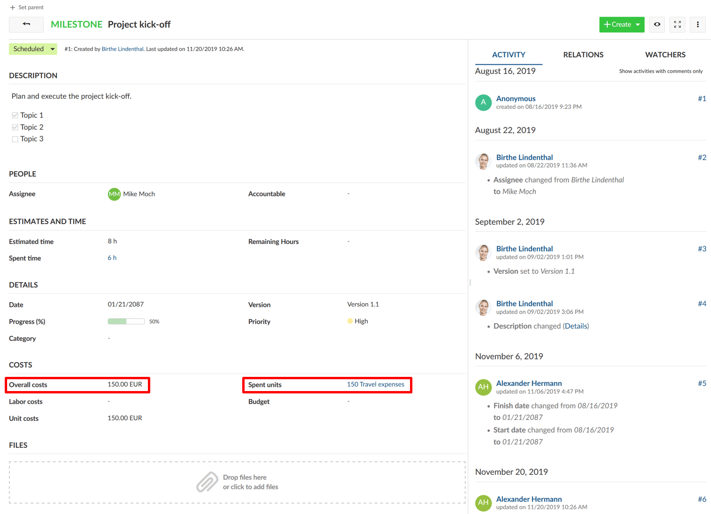
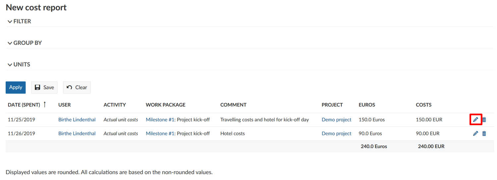
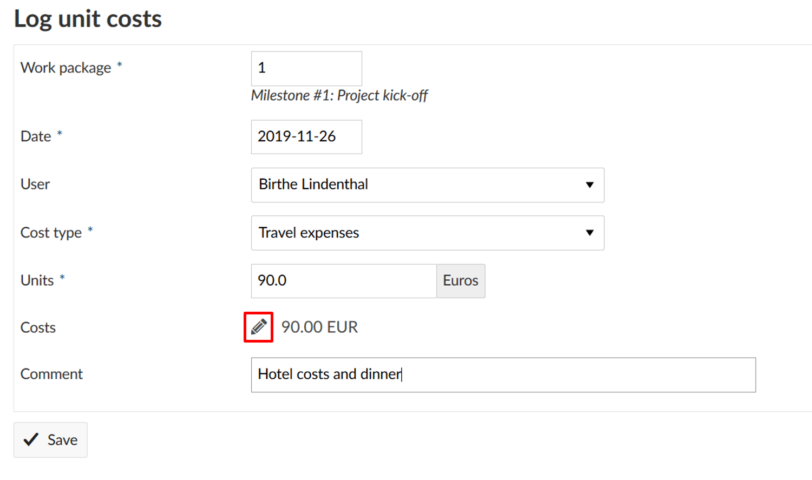
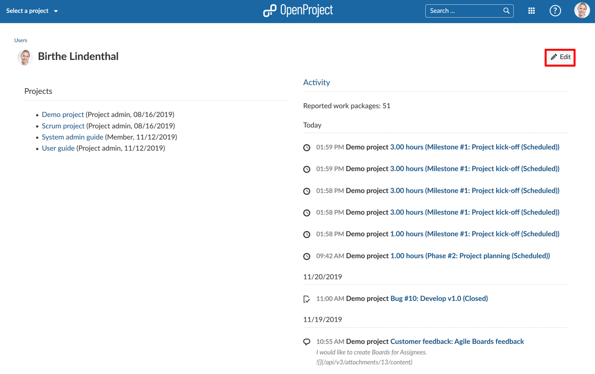
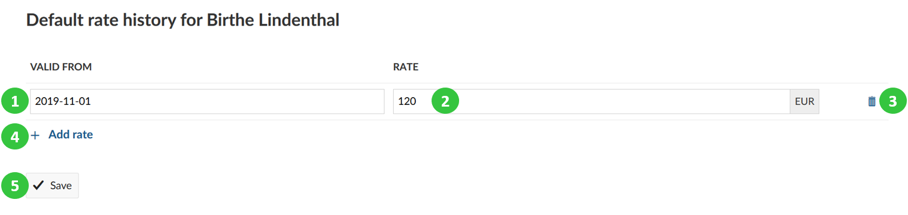

---
sidebar_navigation:
  title: Cost tracking
  priority: 798
description: Time and cost tracking in OpenProject
robots: index, follow
keywords: cost tracking
---

# Cost tracking

You can log unit costs on a work package within a project to keep track on certain units spent in a project, e.g. travel costs or machines.

**Note**: When using the cost tracking functionality, the **Cost reports** module needs to be activated in the [project menu](../../projects/).

| Feature                                                      | Documentation for                                   |
| ------------------------------------------------------------ | --------------------------------------------------- |
| [Logging costs to a work package](#logging-costs-to-a-work-package) | How to track costs on a work package?               |
| [Edit logged costs](#edit-logged-costs)                      | How to edit spent costs logged to a work package?   |
| [Delete logged costs](#delete-logged-costs)                  | How to delete spent costs logged to a work package? |
| [Define hourly rate for labor costs](#define-hourly-rate-for-labor-costs) | How to set the hourly rate to track labor costs?    |

## Logging costs to a work package

To track unit costs to a work package select the **Log unit costs** option from the **More functions** drop down menu.

A new form is opened, where you can log unit costs. You can edit the following information:

1. **Work package ID**. By default, the work package ID of the work package where you selected *Log unit costs* option is shown. You can change this number, in which case the unit costs will be logged for the respective work package.

2. The **date**, for which the unit costs are logged.

3. You can select a **user** (project member) from the drop down menu for whom you log the unit costs.

4. The **cost type** field offers a range of pre-defined cost types which can be configured in the Administration. The  units and respective costs per unit category are defined for every cost type separately. Please note that you need certain privileges to be able to  create new cost types and define costs for specific units.

   
**Cost Types** are defined as types of costs that can be defined by system admins (e.g. Scrum development).

5. You can enter the number of **units** to be logged.

6. The **costs** for the entered units will be automatically calculated  after you have entered the number of units. You can manually change the sum of the calculated costs, if e.g. a discount is offered or a special agreement was reached. To adapt the sum manually click on the **pen icon** to the left of the sum.

7. In the **comment** field you can enter more details to describe the logged costs.

8. Do not forget to **Save** your time log.

9. 

The **spent unit costs** as well as the total amount of **overall costs** are displayed on the work packages details view.

## Edit logged costs

To display and edit the logged costs to a work package, navigate to the work package details view. Here, the total amount of spent costs are displayed. Click on the sum of logged costs on a work package to display the details.

The detailed logs are displayed in a cost report. To edit a cost entry, click on the Edit icon with the little pen next to a cost entry.

It will open the details view of the cost entry and you will be able to make your changes just as for [Logging costs to a work package](#logging-costs-to-a-work-package).

In some cases, you might want to change the costs manually so that it differs from the automatically calculated product from spent units and costs per unit.

In this case, click on the Edit icon, the little pen, next to the cost entry. Now you can manually enter the costs.

Do not forget to save your changes.

## Delete logged costs

If you made a mistake and need to delete logged costs, click on the **delete icon** next to a cost entry in the cost report.

## Define hourly rate for labor costs

You can define an hourly rate to **track labor costs per user**. Please navigate to the user profile, e.g. by clicking on a hyper link of the user name on a work package.

 

You will be directed to the user's profile page.

Here, you can click the **Edit button** on the top right corner of the user profile page.

 

Alternatively, you can navigate to ->Administration ->Users & Permissions ->Users.

Click on the **Rate history** tab.

You will see a default hourly rate valid for all projects.

If you want to set a different hourly rate for the user on different projects, you can overwrite the default rate with a different rate below in the respective projects.

To enter a new hourly rate, click on the **Update** icon next to the rate history. You can either set a **default hourly rate** or define a rate for a certain project.

1. Enter a date from which the rate is **Valid from**.
2. Enter the (hourly) **Rate**. The currency can only be changed in the system's Administration settings.
3. You can delete an hourly rate.
4. You can **add a rate** for a different time period.
5. Save your changes.

