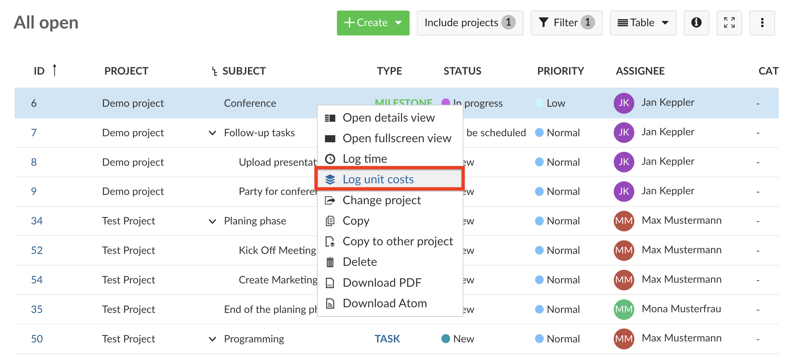

---
sidebar_navigation:
  title: Cost tracking
  priority: 798
description: Time and cost tracking in OpenProject
keywords: cost tracking, log costs, unit costs
---

# Cost tracking

You can log unit costs on a work package within a project to keep track on certain units spent in a project, e.g. travel costs or machines.

| Topic                                                       | Content                                             |
| ----------------------------------------------------------- | --------------------------------------------------- |
| [Log costs to a work package](#log-costs-to-a-work-package) | How to track costs on a work package.               |
| [Edit logged costs](#edit-logged-costs)                     | How to edit spent costs logged to a work package.   |
| [Delete logged costs](#delete-logged-costs)                 | How to delete spent costs logged to a work package. |

## Log costs to a work package

In order to log unit costs, you must first activate the **Time and costs** module and the **Budget** module in the project settings. Then select a budget from the drop-down menu of the work package details and link it to the selected work package

To log costs to a work package you can either press the button on the top right in the work package detail view or double-click on the line of the work package in the work package table. In both cases a function menu appears in which you can select **log unit costs**.

A new form is opened, where you can log unit costs. You can edit the following information:

1. **Work package ID**. By default, the work package ID of the work package where you selected *Log unit costs* option is shown. You can change this number, in which case the unit costs will be logged for the respective work package.

2. The **date**, for which the unit costs are logged.

3. You can select a **user** (project member) from the drop down menu for whom you log the unit costs.
   Please note that you can't log unit costs for [placeholder users](../../../system-admin-guide/users-permissions/placeholder-users).

4. The **cost type** field offers a range of pre-defined cost types which can be configured in the [Administration](../../../system-admin-guide/time-and-costs). The units and respective costs per unit category are defined for every cost type separately. Please note that you need certain privileges to be able to  create new cost types and define costs for specific units.

   

   **Cost Types** are defined as types of costs that can be defined by system admins (e.g. consultant days or licenses).
   

5. You can enter the number of **units** to be logged.

6. The **costs** for the entered units will be automatically calculated  after you have entered the number of units. You can manually change the sum of the calculated costs, if e.g. a discount is offered or a special agreement was reached. To adapt the sum manually click on the **pen icon** to the left of the sum.

7. In the **comment** field you can enter more details to describe the logged costs.

8. Do not forget to **Save** your time log.

9. 

The **spent unit costs** as well as the total amount of **overall costs** are displayed on the work packages details view.

## Edit logged costs

To display and edit the logged costs to a work package, navigate to the work package details view. Here, the total amount of spent costs are displayed. Click on the sum of logged costs on a work package to display the details.

The detailed logs are displayed in a cost report. To edit a cost entry, click on the Edit icon with the little pen next to a cost entry.

It will open the details view of the cost entry and you will be able to make your changes just as for [Logging costs to a work package](#log-costs-to-a-work-package).

In some cases, you might want to change the costs manually so that it differs from the automatically calculated product from spent units and costs per unit.

In this case, click on the **Edit icon**, the little pen, next to the cost entry. Now you can manually enter the costs.

Do not forget to **save** your changes.

## Delete logged costs

If you made a mistake and need to delete logged costs, click on the **delete icon** next to a cost entry in the cost report.

