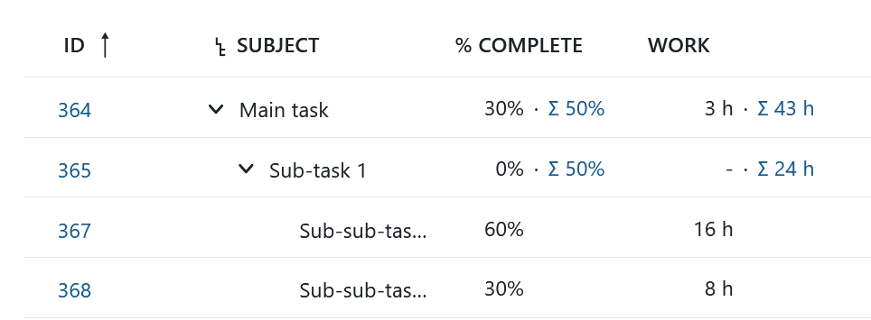
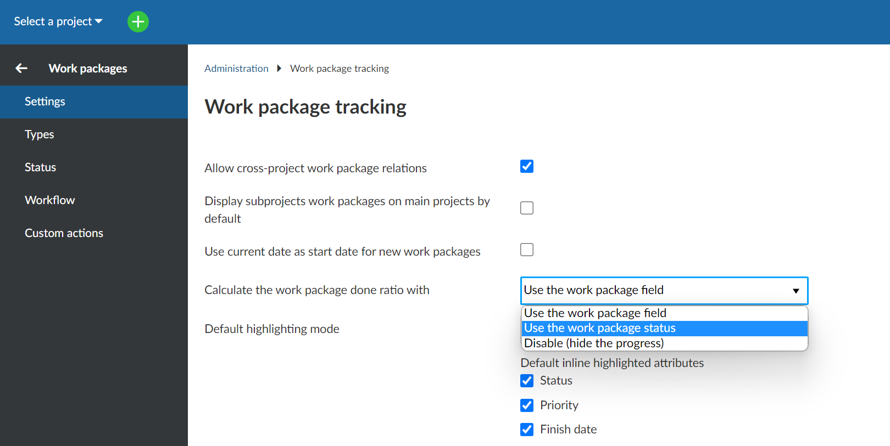
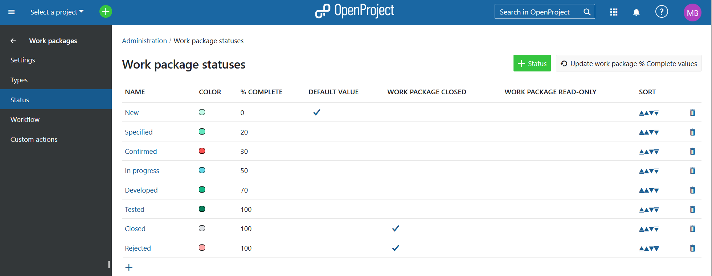

---
sidebar_navigation:
  title: Progress tracking
  priority: 800
description: Progress tracking in OpenProject.
keywords: Progress tracking, cost reporting, earned value analysis, earned value management
---

# Progress tracking

You can track the completion of projects in OpenProject by assigning a **% Complete (earlier called Progress (%))** value to individual work packages.
OpenProject will automatically roll-up progress to parent work packages.

**% Complete** for work packages with children will show two values:

-  the % Complete value from the work package progress itself, set manually (on the left)
- the value, calculated as an aggregation of % Complete values of the children work packages. This calculated value is a hyperlink, clicking it will open the detailed view of the children and illustrate the computation.

## Manual progress tracking

| Topic                                                                                               | Content                                           |
|-----------------------------------------------------------------------------------------------------|:--------------------------------------------------|
| [Manual progress tracking](#manual-progress-tracking)                                               | How to track progress manually per work package.  |
| [Progress tracking in the work package hierarchy](#progress-tracking-in-the-work-package-hierarchy) | How to track progress for multiple work packages. |
| [Status based progress tracking](#status-based-progress-tracking)                                   | How to track progress use work package status.    |

## Manual progress tracking

After the initial installation, OpenProject is configured for manual progress tracking. In order to log progress,
please open the details of a work package.
The **% Complete (earlier called Progress (%))** field shows the default value of 0%.

Clicking on the progress bar opens an in-place editor
that allows you to enter a percentage value between 0 and 100.

Pressing enter saves the value and updates dependent work packages (see below).
Progress is rounded to the next integer.

You can also bulk-modify the **% Complete** in the list of work packages.

## Progress tracking in the work package hierarchy

The progress of **work package with children** is calculated as the weighted average of all direct children, using the field **Work (earlier called Estimated time)** as the weight.
When adding the **% Complete (earlier called Progress (%))** column to a work package hierarchy view, please also add the **Work**
column as well so that you can track the calculation.
The screenshot below shows an example hierarchy with aggregated **% Complete**.

Please note the **Work** column to the right.
Here, values next to the sum icon (for example 43 h next to the  Main task) indicate the sum of estimated time of the task itself and its children, while values without the sum icon (3 hours) refer to estimated time directly assigned to a work package.

Calculation examples:
 * Sub-Task 1 has 50% completion calculated as (16h * 60% + 8h * 30%) / 24h.
 * Sub-Task 2 has 25% completion calculated as (8h * 50% + 8h * 0%) / 16h.
 * Main Task has 40% completion calculated as (24h * 50% + 16h * 25%) / 40h.

## Status-based progress tracking

As an alternative to the manual progress tracking mode above, you can configure your OpenProject system to associate work packages statuses with fixed values for % Complete .
In the Administration, please navigate to Work packages -> Settings and change “Calculate the work package done ratio” to
“Use the work package status”.

In this mode, OpenProject does _not_ allow you to manually modify the
**% Complete (earlier called Progress (%))** field in the work packages.
Instead, the **% Complete** value will be set automatically based on the work package
status configuration page.

Within the Administration, navigate to Work package -> Status and select the status you want to edit regarding the progress tracking. Here you can select the desired progress percentage from the drop-down menu in the progress line and add it to the status. Please do not forget to save your changes.

The screenshot above shows a sample configuration of work package statuses together with suitable **% Complete**  values.
For example, setting the status of a work package to “In progress”
is equivalent to setting **% Complete ** to 50% manually.

Note: The status and its associated progress value from the
administration screen also determines the **% Complete ** of
work packages with children. So there is no roll-up of progress
in the work package table hierarchy in this configuration.
