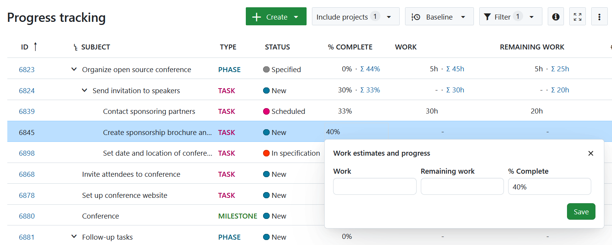
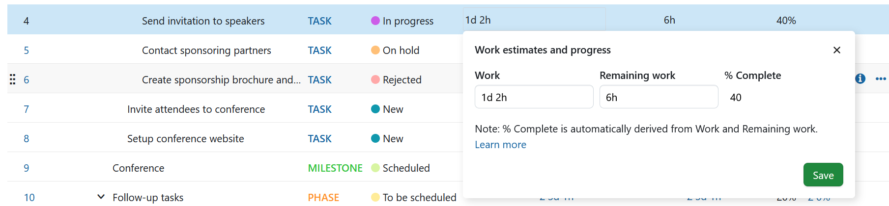
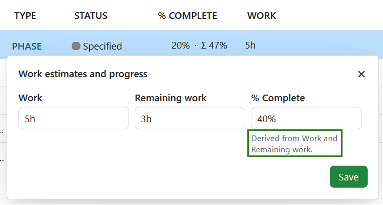
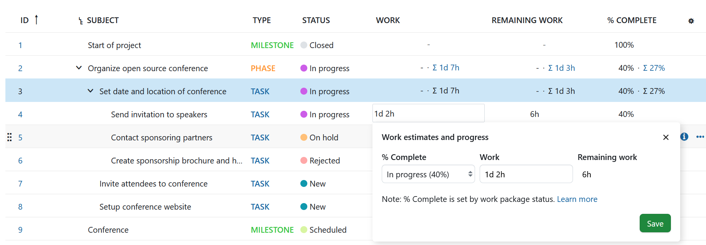
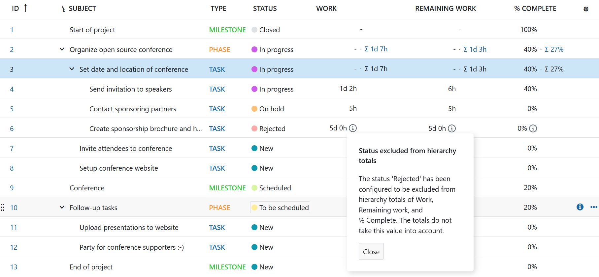

---
sidebar_navigation:
  title: Progress tracking
  priority: 800
description: How to use OpenProject to track and report progress of work packages in either work-based or status-based reporting modes.
keywords: Progress tracking, estimated time, remaining time, work, % complete, percentage complete, remaining work
---

# Progress tracking

OpenProject lets you track and monitor the progress of your work packages.

> [!IMPORTANT]
> In OpenProject 14.0, the way progress is reported and calculated has changed significantly. Refer to [this blog article](https://www.openproject.org/blog/changes-progress-work-estimates/) to follow the changes. 
> **In OpenProject 14.6 some of the changes made in 14.0 were removed and updated**. Please read the documentation below and [this blog post](https://www.openproject.org/blog/updates-to-progress-tracking-in-14-6-based-on-user-feedback/) to understand how OpenProject handles work and progress estimates.

## Terms

[OpenProject 13.2](../../../release-notes/13-2-0/) introduced important changes in the names of three work package fields:

| **Old term**     | **New term**          |
|--------------------|------------------------|
| Progress         | %&nbsp;Complete       |
| Estimated time   | Work                  |
| Remaining time   | Remaining work        |

>[!NOTE]
> You will still find the new attributes if you search using their older names (in the list of filters, for example).

## Units of measurement

Work and Remaining Work can be measured either in **hours** or **days and hours** (this needs to be set by your administrator). 

You can input values for Work and Remaining work in different units. See the examples below:

- Valid inputs for 2 hours and 30 minutes:

  - "2.5"
  - "2.5h"
  - "2h 30m"
  - "2 hours 30 minutes"

- Valid inputs for 6 days:

  - "48"
  - "48 hour"
  - "6d 0h"
  - "6 days"

The default setting is set to be 8 hours per day. Your administrator can change [how many hours are considered a day and select the duration format](../../../system-admin-guide/calendars-and-dates/#working-days-and-hours).

## Progress reporting modes

OpenProject offers two modes for reporting progress:

- **Work-based progress reporting** enables you to automatically derive progress based on the values you enter for Work and Remaining work. You can also manually enter a value for % Complete. 
- **Status-based progress reporting** allows you to assign fixed % Complete values to statuses, and automatically derive Remaining work based on the values for Work you can enter.

> [!NOTE]
> The administrator of your instance will have selected a mode for the entire instance. If you are an administrator, you can modify this by following our [admin guide on work package settings](../../../system-admin-guide/manage-work-packages/work-package-progress-tracking).

### Work-based progress reporting

In the work-based progress reporting mode %&nbsp;Complete can either be automatically calculated based on the values of Work and Remaining work, or entered manually. 

#### Manual values for % Complete

If you you prefer to enter the values for % Complete manually, you can. You can do that in the table view and work package details view.  Values for *Work* and *Remaining work* are not required to enter  % Complete. 

> [!IMPORTANT]
>
>  If you do not enter \*Work\* or \*Remaining work\*, the \*% Complete\* field will remain an independent, manually editable field and behave like it did prior to OpenProject 14.0.

#### Automatic values for % Complete

If you enter a value for *% Complete* and one other field (*Work* or *Remaining work*), the third one will automatically be derived based on the other two. This means that there can be one value (if % Complete is entered manually) or three values but never just two  values.

>**%&nbsp;Complete** is work done (**Work** - **Remaining work**) divided by **Work**, expressed as a percentage. For example, if Work is set at 50h and Remaining work is 30h, this means that %&nbsp;Complete is _(50h-30h)/50h))_ = **40%**. Please note that these calculations are independent and unrelated to the value of **Spent time** (which is based on actual time logged).

To make this link clear and transparent, clicking on *Work* or *Remaining work* to modify them will display the following pop-over:

This allows you to edit Work or Remaining work and get a preview of the updated %&nbsp;Complete value before saving changes. Changing any one field will automatically update the other two.

When you add, edit, or remove a value for *Work*, *Remaining Work*, or *% Complete*, and it affects another field, a helpful message will appear explaining what has changed and why.

#### Calculation logic

**When no field is set**

When none of the three fields (% Complete, Work, or Remaining Work) have values set, the field you fill in first will determine how the others are calculated:

- If you enter % Complete only, no other fields will be automatically updated. Work and Remaining Work will remain empty.
- If you enter Work only, Remaining Work will automatically match the Work value, and % Complete will be set to 100%. You can manually clear these values if needed.
- If you enter Remaining Work only, Work will automatically match the Remaining Work value, and % Complete will be set to 100%. You can manually clear these values if needed.

**When one field is set**

When one field is already set and you enter a value in a second field, the third field will be automatically calculated:

- If Work is already set and you enter % Complete, Remaining Work will be automatically calculated.
- If Remaining Work is already set and you enter % Complete, Work will be automatically calculated.
- If you enter Remaining Work when Work is already set (or vice versa), % Complete will be automatically calculated.

> [!NOTE]
> If you enter a value for Remaining work that is higher than Work, you will see an error message telling you that this is not possible. You will have to enter a value lower than Work to be able to save the new value.
>Additionally, the value for Remaining work cannot be removed if a value for Work exists. If you wish to unset Remaining work, you need to also unset Work.

> [!NOTE]
> **If you enter a % Complete value of 100% when Remaining work has a value**, this will also result in an error, since Remaining work must be 0h when % Complete is 100%.

**When all values are set**

- **Increasing Work**: When you increase the value of Work, the same amount is added to Remaining Work (since the total Work has increased). This change also updates the % Complete accordingly.
- **Decreasing Work**:
  -  If you decrease *Work*, *Remaining work* is lowered by the same amount.
  - If you decrease *Work* by more than the current value for *Remaining work*, then *Remaining work* will be set to 0h and *% Complete* to 100%
- **Changing Remaining work updates % Complete**
- **Changing % Complete updates Remaining work**

For more details and examples of progress tracking calculation please refer to this [blog article](https://www.openproject.org/blog/updates-to-progress-tracking-in-14-6-based-on-user-feedback/).

### Status-based progress reporting

Administrators can also switch to [status-based progress reporting mode](../../../system-admin-guide/manage-work-packages/work-package-settings/) for their instance.

In this mode, each status is associated with a fixed %&nbsp;Complete value in the [admin settings for each one](../../../system-admin-guide/manage-work-packages/work-package-status/), which can be freely updated by changing the status of a work package. This allows teams to report progress simply by changing the status of their work packages over time.

> For example, "New" could be set to 0%, "In progress" to 30%, "In test" to 60% and "Implemented" to 100%. Then, as project members update the status, the %&nbsp;Complete values would reflect these changes automatically.

Unlike in work-based progress reporting mode, in status-based mode, Remaining work is an automatically calculated value that cannot be manually edited.

>**Remaining work** is **Work** times **(100% - %&nbsp;Complete)**, expressed in hours. For example, if the %&nbsp;Complete for a selected status is 50% and Work is 10h, Remaining work is automatically set to 5h.

In Status-based progress reporting mode, Work is not a required value. However, if Work is set, Remaining work is automatically calculated. To make this link clear and transparent, clicking on the value for Work will display the following pop-over:

This allows you to edit %&nbsp;Complete (by changing status) or Work and get a preview of the updated Remaining work before saving changes.

> [!NOTE]
> In the upcoming version, statuses cannot have an empty %&nbsp;Complete value in status-based progress reporting mode. When upgrading, all statuses that do not have a value will take the default value of 0%.

## Hierarchy totals

OpenProject will automatically show totals for Work, Remaining work and % Complete in a work package hierarchy (any parent with children). These appear in a work package table as a number with a Σ sign next to it, indicating that it is a total of the values of the parent _and_ children.

OpenProject offers two modes for calculating *% Complete* in hierarchy totals:

- **Weighted by work**: The total %&nbsp;Complete value of a hierarchy is a weighted average tied to Work. For example, a feature with Work set to 50h that is 30% done will influence the total of %&nbsp;Complete of the parent more than a feature with Work set to 5h that is 70% done. 

  > [!TIP]
  >
  > Work packages without *Work* will be ignored.

- **Simple average**: *Work* is ignored and the *total % Complete* is calculated as a simple average of the *% Complete* values from the direct work packages children in the hierarchy. The value used on each direct child for computing the average is its *total % Complete* value, or its *% Complete* value if it has no children, or 0% if its *% Complete* value is empty.

> [!NOTE]
> The administrator of your instance will have selected a mode for the entire instance. If you are an administrator, you can modify this by following our [admin guide on work package settings](../../../system-admin-guide/manage-work-packages/work-package-progress-tracking).

### Excluding certain work packages from totals

In some cases, you might want to exclude certain work packages (like those with status *rejected*) from total calculations of the parent. Administrators can define these exclusions by going to the [Administration settings for any status](../../../system-admin-guide/manage-work-packages/work-package-settings/) and check a new option called "Exclude from calculation of totals in hierarchy". All work packages with this status will then be excluded when calculating the total value for the parent (for all fields: Work, Remaining work and %&nbsp;Complete).

A small info icon will appear next to excluded values to remind you of this fact:

## Changing modes

When an administrator changes the progress calculation mode from Work-based to Status-based, the % Complete values might be in a transitional stage.

## Work- to status-based

When switching from Work-based to Status-based mode, the previous value for %&nbsp;Complete will be replaced by the the %&nbsp;Complete value associated with the current status of that work package. Then there are two cases to consider:

- If Work was previously set, it will be retained and Remaining work will be re-calculated based on the other two values
- If Work was previously empty, then Work and Remaining work will remain empty

## Status- to work-based

In Status-based mode, it is possible for work packages to have a %&nbsp;Complete value (defined by the status) without having values for Work or Remaining work. In other words, the Work and Remaining work can be empty.

When switching to Work-based mode, OpenProject will retain the value for %&nbsp;Complete that was set with status. 

Changing progress calculation mode from status-based to work-based will make the *% Complete* field freely editable. If you optionally enter values for *Work* or *Remaining work*, they will also be linked to *% Complete*. Changing *Remaining work* can then update *% Complete*.
