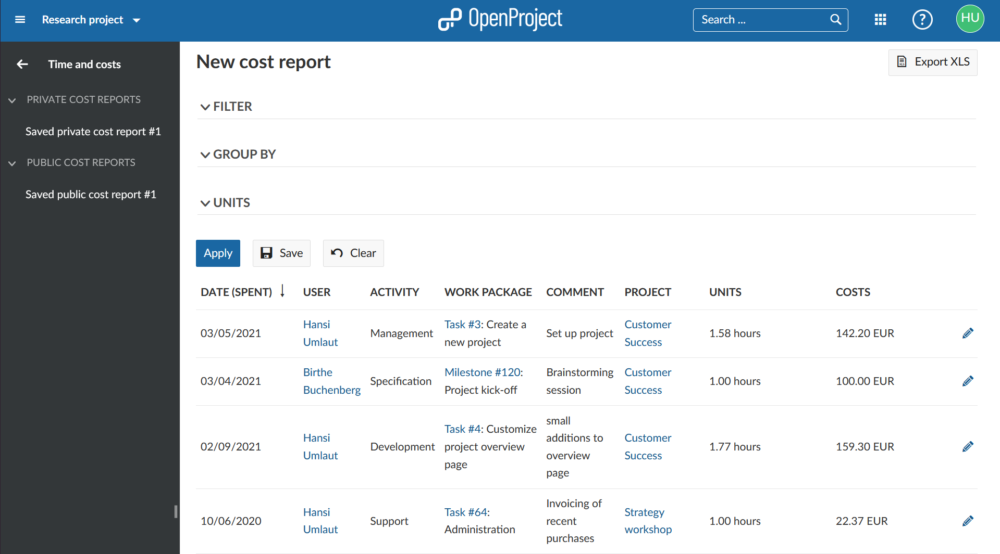
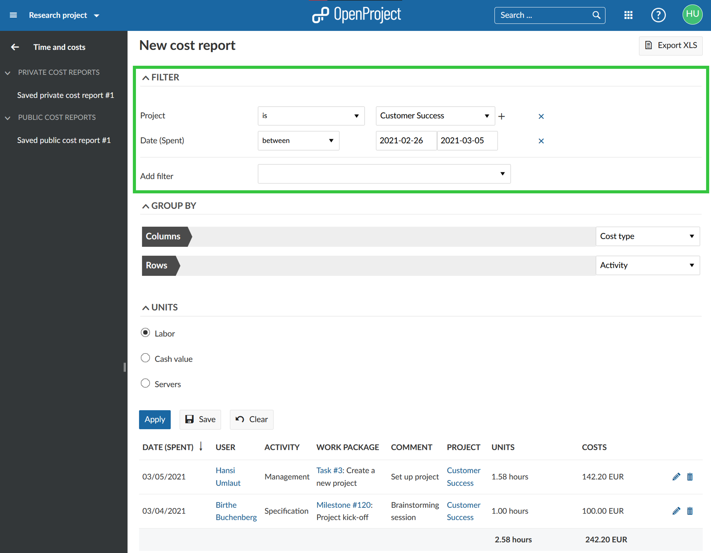

---
sidebar_navigation:
  title: Time and cost reporting
  priority: 797
description: Time and cost reporting
keywords: time and cost reporting
---

# Time and cost reporting

You can easily report spent time and costs in OpenProject and filter, group and save the reports according to your needs.

> **Note**: To use the time tracking functionality, the **Time and costs module** needs to be activated in the [project settings](../../projects/project-settings/modules/).

| Topic                                                                     | Content                                                                                           |
|---------------------------------------------------------------------------|---------------------------------------------------------------------------------------------------|
| [Time and costs report](#time-and-costs-reports)                          | How to open time and costs reports in OpenProject.                                                |
| [Change time and costs reports](#change-time-and-costs-reports)           | How to change the view of the reports, e.g. to filter, group by and select units to be displayed. |
| [Filter cost reports](#filter-cost-reports)                               | How to filter time and cost reports.                                                              |
| [Group by criteria for cost reports](#group-by-criteria-for-cost-reports) | How to group time and cost reports.                                                               |
| [Select units to display](#select-units-to-display)                       | How to choose the unit to be displayed in a report.                                               |
| [Export time and cost reports](#export-time-and-cost-reports)             | How to export time and cost reports to Excel.                                                     |

## Time and costs reports

To open the time and costs reports in OpenProject, navigate to the **Time and costs** module in the project navigation.

**Time and costs** is a plugin to filter cost reports on individual or multiple users across individual or multiple projects. The plugin has to be activated as a module in the project settings to be displayed in the side navigation.

## Change time and costs reports

You can change the view of a cost reports and adapt it to your needs.

### Filter cost reports

You can select and apply various filters, such as work package, author, start date or target version.

Multiple projects can be selected by adding a **Projects** filter.
Depending on your rights in the project, multiple users can also be selected. This way you can filter the time and cost entries exactly to your need, depending on the time, work or user you want to see.

The results will then be displayed in the time and cost report below.

### Group by criteria for cost reports

The time and cost reports can be grouped by selected criteria, such as dates, work packages, assignee, or any other field, incl. custom fields.

To add grouping criteria to the columns or rows of the report, select the drop-down field on the right to **add grouping field**.

The grouping criteria will then be added to the columns or rows of the report.

Click the blue **Apply button** to display your changes.

The report will then be displayed according to the selected criteria in the columns and rows.

You can make changes to the order of the grouping criteria in the columns or rows with drag and drop.

### Select units to display

In the time and cost reports you can select the **units** which you want to display.

You can either select **Labor** which will display the logged time to the work packages according the filter and group by criteria above. Depending on your filter, e.g. when you filter by assignee, it will give you an overview like a timesheet.

The **Cash value** will display the costs logged according to the filter and grouping criteria above. This includes labor costs (calculated based on the logged time and the [hourly rate](../time-tracking/#define-hourly-rate-for-labor-costs) as well as the unit costs.

## Report unit costs

If you just want to report on spent **unit costs**, choose the respective unit costs in the cost report under units. Only the logged unit costs will then be displayed in the report according to your filter and grouping criteria.

## Export time and cost reports

To **export reports for time and costs** to Excel you can open or create a report in the Time and costs module in your project. For the Excel export, first filter the report according to your needs. Select the [units to be displayed](#select-units-to-display) (Labor, Cash value, etc.).

Please note that "Group by" settings won't be applied to the exported file.

Click the grey **Export XLS** (Excel) button.

You can then continue working in the Excel spreadsheet to filter, group, or import the data in different systems.

