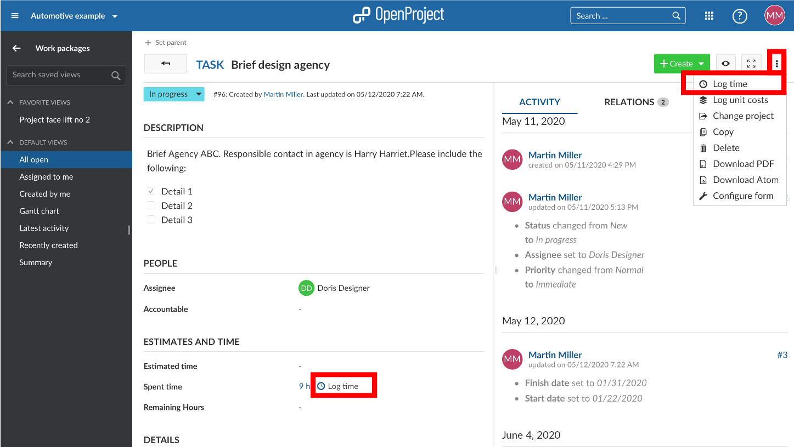
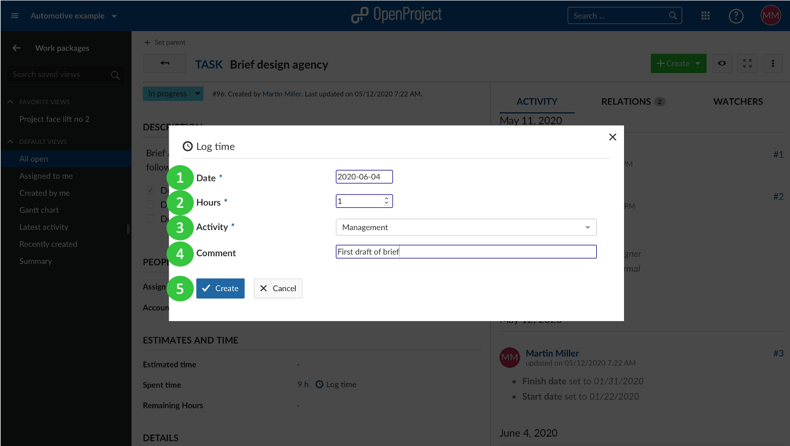
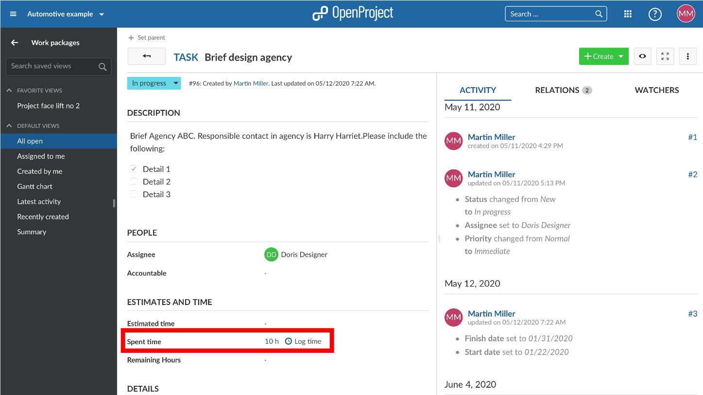
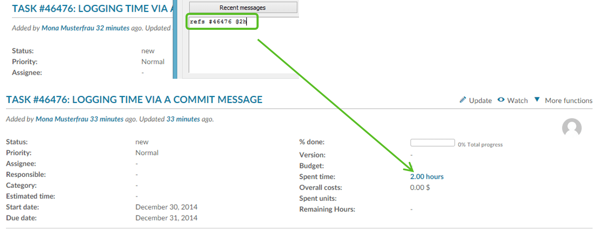
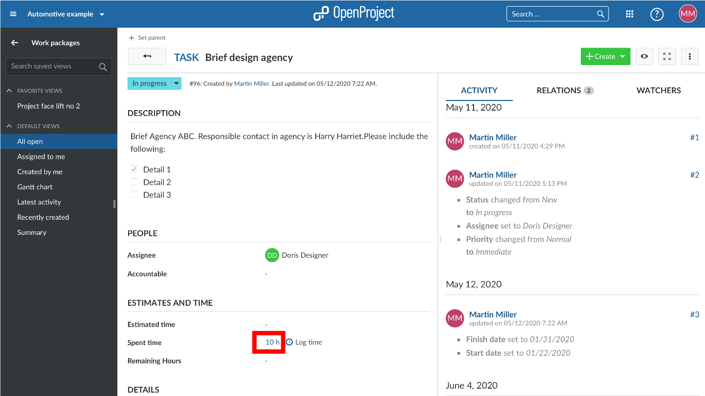
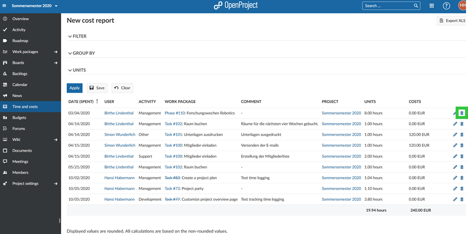
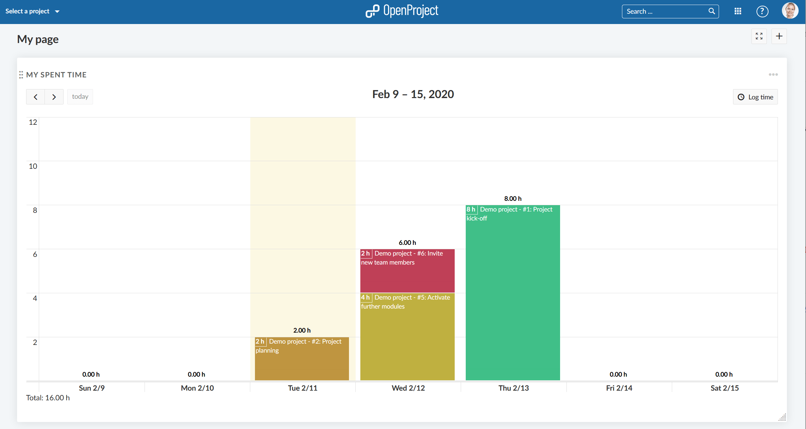
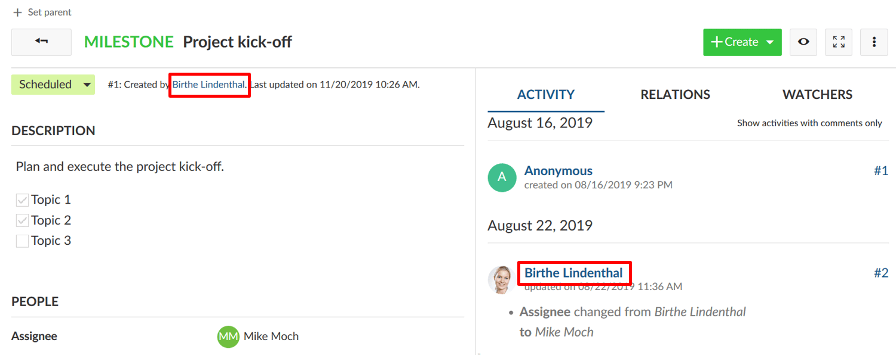
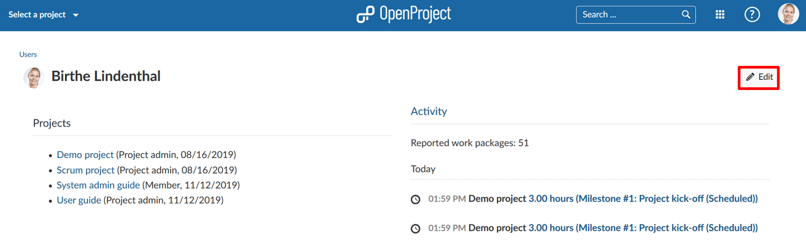

---
sidebar_navigation:
  title: Time tracking
  priority: 799
description: Time tracking in OpenProject
robots: index, follow
keywords: time tracking, logging time, define rate, labor costs
---

# Time tracking

Users can book their time or units spent on an activity within a project directly on work packages,  which gives a clear indication of how much effort the project activities require. You can either log time in the work package view or via a commit message.

**Note**: To use the time tracking functionality, the **Time and costs module** needs to be activated in the [project settings](../../projects/project-settings/modules/).

| Topic                                                        | Content                                                      |
| ------------------------------------------------------------ | ------------------------------------------------------------ |
| [Logging time](#logging-time-in-the-work-package-view)       | How to log time to work packages?                            |
| [Logging time via commit message](#logging-time-via-commit-message) | How to log time via a commit message to a work package?      |
| [Edit logged time](#edit-logged-time)                        | How to edit logged time on a work package?                   |
| [Delete time entries](#delete-time-entries)                  | How to delete time entries logged to a work package?         |
| [Spent time widget on the My Page](#spent-time-widget-on-the-my-page) | How to easily track and display spent time in the spent time widget on the MyPage? |
| [Track time with Toggl](./toggl-integration)                 | How to track spent time with Toggl integration?              |

## Logging time in the work package view

In order to log spent hours for a certain activity, open the details of the corresponding work package. Select **Log time** from the **More functions** drop down menu, the icon with the three dots in the top right of the work packages details. Or use the **Log time** icon next to **Spent time**.

You will be directed to the detailed view to log time where you can edit the following:

2. The date, for which the time will be logged.
3. The actually logged time (in hours).
4. The **Activity** drop down menu offers a choice of activity  categories, such as coordination or development. The range of categories can vary from project to project and can be edited by a project  administrator or a role with respective permissions.
4. The comment field, where you can note a more detailed description of the activities that you log time for.
5. Don’t forget to **Save** your logged time.

The aggregated time spent on a work package is shown in the work package details view.

## Logging time via commit message

Note: the “enable time logging” option must be activated under system settings in order to log time via a commit message.

To log time to a work package via a commit message you need to use  the following syntax: Refs #Work package number @amount of hours. For  example refs #123 @2h will log 2 hours for the work package number 123.

## Edit logged time

To edit logged time, click in the amount of the **Spent time** in the work packages details view.

This will bring you to the time tracking report where you will see all time entries to this work package.

Click on the **Edit** icon next to a time entry in the list.

The same detailed view to log your time entries will appear where you are now able to apply your changes.

## Delete time entries

To delete a time entry, also click on the **Spent time** in the details of a work package (just as to edit a work package).

In the list of time entries, click on the **Delete** icon next to a time entry to drop the logged time.

## Track labor costs

In order to track labor costs, you need to [define an hourly rate](#define-hourly-rate-for-labor-costs) in your user profile first. The labor costs will then be calculated automatically  based on your hours booked and your hourly rate.

## Spent time widget on the My Page

You can easily track spent time in the **spent time widget on the MyPage** and get an overview about all your activities during a week. It is like a weekly timesheet for yourself.

See more information about the My spent time widget on the [MyPage](../../../getting-started/my-page/#my-spent-time-widget).

## Define hourly rate for labor costs

You can define an hourly rate to **track labor costs per user**. You will need system admin permissions for this. Please navigate to the user profile, e.g. by clicking on a hyper link of the user name on a work package.

 

You will be directed to the user's profile page.

Here, you can click the **Edit button** on the top right corner of the user profile page.

 

Alternatively, you can navigate to *Administration -> Users & Permissions -> Users* and click on the respective user name.

Click on the **Rate history** tab. Find out [here](../../../system-admin-guide/users-permissions/users/#rate-history) how to continue. 