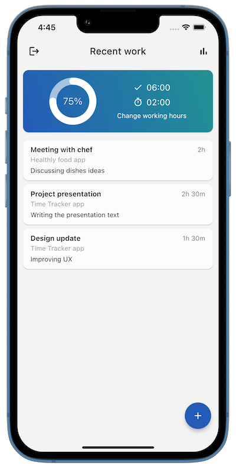
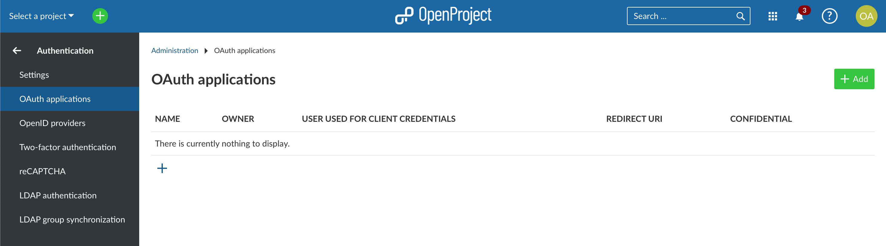
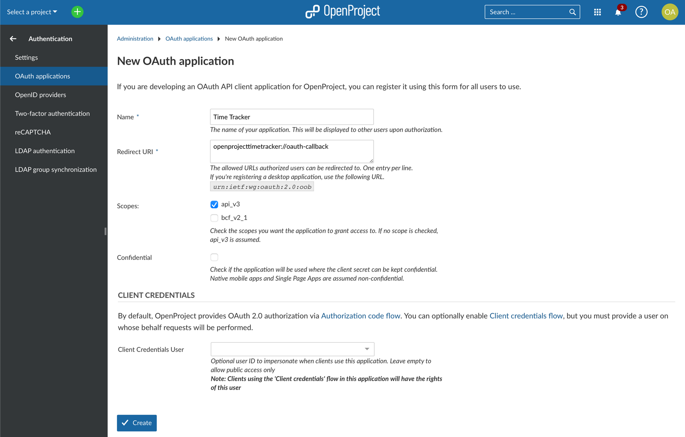
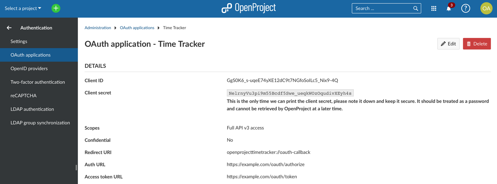

---
sidebar_navigation:
  title: Time Tracker integration
  priority: 796
description: Time tracking with Time Tracker
keywords: time tracking, time tracker integration
---

# Time Tracker for OpenProject

Please note that the Time Tracker integration is not developed, nor officially supported by OpenProject.

[Time Tracker for OpenProject](https://open-time-tracker.com/) is a mobile app that records time spent on tasks and logs it to your Open Project instance.

## Installation

Time Tracker app is available in the Apple [AppStore](https://apps.apple.com/us/app/time-tracker-for-open-project/id1669753978), Google [PlayStore](https://play.google.com/store/apps/details?id=vonrehberg.timetracker) and on [GitHub](https://github.com/VonRehbergConsulting/open-time-tracker).

## Configuration

1. Log in to the Time Tracker app with your administrator account.

2. Once logged in, open the Administration panel, navigate to the Authentication page and when go to the OAuth applications tab.

  

3. Click on the "+" button to create a new OAuth application.

   

4. In the new application window, enter the desired name for the application (for example, Time Tracker) in the Name field.
5. Set  the Redirect URI to `openprojecttimetracker://oauth-callback`. This link  will be used to redirect users back to the app after they authorize the  OAuth application.
6. Set the Scopes to api_v3. This will allow the application to access the necessary APIs.
7. Set the Confidential Property to unchecked.
8. Leave the Client Credentials User field empty.
9. Once you have completed all the fields, press the Create button.
10. After creating the application, copy the Client ID and Base URL values for future reference and keep them secure. Copy  Base URL from Auth URL field, it may look like this: `https://example.com`

