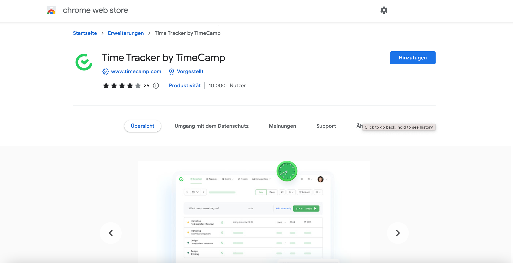
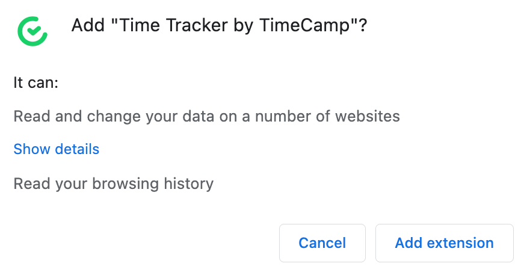
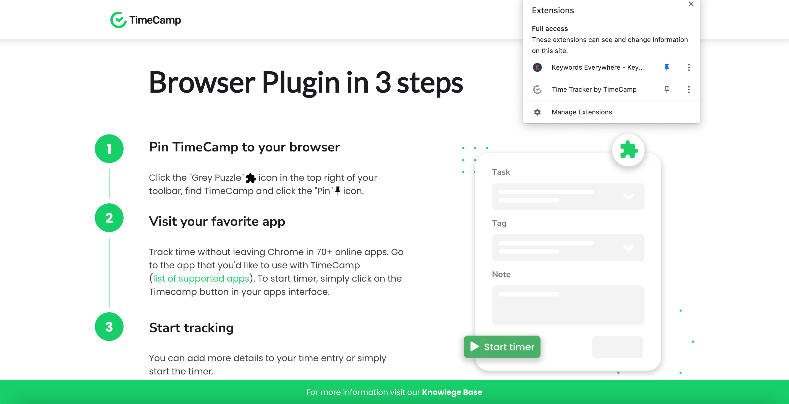
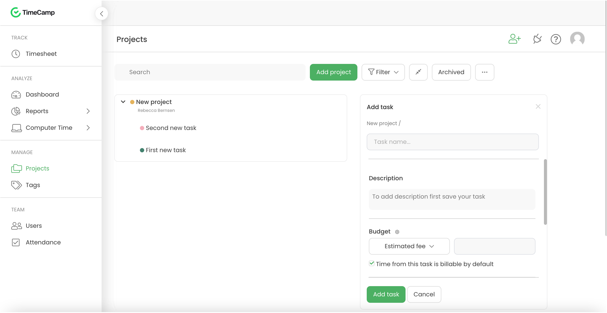
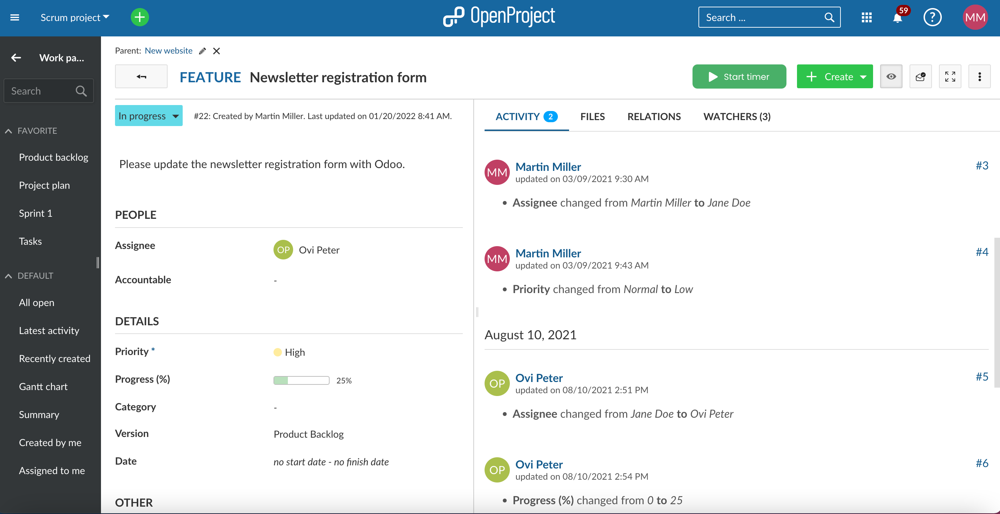
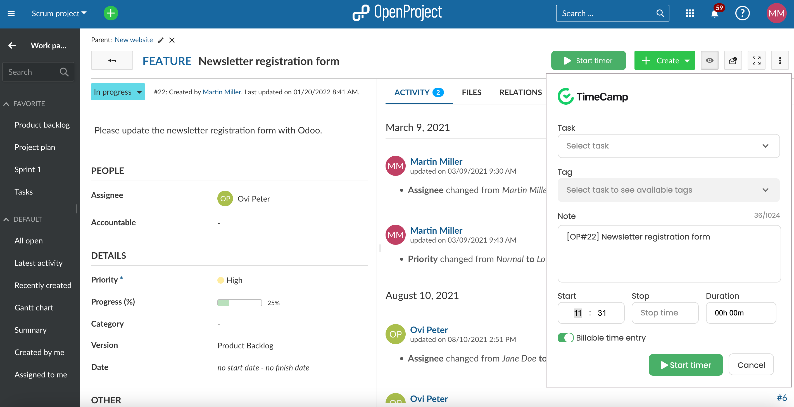
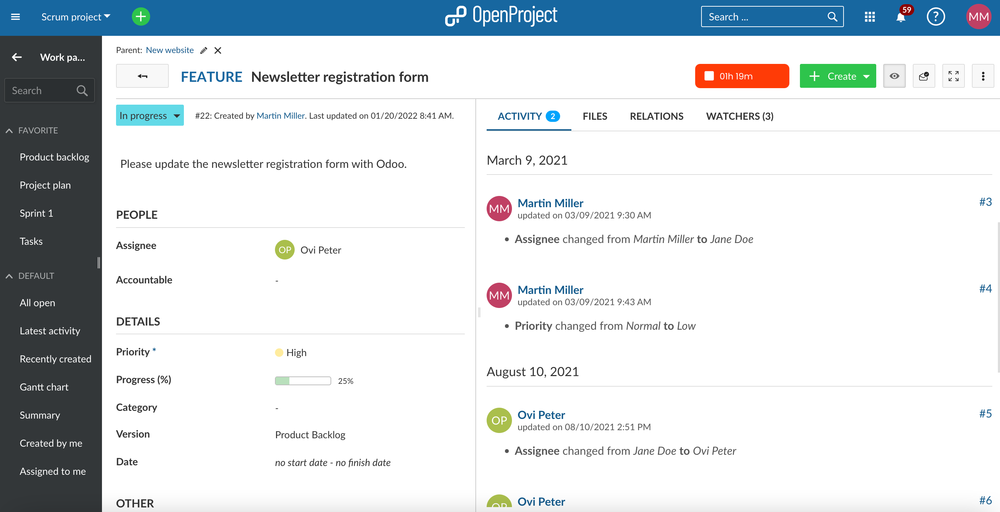
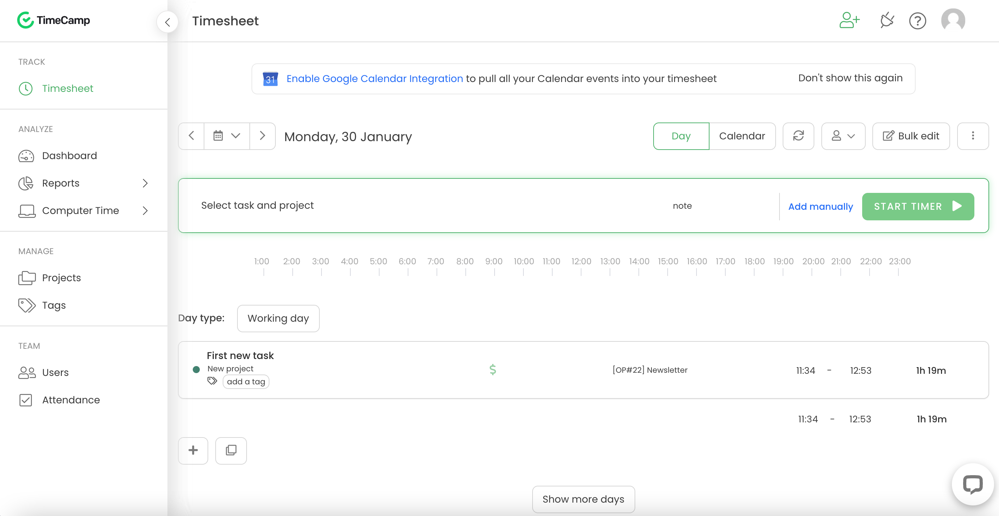

---
sidebar_navigation:
  title: TimeCamp integration
  priority: 797
description: Time tracking with TimeCamp
keywords: time tracking, timecamp integration
---

# Time tracking with TimeCamp

Please note that the TimeCamp integration is not officially supported by OpenProject and consequently is not actively maintained.

TimeCamp allows you to track your time spent on OpenProject work packages with a start/stop button. The times will then be recorded in your [TimeCamp account](https://app.timecamp.com/auth/login).

## Installation

You can install a browser add-in to track time via TimeCamp in OpenProject. This way, you can record time spent directly in a work package in OpenProject via a start/stop button. You need to register an account in TimeCamp in order to use this feature.

This integration can be added for Google Chrome as [TimeCamp extension](https://chrome.google.com/webstore/detail/time-tracker-by-timecamp/ohbkdjmhoegleofcohdjagmcnkimfdaa).

## Configuration

1. Download the [TimeCamp Google Chrome plugin](https://chrome.google.com/webstore/detail/time-tracker-by-timecamp/ohbkdjmhoegleofcohdjagmcnkimfdaa).

   

2. Add the extension.

   

3. Pin TimeCamp to your browser.

   

## Using TimeCamp in OpenProject

1. Create a [TimeCamp account](https://app.timecamp.com/auth/login) if you do not have one yet.

2. In TimeCamp, add a new project and tasks to it if you have not got anything set up yet.

   

   The time tracked in OpenProject will later on appear in TimeCamp on the task that you select.

3. [Log in to OpenProject](https://www.openproject.org/signin/), open a project and go to a work package.

   If you are already logged in, please make sure to log out and back in again so that the TimeCamp projects and tasks will appear in OpenProject.

   

   Only in the work package form you will see the green **TimeCamp Start timer** button.

4. Click on **Start timer** and select a task from your TimeCamp projects that you would want to use for tracking your time.

   

5. The timer button turns red, indicating that time is being recorded.

   

6. Stop the timer by clicking on the red button indicating the time that has passed.

## Time report

Go to you TimeCamp account, to the Timesheet and your tracked time appears there.

