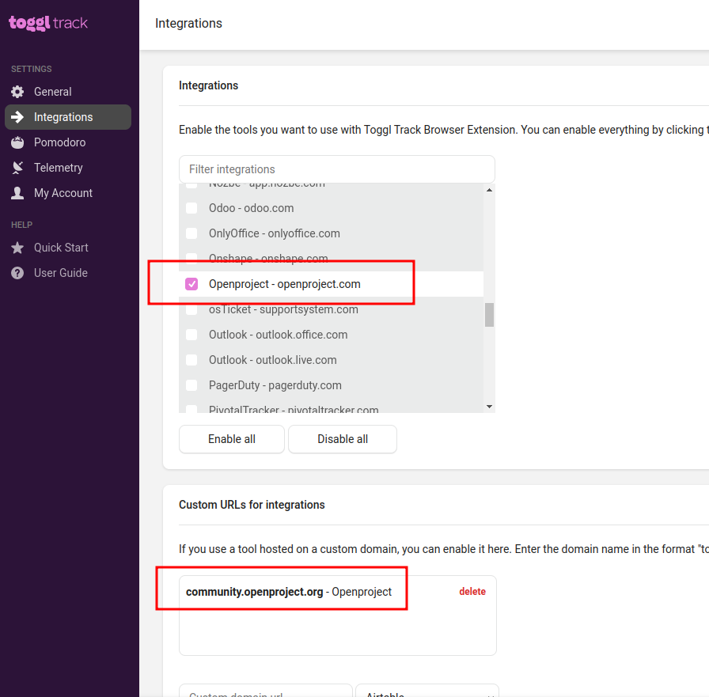
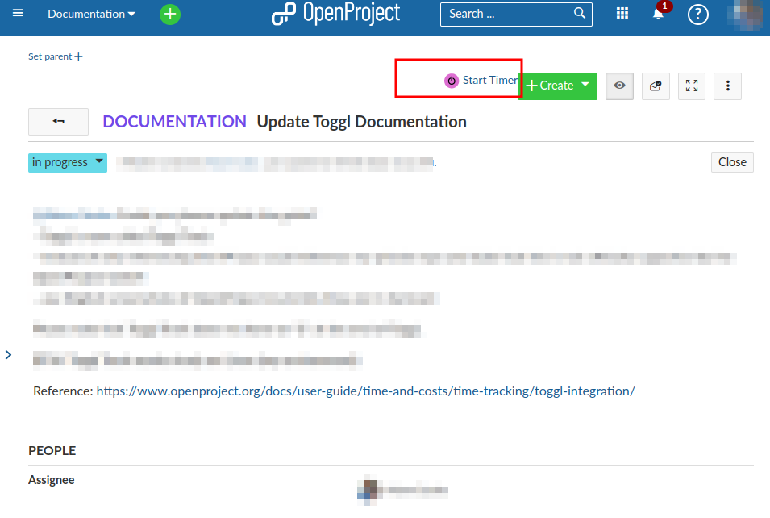

---
sidebar_navigation:
  title: Toggl integration
  priority: 798
description: Time tracking with Toggl
keywords: time tracking, toggl integration
---

# Time tracking with Toggl Track

To track time to a work package via a start and stop button, we offer an integration for the time recording software (or online timesheet software) Toggl Track ([https://toggl.com/track/](https://toggl.com/track/)). The spent time will be saved in your Toggl account.

Please note that the Toggl integration is not developed by OpenProject.

## Installation

You can install a browser add-in to track time via Toggl Track in OpenProject. This way, you can record spent times directly to a work package in OpenProject via a start/stop button. You need to register an account at Toggl in order to use this feature.

This integration can be added for example for Google Chrome as [Toggl Track extension](https://chrome.google.com/webstore/detail/toggl-button-productivity/oejgccbfbmkkpaidnkphaiaecficdnfn) and it also exists for Firefox.

## Configuration

On the cogwheel of the Toggl Track extension you reach the **Settings**, from there chose **Integrations**.

For OpenProject domains that are located on openproject.com, which is the case for most of the Enterprise cloud instances, you are able to chose **OpenProject - openproject.com** from the list of default integrations.

For any other OpenProject Domains you need to exactly add the **Fully Qualified Domain Name** (including subdomain) to the **Custom URLs for Integration** and chose **OpenProject**. For example: community.openproject.org (wildcards are not supported by Toggl Track at the moment of writing)

## Track time from OpenProject to Toggl Track

If this add-in is installed and the **Integration URL** is configured, a **Start/Stop Timer button** is displayed on the work package details view, which can be used to record times from OpenProject into Toggl:

## Copy time entries from Toggl Track to OpenProject

If you would like to use the times tracked in Toggl Track inside of OpenProject, and you are a programmer, you are able to transfer the recorded times back to OpenProject via the API if needed.
Details can be found in our [API documentation](../../../../api/).

Alternatively you could also take a look at this [simple open source ruby script](https://github.com/wielinde/toggl_track_to_openproject) which is not officially supported by OpenProject GmbH. It selects time entries from Toggl Track via the Toggl Track API, accumulates the entries by date and saves them in OpenProject via the OpenProject API.
