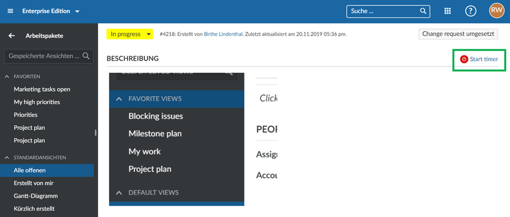

---
sidebar_navigation:
  title: Toggl integration
  priority: 798
description: Time tracking with Toggl
robots: index, follow
keywords: time tracking, toggl integration
---

# Time tracking with Toggl

To track time to a work package via a start and stop button, we offer an integration for the time recording software (or online timesheet software) Toggl (https://toggl.com/).

## OpenProject Toggl integration

You can install a browser add-in to track time via Toggl in OpenProject. This way, you can record spent times directly to a work package in OpenProject via a start/stop button. 

If this is add-in is installed, a start/stop button is displayed on the work package details view, which can be used to record times from OpenProject into Toggl:

This integration can be added for example for Google Chrome as Chrome Extension: https://chrome.google.com/webstore/detail/toggl-button-productivity/oejgccbfbmkkpaidnkphaiaecficdnfn.

You can then transfer the recorded times from Toggl to OpenProject via the API if needed.
Details can be found in our [API documentation](../../../../api/).
