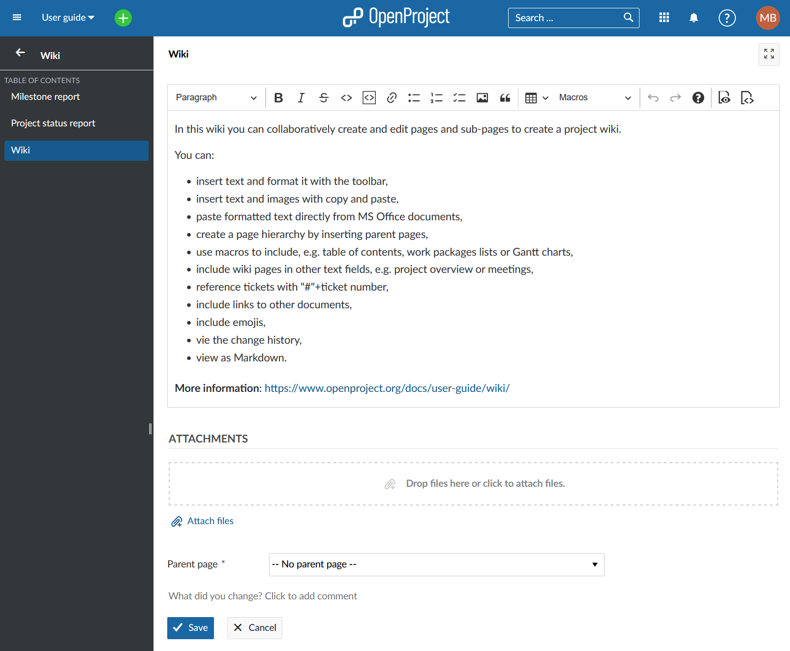
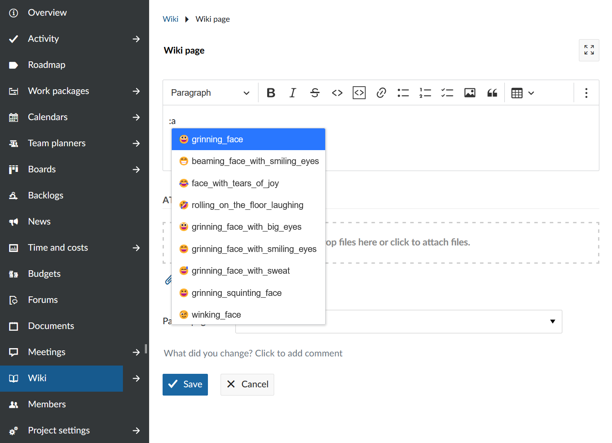

---
sidebar_navigation:
  title: Wiki
  priority: 800
description: Create and manage a wiki in OpenProject.
keywords: wiki, documentation
---

# Wiki

In a project wiki you can collaboratively create and document information with your team, such as project documentation, specifications, guidelines, or any other important project information.

<div class="glossary">
**Wiki** is defined as a module that allows to use textile-based wiki pages. In order to use the wiki module, it has to be activated in the project settings.
</div>

| Topic                                                        | Content                                                      |
| ------------------------------------------------------------ | ------------------------------------------------------------ |
| [General wiki information](#general-wiki-information)        | How to format a wiki page.                                   |
| [Image handling](#image-handling)                            | How in insert images in the wiki.                            |
| [Macros](#macros)                                            | How to add more information to a wiki page, e.g. work package create button or work package list. |
| [Links to OpenProject resources](#links-to-openproject-resources) | How to link to OpenProject resources, e.g. work packages, members or projects. |

## General wiki information

OpenProject's wiki and all other text input fields include a WYSIWYG editor, powered by [CKSource CKEditor5](https://ckeditor.com/ckeditor-5/). The underlying format is GitHub-flavored CommonMark (GFM).

All previous textile-based content will be migrated when upgrading to OpenProject 8.0.

### Basic formatting

The text editor in OpenProject supports basic text styles, such as bold and italic formatting, headings, strikethrough, inline code, and quotes as well as inline image handling. Pasting content such as images or rich text is also supported, while unsupported styling will be stripped by the editor.

Simply type in your text in the input field, highlight a text and select the formatting via the toolbar on top.



### Line breaks

Instead of creating a new paragraph with Enter, you can also press SHIFT+Enter to create a line break without creating a new paragraph.

### Links

Create hyperlinks by pressing the link icon in the toolbar (optionally with some selected text), or by pressing CTRL+k to open a popup to enter the link href.

### Widgets and Newlines

CKEditor uses widgets to display block elements such as images, tables, and other elements that are not inline. You can select most widgets by pressing on it - The only exception to that is the table widget, it has a little select knob at the top left to select the entire table.

When you have a widget selected, you can remove or cut it. You can create a newline below it by selecting the widget and pressing ENTER or ↓ (ARROW DOWN), or a newline above it by pressing SHIFT+enter or ↑ (ARROW UP). This is especially needed when the widget is the first or last element on the page to insert a line below or above it.

### Code Blocks

As CKEditor5 currently does not provide support for code blocks, OpenProject can display, but not edit code blocks within the CKEditor instance. A code block can be edited through a modal window within a CodeMirror editor instance. This has the advantage of providing syntax highlighting and code sensing (for supported languages).

### Tables

The GFM extension of the CommonMark specs adds a definition for table syntax which the CKEditor build of OpenProject supports. This definition requires all tables to have a heading row. For tables created with CKEditor without heading rows, a HTML table is output instead. This matches the behavior of, e.g., GitHub.

### Emojis

Starting with OpenProject 13.0 you can add emojis to all text editors. Type a colon and a letter, e.g. **:a** into the wiki editor and get a suggested list of emojis you can use.



### Autoformatting

CKEditor5 allows certain CommonMark-like autoformatting keyboard strokes:

```markdown
Create bold or italic styles by typing **will become bold**, _will become italic_,
Create headings of different indentation with #, ##, ###, …
Create a bulleted list by starting the line with * or - and a space
Create a numbered list by starting the line with 1. or 1) and a space
```

## Image handling

In supported resources of OpenProject where attachments are allowed, you can add images to the page by either

- using the toolbar button,
- pasting an image from your clipboard,
- or drag & drop an image onto the editor.

The attachment will be automatically uploaded and stored as an attachment.

## Macros

OpenProject has supported macros on textile formatted pages and continues to do so with the [WYSIWYG](../wysiwyg) editor. Note that macros are not expanded while editing the page, instead a placeholder is shown.

### Table of contents

Where applicable, the table of contents (TOC) macro will output a listing of all headings on the current page.

### Embed work package table and Gantt chart

This is the most flexible macro that provides extensive functionality regarding the inclusion of dynamic work package tables with all the potential of the regular work package table.

By adding an embedded work package table through the toolbar, you can configure the table view (such as columns, grouping, filters, and further properties) in a popup window.

The rendered page will then fetch the work package table results dynamically, respecting the visibility for each user.

Use it to embed views in other pages, create reporting of multiple results, or to embed a Gantt chart view.

### Work package button

Configure a button or link to target the work package creation screen in the current project. You can preselect a work package type that should be selected, making it easy to guide the users to the work package creation form.

### Links to child pages

Create a hierarchical list of all child pages of the current page.

> [!TIP]
>
> For more information on using macros take a look at this [blog article](https://www.openproject.org/blog/how-to-use-macros/).

## Full vs constrained editor

In some resources such as work packages or comments, the editor does not exhibit all functionality such as macros or image upload.

## Links to OpenProject resources

As with the textile formatting syntax, you can link to other resources within OpenProject using the same shortcuts as before. Create links to:

```wiki
a wiki page: [[Wiki page]]
a wiki page with separate link name: [[Wiki page|The text of the link]]
a wiki page in the Sandbox project: [[Sandbox:Wiki page]]

a work package with ID12: #12
a work package with ID234: view#12
the default work package view: view:default

a version by ID or name: version#3, version:"Release 1.0.0"
a project by ID/name: project#12 , project:"My project name"
an attachment by filename: attachment:filename.zip
a user by id or login: user#4 , user:"johndoe"
a forum message by ID: message#1218
a repository revision 43: r43
a commit by hash: commit:f30e13e4
a source file in the repository: source:"some/file"
```

You can always prefix these links with a project identifier followed by a colon in order to reference resources from projects other than the one of the current wiki page:

```text
my-project:view:default
```

To avoid processing these items, precede them with a bang ! character such as !#12 will prevent linking to a work package with ID 12:

```text
Wiki systems contain all the answers !#42
```

### Autocompletion for work packages

For work packages, typing # will open an autocompleter for visible work packages. This means when you type e.g. #3 or #Market, a list of work packages matching the description will be shown. Then you can either continue typing or choose a work package from the list.
