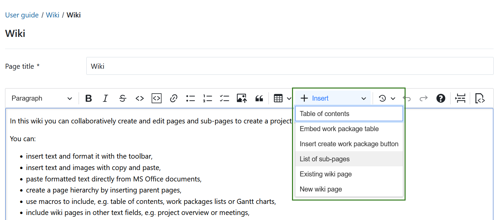

---
sidebar_navigation:
  title: Wiki
  priority: 800
description: Create and manage a wiki in OpenProject.
keywords: wiki, documentation
---

# Wiki

OpenProject offers two different ways to work with project documentation:

- **Project wiki** – the built-in OpenProject wiki described on this page.
- **External wiki providers** – integrations with external documentation platforms, including **XWiki**.

This page explains how to use the **OpenProject wiki**.

If you want to connect an external documentation platform such as XWiki to your projects, see the documentation on **[external wiki providers setup](../../system-admin-guide/wikis/wiki-providers)**.

<div class="glossary">

**Wiki** is the built-in OpenProject module for collaboratively creating and editing project documentation. It uses GitHub-flavored CommonMark (GFM) and must be enabled in the project settings before it can be used.

For organizations that prefer to manage documentation outside of OpenProject, external wiki providers such as XWiki can be connected through an integration.
</div>


| Topic | Content |
| ------ | ------- |
| [Create and edit wiki pages](create-edit-wiki/) | Create, edit, organize, and manage wiki pages. |
| [Wiki navigation](wiki-navigation/) | Navigate and organize wiki pages within a project. |
| [Wiki FAQ](wiki-faq/) | Frequently asked questions about the wiki. |

## Enable project wiki

The project wiki can be enabled for each project individually.

To use the internal wiki, it must first be [enabled on your OpenProject instance](../../system-admin-guide/wikis/wiki-providers) and then **enabled for the project** under the [project settings](../projects/project-settings/project-wiki).

## Editing wiki pages

Wiki pages use the OpenProject **WYSIWYG editor**, powered by [CKEditor 5](https://ckeditor.com/ckeditor-5/). The editor supports GitHub-flavored CommonMark (GFM), allowing you to create rich documentation with formatting, images, tables, links, and macros.

Most editing features are available throughout OpenProject. For detailed information about:

- text formatting
- images
- tables
- links
- macros
- keyboard shortcuts
- supported editor features

see the **[WYSIWYG editor](../wysiwyg)** guide.

## Wiki-specific features

The wiki includes additional features that are only available when editing wiki pages.

### Wiki-specific elements

Click **+ Insert** in the toolbar to access the following wiki-specific macros:

- **List of sub-pages** – inserts a hierarchical list of all child pages. This macro is only available when editing wiki pages.
- **Existing wiki page** – inserts a link to an existing wiki page.
- **New wiki page** – creates and inserts a link to a new wiki page.

The **Existing wiki page** and **New wiki page** macros are also available in other rich text editors in OpenProject, including meeting descriptions and outcomes, comments, and custom fields of type **Text**.



> [!TIP]
> For more information about using macros, see our [How to use macros](https://www.openproject.org/blog/how-to-use-macros/) blog article.

### Wiki page links

You can also create links to wiki pages using the following syntax:

```wiki
[[Wiki page]]
[[Wiki page|Link text]]
[[Project identifier:Wiki page]]
```
