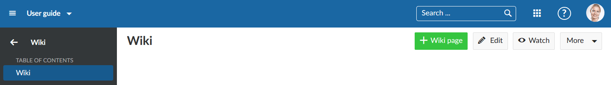
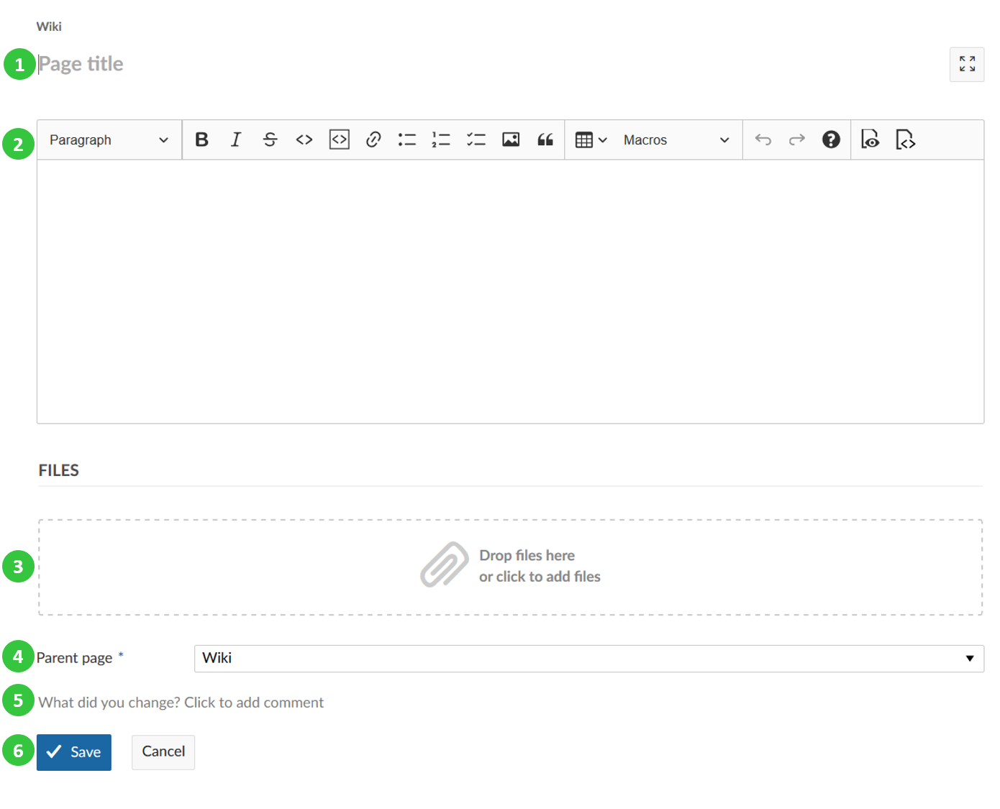
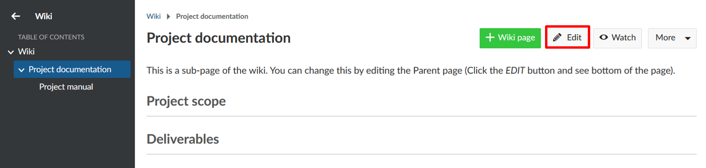
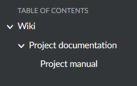
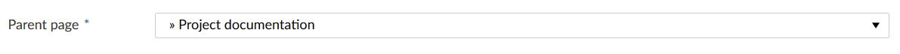
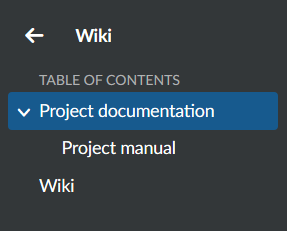
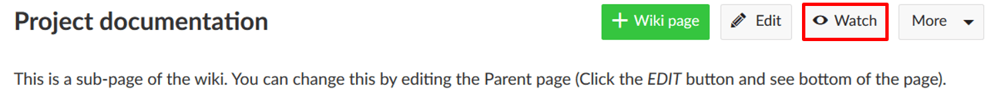

---
sidebar_navigation:
  title: Create and edit wiki
  priority: 799
description: Create a new wiki page in OpenProject
robots: index, follow
keywords: create wiki
---

# Create and edit a wiki page

In OpenProject you can create and edit wiki pages together with your team to document important project information.

| Feature                                                      | Documentation for                             |
| ------------------------------------------------------------ | --------------------------------------------- |
| [Create a new wiki page](#create-a-new-wiki-page)            | How to create a new wiki page?                |
| [Edit a wiki page](#edit-a-wiki-page)                        | How to make changes to an existing wiki page? |
| [Create a wiki page structure](#create-a-wiki-page-structure) | How to create a wiki page structure?          |
| [Watch a wiki page](#watch-a-wiki-page)                      | How to watch a wiki page?                     |

## Create a new wiki page

To create a new wiki page in a project, navigate to the wiki module in your project menu and click on the green **+ Wiki page** button in the toolbar on the right hand side.

**Note**: If you do not see the wiki module in your project menu, you first have to [activate the module in your project settings](../../projects).

The editor window will open, allowing you to enter title and content of the new page.

(1) Enter your page title

(2) Enter your wiki content. You can use the editor bar to format your texts.  [Learn here how to format texts in wiki](#wiki) with the editor toolbar.

(3) Files can be inserted directly via drag and drop or copy and paste into the text input field, or via the image button in the editor toolbar.

(4) Choose a parent wiki page.

(5) Comment which changes you have made to a wiki page.

(6) Save (or cancel) your changes to the page.

## Edit a wiki page

To edit a wiki page, click the **Edit** button on the wiki page details on the top right.

The text editor will be openend to make changes to the wiki page, as described above, how to [create a new wiki page](#create-a-new-wiki).

Do not forget to **Save** your changes after you finished editing the page.

### Change the wiki page title

To rename a wiki page, simply select the wiki page you want to change, and click the **Edit** button on the top right of the page. Click in the title and just enter the new name of the page.

Do not forget to **Save** your changes by pressing the button at the bottom of the page.

## Create a wiki page structure

If you want to create a wiki structure with different pages and sub-pages, you can enter a parent page for a wiki page which then will be displayed automatically in the wiki page menu.

If you are on an existing wiki page and click the green **+ Wiki page** button on top of the page to [create a new wiki page](#create-a-new-wiki-page), the wiki page will already be pre-selected as a **parent page**.

You can change the parent page afterwards to change the wiki page structure by clicking on the **Edit** button of an existing wiki page and select the new parent page at the bottom of the form.

If you select **-- No parent page --** the wiki page will be displayed at first level of the wiki navigation in the project menu.

The pages are ordered alphabetically in the wiki menu.

## Watch a wiki page

If you want to keep updated about any changes to a wiki page, you can make use of the **Watch** option. Browse to the wiki page you want to watch and click on the **Watch** button in the top right corner. You can undo this choice at any time.

With this function being activated, you will receive an e-mail notification (according to [your email preferences](../../../getting-started/#email-notifications)) after every page update, including a link to the respective changes.

